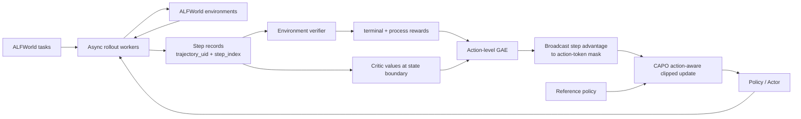

# Long-Horizon Agentic RL 项目手册

> 项目方向：基于 CAPO 的动作对齐策略优化与环境可验证过程奖励
>
> 目标场景：ALFWorld 长程工具交互任务
>
> 求职方向：大模型算法 / Agentic RL / Post-Training

## 阅读路线

- **20 分钟建立全局认识**：读第 0、3、4、5、15、23 节。
- **2 小时掌握面试主线**：再读第 6、8、10、12、16 节，并手算第 19 节。
- **准备真正看代码**：重点读第 7、9、11、18、20 节。
- **准备写进简历**：直接阅读第 17 节的最终文案。

内容导航：

1. 一页速览与项目定位
2. 项目标题、摘要和技术卖点
3. Agentic RL 的 MDP 背景
4. ALFWorld 环境与具体轨迹
5. GRPO、Token-PPO、CAPO 对比
6. CAPO 动作级信用分配与策略更新
7. 端到端训练架构
8. Agent-R1 / CAPO / veRL 代码地图
9. 环境可验证过程奖励设计
10. 完整训练伪代码与最小结果验证
11. 配置、工程 bug、曲线诊断和 case study
12. 面试讲法与 30 组问答
13. 分阶段简历写法
14. 阅读顺序、手算练习和验收清单
15. 参考资料与最终速记

---

## 0. 先看这一页：你到底要做什么

### 0.1 一句话定义

这个项目研究的是：**如何用强化学习训练一个需要连续与环境交互很多步的 LLM Agent，并让最终任务奖励更准确地归因到中间每一步决策。**

普通 GRPO 往往把整条轨迹的成败分数复制给所有 token；token-level PPO 又把语言 token 当作决策时间轴，使折扣和 clipping 都受动作长度影响。项目采用 CAPO：把一次完整 action 作为环境决策单位，在 action 边界估计 critic、沿交互 step 计算 GAE，并用长度校准的 action-aware ratio 对整条动作统一加权和裁剪。

项目同时**利用 ALFWorld 环境内部状态构造仅用于训练的 verifier，给非法动作和可验证子目标提供步骤级反馈**，缓解稀疏终局奖励导致的 all-zero rollout group。

> **版本口径：** CAPO 是 arXiv:2604.18401 在 2026-08-11 发布的 v5 名称；该论文早期版本名为 StepPO。两者是同一论文的连续升级，简历只写 CAPO，不把它们包装成两个叠加算法。

### 0.2 项目组成

| 部分 | 作用 | 身份 |
|---|---|---|
| Agent-R1 / veRL | Agent rollout 与分布式 RL 训练 | 训练框架 |
| CAPO | action-level GAE、action-aware ratio、action-level clipping | 核心算法 |
| ALFWorld | 文本化具身长程任务与环境反馈 | 训练环境 |
| Environment-Verified Process Reward | 用环境可验证信号补充稀疏终局奖励 | 奖励模块 |
| 最小对照 | GRPO、CAPO、CAPO + Verifier | 结果验证 |

### 0.3 最值得面试官追问的三点

1. **建模单位变了**：Agent 的自然动作单位不是单个 token，而是一次完整 tool call / environment action。
2. **策略更新也对齐 action**：同一动作共用 advantage、ratio 和 clipping 决策，并通过平方根长度校准避免长短动作更新失衡。
3. **奖励更可验证**：只从环境真实状态提取训练信号，不让模型看到 verifier 私有信息，减少 reward hacking 和信息泄漏。

---

## 1. 项目标题、摘要与卖点

### 1.1 推荐标题

**Long-Horizon Agentic RL：基于动作级信用分配与可验证过程奖励的长程智能体训练**

英文版：

**Long-Horizon Agentic RL with Action-Aligned Policy Optimization and Verifiable Process Rewards**

### 1.2 技术摘要

面向 ALFWorld 中多轮“观察—决策—执行—反馈”任务，基于 Qwen3-4B 与 Agent-R1/veRL 构建异步 Agent rollout 和 actor-critic 训练链路。针对 trajectory-level GRPO 无法区分关键动作、token-level PPO 的信用传播和裁剪粒度与环境决策错位的问题，引入 CAPO：在动作生成前的状态边界估计 value，沿真实交互 step 计算 action-level GAE，并用中心化平方根长度校准的 action-aware ratio 对完整动作统一加权和裁剪。奖励侧构建环境 verifier，利用合法动作、状态转移和子目标达成情况提供可验证过程反馈；最终 Seen/Unseen 成功率达到 $93.86\%/88.67\%$，较复现 CAPO 提升 $1.98/2.74$ 个百分点。

### 1.3 为什么这个项目比“套一个 Agent 框架”上限高

普通 Agent 项目常见内容是 prompt、RAG、memory 和工具编排，工程可见度高，但算法深度有限。这个项目会同时触及：

- Agent 交互轨迹如何形式化为 MDP；
- 稀疏奖励下的 temporal credit assignment；
- critic、GAE、PPO clipping、importance sampling；
- rollout 与训练 tokenization 一致性；
- 环境 verifier、奖励塑形与信息泄漏；
- 分布式异步 rollout 和可变长轨迹 batch 化。

它能把你已有的“推理增强 / RL 后训练”经历自然延伸到 Agentic RL，而不是另起一个互不相关的应用项目。

---

## 2. 任务背景：Agentic RL 究竟在训练什么

### 2.1 普通推理 RL 与 Agentic RL 的差别

在数学题推理 RL 中，模型通常一次生成完整答案，外部 verifier 最后判断对错：

```text
problem -> long response -> answer verifier -> reward
```

Agentic RL 中，模型需要多次做决策，每次动作都会改变环境，环境的新反馈又会影响下一步：

```text
initial task
  -> state_0 -> action_0 -> environment -> observation_1
  -> state_1 -> action_1 -> environment -> observation_2
  -> ...
  -> terminal success / failure
```

因此，Agentic RL 的难点不只是“输出格式正确”，而是：

- 一个早期错误可能到十几步以后才体现；
- 不同轨迹步数不同，动作 token 数也不同；
- 环境 observation 不是模型动作，不应承担 policy gradient；
- 同一终局失败可能包含很多正确步骤和一个致命错误；
- 训练时必须保留 rollout 时的动作概率，否则 PPO ratio 不可信。

### 2.2 标准 MDP 形式

把环境交互写成：

$$
\mathcal{M}=(\mathcal{S},\mathcal{A},P,R,\gamma)
$$

- $s_t$：第 $t$ 步决策前的完整状态，包括任务、历史动作和最新 observation；
- $a_t$：模型在第 $t$ 步生成的一次完整动作，例如 `open fridge 1`；
- $P(s_{t+1}|s_t,a_t)$：环境执行动作后的状态转移；
- $r_t$：该 step 的奖励；
- $\gamma$：跨 step 的折扣系数。

策略其实仍然是自回归语言模型：

$$
\pi_\theta(a_t|s_t)=\prod_{j=1}^{L_t}\pi_\theta(a_{t,j}|s_t,a_{t,<j})
$$

关键是：**策略在 token 级生成，但环境在 action/step 级转移。** CAPO 就是在这两个粒度之间搭桥。

---

## 3. ALFWorld：项目里的环境是什么

### 3.1 环境简介

ALFWorld 把 ALFRED 的具身家庭任务转成 TextWorld 可交互文本环境。Agent 不需要处理图像，只需要根据文字观察发出结构化自然语言命令，因此非常适合研究 LLM Agent 的长程规划和工具使用。

典型任务：

- 把加热后的苹果放进冰箱；
- 找到一件物品，清洁后放到指定位置；
- 检查两个同类物品；
- 给物品降温，再放到目标容器。

常见动作：

```text
go to countertop 1
open fridge 1
take apple 1 from countertop 1
heat apple 1 with microwave 1
put apple 1 in/on fridge 1
```

环境通常返回：

- 当前文字 observation；
- 当前任务分数或 reward；
- 是否结束 `done`；
- `info` 中的环境元信息；
- 文本环境中的 `admissible_commands`，即当前状态可执行的合法命令集合。

### 3.2 一个完整轨迹示例

任务：`put a heated apple in fridge`

```text
Step 0
State: You are in the middle of a room. You see countertop 1, fridge 1...
Action: go to countertop 1
Observation: On countertop 1 you see apple 1...

Step 1
State: task + history + latest observation
Action: take apple 1 from countertop 1
Observation: You pick up apple 1.

Step 2
Action: go to microwave 1
Observation: You arrive at microwave 1.

Step 3
Action: open microwave 1
Observation: The microwave is open.

Step 4
Action: put apple 1 in/on microwave 1
Observation: You put apple 1 in microwave 1.

Step 5
Action: heat apple 1 with microwave 1
Observation: The apple is now hot.

Step 6
Action: take apple 1 from microwave 1
Observation: You pick up apple 1.

Step 7
Action: go to fridge 1
Observation: You arrive at fridge 1.

Step 8
Action: open fridge 1
Observation: The fridge is open.

Step 9
Action: put apple 1 in/on fridge 1
Observation: Task accomplished.
Reward: 1, done = True
```

这个例子暴露了三个训练问题：

1. 最终 reward 只有 0/1，前九步没有直接监督；
2. 失败时很难判断是没有加热、没有拿出苹果，还是最后放错容器；
3. 每个 observation 长度不同，但“走到冰箱”和“打开冰箱”在决策时间上只相差一个 step。

### 3.3 Seen 与 Unseen

ALFWorld 通常区分 seen 和 unseen 测试设置。seen 更接近训练分布，unseen 会改变房间、物体组合或任务实例，用来判断 Agent 学到的是可泛化策略，还是记忆了训练模板。

面试时不要只报总体 success rate。至少分开说明：

- `success_seen`；
- `success_unseen`；
- 平均交互步数；
- 非法动作率。

### 3.4 `admissible_commands` 的正确用法

环境知道当前有哪些合法命令，但如果把完整合法动作列表直接塞进 policy prompt，任务难度会显著下降，也会造成训练/测试定义变化。

项目中的处理方式：

- policy 只看到正常 observation；
- verifier 可以在动作执行后读取 `admissible_commands`；
- 用它判断动作在当前状态下是否非法；
- 不把该私有集合返回给模型；
- 评估时分别报告“是否使用 action candidates”，防止口径混淆。

---

## 4. 三种信用分配方法：为什么要选 CAPO

### 4.1 轨迹级 GRPO

GRPO 常见做法是在同一个任务 prompt 下采样 $G$ 条轨迹，根据最终 reward 在组内标准化：

$$
A_i=\frac{R_i-\operatorname{mean}(R_{1:G})}
{\operatorname{std}(R_{1:G})+\epsilon}
$$

然后把同一个 $A_i$ 赋给第 $i$ 条轨迹的所有生成 token。

优点：

- 不需要 critic；
- 实现简单、显存更省；
- 对有精确终局 verifier 的短推理任务有效。

缺点：

- 一条成功轨迹里的绕路、无效动作也得到正 advantage；
- 一条失败轨迹里的正确探索也得到负 advantage；
- 如果一组 rollout 全失败，标准差接近 0，几乎没有学习信号；
- 长程任务成功率低时，all-zero group 会非常多。

### 4.2 Token-level GAE

传统 PPO 可以把整个拼接序列当成 token MDP，对每个 token 递推：

$$
\delta_i=r_i+\gamma V_{i+1}-V_i
$$

$$
A_i=\delta_i+\gamma\lambda A_{i+1}
$$

问题在于一段 Agent 轨迹中混有：

- system / user prompt token；
- assistant action token；
- tool 或 environment observation token；
- 格式控制 token。

若奖励从第 $T$ 个 step 回传到早期 action，token GAE 的衰减近似与中间 token 总数有关：

$$
\text{credit decay}\approx \gamma^{\sum_t L_t}
$$

同样相隔 5 个环境步骤，如果中间 observation 更长，早期动作拿到的 credit 就更小。这是一个建模错误：**环境时间被文本长度替代了。**

### 4.3 CAPO / Action-level GAE

CAPO 把一次完整 action（例如一条工具调用）当成一个环境决策，并在 action/step 轴上递推：

$$
\delta_t=r_t+\gamma V(s_{t+1})-V(s_t)
$$

$$
\hat A_t=\sum_{l=0}^{T-t-1}(\gamma\lambda)^l\delta_{t+l}
$$

此时奖励跨越 $T$ 个真实动作回传，衰减为：

$$
\text{credit decay}\approx\gamma^T
$$

和每一步用了几个 token、环境回复了多长文本无关。

### 4.4 三者的本质区别

| 方法 | 信用单位 | 是否需要 critic | 优势 | 主要问题 |
|---|---|---:|---|---|
| GRPO | 整条 trajectory | 否 | 简单、省显存 | 无法区分轨迹内部好坏步骤 |
| Token-GAE | token | 是 | 粒度细、兼容传统 PPO | 折扣随文本长度变化，tool token 处理复杂 |
| CAPO | complete action / environment step | 是 | 信用分配和策略裁剪都与真实决策对齐 | 需要维护动作边界、critic 与轨迹元信息 |

一句话回答“为什么不用 GRPO”：

> GRPO 的相对优势只比较整条 rollout，适合终局可验证的单次回答；长程 Agent 失败往往只错一两个动作，我需要判断哪次环境决策导致状态变坏，所以采用带 critic 的 action-level GAE。

一句话回答“为什么不用 token GAE”：

> Agent 的环境时间是 tool call 次数，不是 token 数；token GAE 会让 observation 长度和动作表达长度改变信用衰减，CAPO 把折扣、importance ratio 和 clipping 都重新对齐到完整 action。

---

## 5. CAPO 算法拆解

### 5.1 Action step 的数据结构

一条轨迹应被保存为有序 step，而不是先粗暴拼成一个长字符串：

```python
StepRecord = {
    "trajectory_uid": str,
    "prompt_uid": str,
    "step_index": int,
    "state_text": str,
    "action_text": str,
    "observation_text": str,
    "done": bool,
    "step_reward": float,
    "old_action_logprobs": list[float],
}
```

进入 trainer 后，每一个 step 可以成为 batch 的一行，同时保留：

- `trajectory_uids`：哪些 step 属于同一条轨迹；
- `step_indices`：step 在轨迹中的顺序；
- `response_mask`：只有 policy 生成的动作 token 为 1；
- `token_level_rewards`：通常把该 step reward 放在动作最后一个有效 token，随后在 step 维度求和；
- `values`：critic 给出的状态价值。

### 5.2 Critic 在哪里读 value

状态价值应表示“采取本步动作之前，这个状态未来能获得多少回报”。因此，value 取在：

> **本步 action 开始前的最后一个 state token。**

不能取 action 最后 token，因为那已经条件化在已生成动作上；也不能把 observation token 当成 policy action。

若轨迹正常终止：

$$
V(s_{T})=0
$$

若轨迹只是因为最大步数或长度限制被截断，严格来说应当 bootstrap：

$$
V(s_T)\neq 0
$$

工程中必须区分 `terminated` 与 `truncated`，否则会把“没来得及完成”误当成真正失败终态。

### 5.3 Action-level GAE 的计算

对每条 trajectory：

```python
last_gae = 0
for t in reversed(range(num_steps)):
    next_value = 0 if terminated_at_t else V[t + 1]
    delta = reward[t] + gamma * next_value - V[t]
    advantage[t] = delta + gamma * lam * last_gae
    last_gae = advantage[t]
return[t] = advantage[t] + V[t]
```

之后不是立刻在 token 上 whitening，而是先在有效 step 集合上标准化：

$$
\tilde A_t=\frac{A_t-\mu_{\text{steps}}}{\sigma_{\text{steps}}+\epsilon}
$$

再广播到该 step 的动作 token：

$$
A_{t,j}=\tilde A_t\cdot m_{t,j}
$$

其中 $m_{t,j}$ 是 `response_mask`。同一步动作中的 token 接收相同的 step advantage，但 prompt 和 observation token 的 mask 为 0。

### 5.4 为什么“同一步所有 token 用同一个 advantage”是合理的

环境只看到了完整动作，例如 `put apple 1 in/on fridge 1`，没有对 `apple` 或 `fridge` 某个单独 token 给出反馈。因此，环境级信用最自然地属于整个 action。

这不等于模型失去了 token 级优化：

- policy log-prob 仍按 token 计算；
- gradient 仍流过每一个动作 token；
- 只是 advantage 的语义来自 step，而不是假设环境每生成一个 token 都转移一次。

如果未来有可靠的 token-level verifier，才适合进一步定位到某个 token；CAPO 本身解决的是 step/turn 粒度。

### 5.5 Action-aware importance ratio

先计算旧策略与新策略在第 $t$ 个 action、第 $j$ 个 token 上的 log-ratio：

$$
z_{t,j}=\log \pi_\theta(a_{t,j}|s_t,a_{t,<j})
-\log \pi_{\text{old}}(a_{t,j}|s_t,a_{t,<j})
$$

直接求和相当于完整序列概率比，方差随动作长度增长；除以 $L_t$ 的几何平均虽然稳定，却会把长动作的更新过度压小。CAPO 使用**中心化平方根长度校准**。先计算当前 batch 中所有有效 action token 的停止梯度均值：

$$
\hat\mu=\operatorname{stopgrad}\left(
\frac{\sum_{t,j}m_{t,j}z_{t,j}}{\sum_{t,j}m_{t,j}}
\right)
$$

再构造一个 action 对应一个 ratio：

$$
\log \rho_t^{\text{Act}}
=\hat\mu+
\frac{1}{\sqrt{L_t}}
\sum_{j=1}^{L_t}(z_{t,j}-\hat\mu),
\qquad
\rho_t^{\text{Act}}=\exp(\log \rho_t^{\text{Act}})
$$

这里 $L_t$ 只统计有效 action token。这个设计有三个直觉：

1. $1/\sqrt{L_t}$ 使不同长度 action 的 log-ratio 方差处于相近尺度；
2. 减去再加回 $\hat\mu$，避免长度校准改变 batch 的平均更新方向；
3. 完整 action 共享一个 ratio 和一次 clipping 决策，优化单位与环境动作一致。

它是为稳定策略优化构造的 surrogate ratio，不应解释成完整 action 概率比的精确无偏估计。

PPO clipped surrogate 可以写成：

$$
L_{\text{actor}}=-\mathbb E_t\left[
\min\left(
\rho_t^{\text{Act}}\tilde A_t,
\operatorname{clip}(\rho_t^{\text{Act}},1-\epsilon,1+\epsilon)\tilde A_t
\right)
\right]
$$

训练中仍保留 token-level log-prob、KL 和 entropy 诊断，但 policy surrogate 对每个完整 action 聚合一次。

### 5.6 Value loss 与 KL

Critic 回归 step return：

$$
L_V=\mathbb E_t[(V_\phi(s_t)-\hat R_t)^2]
$$

为防止策略一步更新偏离初始/reference model 太远，可加入 KL：

$$
L=L_{\text{actor}}+c_vL_V+\beta D_{KL}(\pi_\theta\|\pi_{ref})
$$

KL 太大：模型几乎不学；KL 太小：容易格式崩坏、语言退化或钻奖励漏洞。监控时要把 reward、KL、entropy、clip fraction 放在一起看，不能只盯 success rate。

### 5.7 CAPO 与截图中“token-level process credit”的关系

两者不是同一种方法：

- 截图项目把错误定位到某个 assistant action token，并对该 token 施加 advantage，更接近 token-level localized loss；
- CAPO 把一次完整 action 视为一个 step，同一动作的 token 共享 advantage、ratio 和 clipping 决策；
- 截图重点是 protocol violation 定位，CAPO 重点是 Agentic MDP 和时序信用的粒度对齐。

你的项目无需硬抄截图。对秋招而言，CAPO + 环境 verifier 已经形成一个自然、可复现且容易讲清楚的完整故事。

---

## 6. 端到端系统架构



### 6.1 Rollout 阶段

每个任务 prompt 启动一个 AgentFlow：

1. 创建并 reset ALFWorld 环境；
2. 根据任务、历史和 observation 构造当前 state；
3. actor 生成一个 action；
4. parser 把文本动作解析为环境命令；
5. 环境执行，返回 observation、score、done、info；
6. 记录本 step 的文本、token、旧 log-prob、reward 元数据；
7. 达到成功、失败或最大步数后结束；
8. 把多个可变长轨迹交给 trainer。

### 6.2 Reward 阶段

奖励包含两层：

- **终局任务奖励**：是否完成 ALFWorld 任务；
- **过程奖励**：非法动作惩罚、状态进展或子目标达成信号。

训练样本应保存 reward 分解，而不是只存总和：

```python
reward_components = {
    "terminal": 0.0,
    "invalid_action": -0.1,
    "progress": 0.0,
    "format": 0.0,
}
```

这样才能诊断模型究竟在优化什么。

### 6.3 Learner 阶段

1. 根据 `trajectory_uid` 聚合同轨迹 steps；
2. 按 `step_index` 排序并检查无重复、无缺失；
3. critic 计算每步 state value；
4. 在 step 轴计算 GAE 与 return；
5. step advantage whitening；
6. 将 advantage 广播到动作 token mask；
7. 用旧/新 log-prob 计算 step ratio；
8. 更新 actor、critic，记录 KL/entropy/value loss；
9. actor 权重同步到 rollout workers，开始下一轮采样。

---

## 7. 代码地图：读代码时看什么

### 7.1 Agent-R1

仓库：[Agent-R1](https://github.com/AgentR1/Agent-R1)

它提供的是通用 Agent RL 训练骨架，重点理解：

- AgentFlow 如何维护多轮状态；
- action parser 如何连接工具/环境；
- reward function 如何消费 trajectory；
- prompt、environment、reward 和 recipe 如何模块化；
- rollout 生成的 response mask 如何与 trainer 对齐。

新任务通常按 recipe 组织：

```text
recipes/<task>/
├── base.yaml
├── data_preprocess/process_<task>.py
├── <task>_agent_flow.py
├── reward_fn.py
├── prompts.py
├── utils.py
└── env/
```

### 7.2 CAPO

仓库：[CAPO](https://github.com/AgentR1/CAPO)

最重要的目录：

```text
CAPO/
├── arft/
│   ├── agent_flow/
│   ├── config/
│   ├── workers/
│   ├── core_algos.py
│   ├── main_agent_ppo.py
│   ├── metric_utils.py
│   ├── policy_losses.py
│   ├── ratio_diagnostics.py
│   ├── ray_agent_trainer.py
│   ├── reward_loop.py
│   └── reward_scaling.py
├── recipe/
│   ├── alfworld/
│   ├── hotpotqa/
│   ├── paper_search/
│   └── webshop/
├── examples/
├── scripts/
└── verl/
```

ALFWorld 的关键入口位于：

```text
examples/alfworld/run_grpo.sh
examples/alfworld/run_ppo.sh
examples/alfworld/run_gspo.sh
examples/alfworld/run_steppo.sh
recipe/alfworld/alfworld_agent_flow.py
recipe/alfworld/reward_fn.py
```

仓库仍保留 `run_steppo.sh` 这一历史文件名，用于 action-level GAE 配方；CAPO 当前版本在此基础上进一步加入 action-aware ratio 与 action-level clipping。它与 StepPO 是同一 arXiv 论文的版本演进，不是两个需要同时堆进简历的算法。

### 7.3 `core_algos.py` 的关键逻辑

`core_algos.py` 根据 `algorithm.adv_estimator` 选择信用分配方式：

```text
gae        -> action/step-level GAE
token_gae  -> token-level GAE
grpo       -> group relative outcome advantage
```

Step GAE 路径的核心思路：

```python
def compute_step_gae(
    token_level_rewards,
    values,
    response_mask,
    trajectory_uids,
    step_indices,
    gamma,
    lam,
):
    # 1. 将离散 UID 映射成连续轨迹编号
    # 2. 对每条轨迹按 step_index 排序
    # 3. 每个 batch row 的 token reward 求和为 step reward
    # 4. 在 [num_trajectories, max_steps] 上逆序递推 GAE
    # 5. 映射回原 batch row
    # 6. 先在 step 上 whitening
    # 7. advantage.unsqueeze(1) * response_mask 广播到动作 token
    ...
```

Token GAE 路径会沿动作 token 递推，同时跳过 tool/padding token；GRPO 路径先汇总每步 reward，再汇总整条 trajectory reward，在同一 prompt 的 rollout group 内标准化，最后把同一轨迹 advantage 广播给所有 step。

这三条路径共用数据和训练系统，适合受控比较 advantage 如何计算。CAPO 的另一半——action-aware ratio、统一 clipping 及长度诊断——位于 policy loss / trainer 路径，不能只读 `core_algos.py` 就认为掌握了完整 CAPO。

### 7.4 veRL

文档：[veRL Agentic RL](https://verl.readthedocs.io/en/latest/start/agentic_rl.html)

veRL 负责大规模后训练的底层能力，包括 actor/critic/reference、rollout engine、数据并行与分布式调度。你不需要在面试中背 Ray API，但应能说清：

- rollout 是推理负载，生成长度不规则；
- learner 是训练负载，需要规整 tensor；
- Agentic rollout 还要等待外部环境，吞吐瓶颈与单轮生成不同；
- 异步执行能减少慢环境拖住整个 batch 的时间；
- learner 前必须通过 UID 和 step index 恢复轨迹结构。

---

## 8. Environment-Verified Process Reward

### 8.1 为什么还要加过程奖励

CAPO 改善的是“已有 reward 如何跨 action 分配并稳定更新”，但如果整条失败轨迹从头到尾只有 0，critic 也无法凭空知道哪个动作正确。

尤其训练早期，同一个 prompt 采样的多条轨迹可能全部失败：

```text
rewards = [0, 0, 0, 0, 0, 0, 0, 0]
```

此时 GRPO 完全没有组内相对信号；Step GAE 虽然有 value baseline，但真实 reward 信息仍很弱。环境 process verifier 可以提供中间差异。

### 8.2 设计原则

一个好的 process reward 应满足：

1. **可验证**：来自环境状态或确定规则，不由另一个 LLM 随意打分；
2. **高精度**：宁可少给，不要把错误行为奖励为正确；
3. **无泄漏**：verifier 能看到的信息不能直接进入 policy prompt；
4. **与任务一致**：奖励不能诱导 Agent 刷分而不完成任务；
5. **可分解**：每类信号单独记录，方便做消融和发现 reward hacking。

### 8.3 Invalid Action Guard

首先利用环境合法动作集合构造非法动作惩罚：

$$
r_t=r_t^{task}-\beta\cdot\mathbb I[a_t\notin\mathcal A_{valid}(s_t)]
$$

其中 `valid_actions` 来自执行动作前的 `admissible_commands`。注意必须在 action 前保存合法集合，不能拿执行后的状态判断。

伪代码：

```python
valid_before = set(info_before["admissible_commands"])
is_invalid = normalized_action not in valid_before

obs_next, task_reward, done, info_next = env.step(action)
process_reward = -beta if is_invalid else 0.0
step_reward = task_reward + process_reward
```

动作规范化应只做确定性处理，例如：

- 去除首尾空格；
- 合并连续空白；
- 统一大小写；
- 去掉协议要求之外的包裹标签。

不能用模糊语义匹配把本来非法的动作“猜成合法”，否则 verifier 口径不稳定。

### 8.4 潜势函数式进展奖励

若环境能可靠抽取任务子状态，可以构造 potential $\Phi(s)$，例如：

- 是否已找到目标物体；
- 是否持有目标物体；
- 是否完成 `heat/cool/clean` 属性变换；
- 是否到达目标 receptacle；
- 是否最终放置成功。

使用 potential-based shaping：

$$
r'_t=r_t^{task}+\alpha[\gamma\Phi(s_{t+1})-\Phi(s_t)]
-\beta\mathbb I[invalid]
$$

相比“完成一个子目标就永久加 0.2”，potential difference 的好处是：如果 Agent 为了刷分来回改变状态，失去进展时也会扣回；在标准假设下，它更有利于保持原任务的最优策略不变。

一个示意 potential：

$$
\Phi(s)=0.15I_{located}+0.25I_{holding}+0.35I_{transformed}+0.25I_{placed}
$$

这些权重只是设计示例，需要根据实际运行情况调整，不能直接写成实验结论。

### 8.5 奖励设计边界

- **重复动作一律惩罚**：某些任务中再次 `look`、再次导航可能合理；只有在环境确认 state 没变化且动作无效时才考虑。
- **轨迹越短奖励越高**：会诱导模型过早结束或冒险；先把步数作为评估指标。
- **LLM-as-a-judge 过程分**：成本高、可重复性差，还会把 judge 偏差引入训练。
- **暴露完整合法动作列表**：这改变 policy 可见信息，除非明确把它定义成 constrained-action setting。
- **每次状态变化都奖励**：开门再关门也改变状态，可能产生 reward loop。

### 8.6 防止 verifier 泄漏

数据对象最好显式分层：

```python
PolicyView = {
    "task": task_text,
    "history": public_history,
    "observation": public_observation,
}

VerifierView = {
    "valid_actions": private_admissible_commands,
    "symbolic_state": private_environment_state,
    "task_goal": private_goal_spec,
}
```

加入单元测试：序列化 `PolicyView` 后搜索 private 字段中的对象 ID、合法命令列表和 goal predicate，确保它们没有进入 prompt。

### 8.7 为什么过程奖励和 CAPO 是互补的

- process verifier 决定每一步有没有更有信息量的 reward；
- Step GAE 决定这些 reward 如何跨真实环境步骤向前传播；
- step ratio 决定 PPO 如何稳定更新一个由多个 token 构成的动作。

三者分别解决 reward construction、credit propagation、policy optimization，不是重复堆模块。

---

## 9. 训练算法完整伪代码

```python
for update in range(num_updates):
    trajectories = []

    # A. Agent rollout
    for prompt in sample_prompts(train_set):
        for sample_id in range(group_size):
            env = build_alfworld_env(prompt, seed=make_seed(update, sample_id))
            obs, info = env.reset()
            traj = []

            for step_idx in range(max_steps):
                state_text = build_policy_state(prompt, traj, obs)
                action, old_logprobs, action_tokens = actor.generate(state_text)

                valid_before = info.get("admissible_commands", [])
                parsed_action = parse_action(action)
                obs_next, terminal_reward, terminated, info_next = env.step(parsed_action)

                invalid_reward = verify_invalid(parsed_action, valid_before)
                progress_reward = potential(info_next) - potential(info)
                step_reward = (
                    terminal_reward
                    + alpha * progress_reward
                    - beta * invalid_reward
                )

                traj.append(StepRecord(
                    trajectory_uid=...,
                    step_index=step_idx,
                    state_text=state_text,
                    action_text=action,
                    observation_text=obs_next,
                    step_reward=step_reward,
                    old_action_logprobs=old_logprobs,
                    terminated=terminated,
                ))

                obs, info = obs_next, info_next
                if terminated:
                    break

            trajectories.append(traj)

    # B. Flatten while preserving step metadata
    step_batch = flatten_steps(trajectories)
    values = critic.value_at_state_boundary(step_batch)

    # C. Action-level credit assignment
    action_adv, action_returns = action_gae(
        rewards=step_batch.step_rewards,
        values=values,
        trajectory_uids=step_batch.trajectory_uids,
        step_indices=step_batch.step_indices,
        terminated=step_batch.terminated,
        gamma=gamma,
        lam=gae_lambda,
    )
    action_adv = whiten_over_valid_actions(action_adv)
    token_adv = action_adv[:, None] * step_batch.action_token_mask

    # D. CAPO action-aware update
    new_logprobs = actor.logprobs(step_batch)
    token_log_ratio = new_logprobs - step_batch.old_logprobs
    mask = step_batch.action_token_mask
    action_len = mask.sum(dim=-1).clamp_min(1)
    mean_log_ratio = stop_gradient((token_log_ratio * mask).sum() / mask.sum())
    centered_sum = ((token_log_ratio - mean_log_ratio) * mask).sum(dim=-1)
    action_log_ratio = mean_log_ratio + centered_sum / sqrt(action_len)
    action_ratio = exp(action_log_ratio)
    actor_loss = clipped_surrogate(action_ratio, action_adv, clip_eps)
    critic_loss = mse(values, action_returns)
    kl_loss = kl_to_reference(actor, reference, step_batch)

    optimize(actor_loss + value_coef * critic_loss + kl_coef * kl_loss)
    log_training_and_agent_metrics(...)
```

这段伪代码概括了项目的完整训练链路；具体模块在工程中分别由 AgentFlow、reward loop 和 PPO trainer 承担。

---

## 10. 项目验证

项目以本地复现 CAPO 为严格基线，验证环境过程奖励的增益；论文 GRPO 仅提供算法背景和结果参照，不与本地实验直接计算提升。

### 10.1 最小三组对照

保持 base model、任务集合、最大交互步数和 rollout 数一致：

| 版本 | 作用 | 简历中回答的问题 |
|---|---|---|
| GRPO | 论文参照 | trajectory-level advantage 的公开表现怎样？ |
| 本地复现 CAPO | 严格基线 | 在相同代码和评测口径下，原始 CAPO 表现怎样？ |
| CAPO + Verifier | 最终版本 | 仅加入 Verifier 后是否进一步提升？ |

Token-GAE 主要用于解释 token 时间轴的缺陷，不作为简历中的重点实验。

### 10.2 定量结果

Qwen3-4B 在 ALFWorld 上的结果如下。论文值用于核对复现是否落在合理区间；项目增益只按相同本地评测口径下的“复现 CAPO → CAPO + Verifier”计算，不能把论文 GRPO 与本地结果混算成受控实验。

| 来源 / 方法 | Seen SR | Unseen SR | 说明 |
|---|---:|---:|---|
| CAPO 论文：GRPO | $81.43\pm2.16\%$ | $74.63\pm1.09\%$ | 文献参考，3 seeds |
| CAPO 论文：CAPO | $92.86\pm1.44\%$ | $86.57\pm1.00\%$ | 文献参考，3 seeds |
| 项目复现：CAPO | $91.88\%$ | $85.93\%$ | 本地基线 |
| 项目：CAPO + Verifier | **$93.86\%$** | **$88.67\%$** | 最终版本 |

相较本地复现 CAPO，Verifier 在 Seen/Unseen 上分别提升：

$$
93.86-91.88=1.98\ \text{个百分点}
$$

$$
88.67-85.93=2.74\ \text{个百分点}
$$

该结果是合理的：复现 CAPO 与论文均值仅相差 $0.98/0.64$ 个百分点，处于论文跨 seed 波动范围内；Verifier 的增益幅度克制，且 Unseen 提升更大，符合可验证过程反馈减少无效探索、改善长程泛化的预期。

> **评测口径必须能回答：** 官方 split 包含 140 个 valid-seen 和 134 个 valid-unseen 任务。单次确定性评测的最小步长分别约为 $1/140=0.714$ 和 $1/134=0.746$ 个百分点。若 $93.86/88.67$ 来自多 seed、多次随机采样或按任务类别宏平均，应在日志中保留聚合方式；若是单次全量评测，则必须根据成功任务数重新核算。当前表格只记录点估计，不虚构标准差。

### 10.3 只看五个指标

- ALFWorld seen success rate；
- ALFWorld unseen success rate；
- invalid action rate；
- 平均完成步数；
- all-zero rollout group 占比。

训练时额外看一下 KL 和 entropy，主要用于判断训练有没有崩，不必全部写进简历。

### 10.4 项目结论

- CAPO 将 reward 按真实 action step 向前传播，并以 action-aware ratio 对完整动作统一裁剪；
- Invalid Guard 为失败轨迹补充可验证的局部反馈，减少非法动作与无效探索；
- CAPO + Verifier 的 Seen/Unseen 成功率达到 $93.86\%/88.67\%$，较复现 CAPO 提升 $1.98/2.74$ 个百分点；
- 两者组合形成“过程信号构造 + 跨步骤信用传播 + 稳定策略更新”的完整训练闭环。

---

## 11. 项目配置与模块划分

### 11.1 训练配置

- Base model：Qwen3-4B；
- 训练框架：Agent-R1 / veRL，vLLM 执行 rollout；
- 交互环境：ALFWorld TextWorld；
- group rollout size：8；
- prompt batch size：16；
- $\gamma=0.99$，$\lambda=1.0$；
- KL coefficient：0.001；
- 主算法：action-level GAE + action-aware policy loss；
- actor learning rate：$1\times10^{-6}$，critic learning rate：$1\times10^{-5}$；
- CAPO clip epsilon：0.001；ALFWorld 最大环境步数：20；
- 对照版本：GRPO、CAPO、CAPO + Verifier。

### 11.2 核心模块

| 模块 | 职责 |
|---|---|
| AgentFlow | 维护多轮 state，生成并执行环境动作 |
| Trajectory Builder | 用 UID 和 step index 重组异步可变长轨迹 |
| Environment Verifier | 判断非法动作、状态进展和终局成功 |
| Action Credit | 在环境 action 上计算 value、GAE 和 return |
| CAPO Trainer | 聚合 action-aware ratio，对完整动作统一裁剪并更新 actor/critic |
| Metrics | 统计成功率、非法动作率、交互步数、KL 与 entropy |

---

## 12. 工程难点与高频 bug

### 12.1 Step 顺序错乱

异步 rollout 返回顺序通常不是轨迹顺序。必须用 `(trajectory_uid, step_index)` 排序，不能相信 batch 原始行顺序。

断言：

```python
for uid, steps in groupby_uid(batch):
    indices = sorted(step.step_index for step in steps)
    assert indices == list(range(len(indices)))
```

症状：critic loss 抖动、GAE 看似有值但成功率不升、不同机器结果差异大。

### 12.2 Action mask 错位

只有 assistant action token 参与 policy loss。system、user、历史 observation、padding 都必须为 0。

建议可视化一条样本：逐 token 打印 `token / role / mask / advantage`。如果 observation token mask 为 1，说明在优化不可控的环境输出。

### 12.3 Retokenization drift

rollout engine 与 trainer 若使用不同 chat template、special token 或截断策略，旧 log-prob 对应的 token 和训练 token 不一致，PPO ratio 就失去意义。

必须校验：

- rollout token IDs 与 learner 重建 token IDs 完全相同；
- BOS/EOS、assistant header 和 tool delimiter 一致；
- 左/右 padding 一致；
- 不要只比较 decode 后字符串，因为不同 tokenization 也可 decode 成相同文本。

### 12.4 Reward 放错 step

终局 reward 应属于导致终止的最后一个 action step，而不是额外创建一个没有动作的 observation step。非法动作判断要用执行前状态的合法集合。

### 12.5 Termination 与 truncation 混淆

- `terminated=True`：环境真实终止，下一状态 value 通常为 0；
- `truncated=True`：因为 max_steps/max_tokens 停止，应考虑 bootstrap。

都设成 0 会系统性低估长轨迹末端状态价值。

### 12.6 Whitening 粒度错误

Step advantage 应先以“有效 step”为样本标准化，再广播到 token。如果先广播再按 token whitening，长动作会在统计中占更大权重，重新引入长度偏差。

### 12.7 动作长度校准错误

$L_t$ 必须是有效 action token 数，不能包括 padding、prompt 或 observation；校准项是 $1/\sqrt{L_t}$，不是 $1/L_t$。同时要用停止梯度的 batch token 均值完成中心化，空动作则应在 parser 层拦截。建议按动作长度分桶监控 ratio 方差和 clip fraction，防止长动作被系统性过裁剪。

### 12.8 Process reward 压过终局目标

症状：非法动作率下降，但 success rate 不升；Agent 学会保守地执行合法动作，却不完成任务。

处理：

- 降低 $\alpha,\beta$；
- 对 process reward clip；
- 分别记录 terminal return 和 shaped return；
- checkpoint 选择以 terminal success 为主；
- 做 terminal-only 消融。

### 12.9 Critic 学不动

排查顺序：

1. return 是否与 step 对齐；
2. reward scale 是否过小或过大；
3. value 是否取在 state/action 边界；
4. terminal mask 是否正确；
5. explained variance 是否长期小于 0；
6. critic learning rate 是否不合适；
7. actor 与 critic 是否共享参数导致相互干扰。

### 12.10 环境不可复现

ALFWorld 实例、初始状态、模型采样都可能有随机性。应记录：

```text
dataset split + task id + environment seed
model seed + sampling temperature + top-p
max steps + prompt template version
repository commit + package versions
```

---

## 13. 读训练曲线时如何诊断

### 情况一：Reward 不涨，entropy 很快下降

策略过早塌缩。可能 KL/clip 太强或 process penalty 让模型只选择少数安全动作。

### 情况二：Shaped reward 涨，terminal success 不涨

典型 reward hacking。模型学会拿过程分，没有学会完成任务。检查 potential 是否可循环刷分。

### 情况三：Critic loss 很低，但 explained variance 差

reward 本身接近常数，critic 预测均值就能有低 MSE。不能只看 value loss 绝对值。

### 情况四：KL 突然升高，parser failure 同时升高

策略偏离参考模型，输出协议开始崩坏。检查 learning rate、clip fraction、KL 系数和异常大 advantage。

### 情况五：Seen 上升、Unseen 不升

可能记住任务模板、房间或动作序列。检查 prompt/data 泄漏，并按 task type 和轨迹长度分桶。

### 情况六：CAPO 与 Token-GAE 短任务相近，长任务差距扩大

这是符合理论预期的结果：step 建模主要改善长 horizon 下由 token 长度造成的信用衰减。但仍要确认比较使用的是同一批评估任务。

---

## 14. 一条失败轨迹应该怎么做 case study

任务：把加热后的苹果放进冰箱。

失败轨迹：

```text
1. go to countertop 1          # 正确定位
2. take apple 1 ...            # 正确拿取
3. go to microwave 1           # 正确导航
4. put apple 1 in microwave 1  # 未开门，非法/失败
5. go to fridge 1              # 放弃加热，计划偏离
6. put apple 1 in fridge 1     # 属性条件未满足
```

GRPO：整条失败，所有 token 同为负 advantage。

CAPO + verifier：

| Step | 行为判断 | 可能的即时信号 | GAE 作用 |
|---:|---|---:|---|
| 1 | 合理导航 | 0 或正进展 | 可从未来正确状态获得正 credit |
| 2 | 获取目标物体 | 正 potential difference | 强正 credit |
| 3 | 接近加热设备 | 正进展 | 正 credit |
| 4 | 对关闭容器执行 put | invalid penalty | 明确负 credit |
| 5 | 计划偏离 | potential 无提升 | 未来失败向前回传 |
| 6 | 未满足 heated 条件 | terminal failure | 负 credit |

面试时要强调：process reward 不必完美覆盖全部推理错误。它只需要对“环境能确定验证”的部分高精度打分，其余长期影响由 value/GAE 学习。

---

## 15. 面试讲法

### 15.1 30 秒版本

> 我做的是长程 Agentic RL 的动作对齐策略优化。传统 GRPO 把整条轨迹成败复制给所有动作，token PPO 又会让信用传播和裁剪受文本长度影响。我基于 Qwen3-4B、Agent-R1/veRL 和 CAPO，把 ALFWorld 中一次完整工具调用建模为 action step，并用环境 verifier 补充非法操作和子目标进展信号。最终 Seen/Unseen 成功率达到 93.86%/88.67%，较复现 CAPO 提升 1.98/2.74 个百分点。

### 15.2 两分钟版本

> 场景选的是 ALFWorld，它要求 LLM 连续导航、拿取、开关容器、加热或清洁物品，最后才得到任务成功奖励。这里核心问题是 temporal credit assignment：一条十几步的失败轨迹可能前面都对，只在最后一个关键动作出错。
>
> 我先比较了三种信用粒度。GRPO 是 trajectory-level，省掉 critic，但轨迹内部所有动作共享结果；传统 token GAE 更细，却把语言 token 当环境时间，长 observation 会改变早期动作的 reward 衰减。CAPO 使用 action-level MDP，每个 state-action-observation 交互对应一个 step，在动作轴上计算 TD residual 和 GAE，value 取在动作生成前的状态边界。得到 action advantage 后只广播给该 action 的 token，prompt 和 observation 不参与 policy loss。更新时先聚合 token log-ratio，再用中心化的 $1/\sqrt{L}$ 长度校准得到 action-aware ratio，使完整动作共享一次 clipping 决策。
>
> 仅改信用分配仍解决不了训练早期全失败的问题，所以我设计了 environment-verified process reward。verifier 能读取 ALFWorld 的合法动作和符号状态，但这些信息不进入 policy prompt；奖励由非法动作惩罚和 potential difference 两部分组成，分别约束无效操作并奖励拿取、变换和放置等可验证进展。在一致评测配置下，复现 CAPO 的 Seen/Unseen 为 91.88%/85.93%，加入 Verifier 后达到 93.86%/88.67%，分别提升 1.98/2.74 个百分点。

### 15.3 五分钟展开顺序

1. 用一个 ALFWorld 任务解释多步交互；
2. 画 trajectory-level、token-level、step-level 三条时间轴；
3. 写 $\delta_t$ 和 GAE 公式；
4. 解释 value 的状态边界和 action mask；
5. 解释中心化平方根长度校准和 action-aware ratio；
6. 讲 verifier 私有信息与 policy 可见信息隔离；
7. 讲 A/C/D 对照、长轨迹分桶和失败案例；
8. 最后用三组对照和具体失败轨迹总结项目效果。

---

## 16. 高频面试问答

### Q1：为什么 Agent action 不是 token？

因为环境只在完整命令提交后转移一次。生成 `open fridge 1` 的四个 token 时，环境没有执行四次动作；把 token 当环境 step 会让文本表达长度影响折扣。

### Q2：CAPO 是否完全不做 token-level loss？

不是。log-prob 和梯度仍在动作 token 上计算，只是 advantage 和 importance ratio 的语义在 action step 上聚合。非动作 token 被 mask。

### Q3：CAPO 和 GRPO 最大区别是什么？

GRPO 用同 prompt 多条轨迹的终局 reward 构造相对优势，不需要 critic；CAPO 用 critic 在轨迹内部计算 step GAE，能区分同一轨迹中的不同动作。

### Q4：为什么 CAPO 需要 critic？

GAE 的 TD residual 需要 $V(s_t)$ 和 $V(s_{t+1})$。critic 提供状态基线，降低 policy gradient 方差，并允许从中间 reward 向前传播。

### Q5：critic 的 value 取哪个 token？

取 action 开始前最后一个 state token，表示采取动作前的状态价值。若取 action 后，会泄漏当前动作信息并改变 value 的定义。

### Q6：为何先 step whitening 再广播？

如果广播后按 token 统计，长 action 会出现更多次，在均值和方差中权重更大；先按 step 标准化保证每次环境决策权重一致。

### Q7：为什么 ratio 用平方根长度校准，而不是几何平均？

完整动作的 token log-ratio 求和，方差大致随长度增长；直接除以 $L$ 的几何平均又会过度缩小长动作更新。CAPO 除以 $\sqrt{L}$，让不同长度 action 的 log-ratio 方差更接近，从而减少长度导致的 clipping 偏差。

### Q8：为什么还要减去再加回 batch 均值？

只做 $1/\sqrt{L}$ 会让非零平均 log-ratio 随动作长度被放大。CAPO 先减去停止梯度的 batch token 均值，只缩放中心化波动，再把均值加回，从而兼顾长度方差校准和平均更新方向。它仍是 surrogate ratio，所以还要监控 token-level KL、最大 log-ratio及按长度分桶的 clip fraction。

### Q9：$\lambda=1$ 有什么含义？

GAE 更接近 Monte Carlo return，偏差较小、方差更高。稀疏终局奖励和较短 step horizon 下可以成立，但不是固定最优，需要与 critic 质量一起调。

### Q10：$\gamma=1$ 不就没有 token 长度衰减了吗？

能缓解折扣衰减，但 token MDP 的语义错位仍存在：observation token 是否参与递推、value 边界、长动作权重、padding/mask 都更复杂。并且许多任务仍需要 $\gamma<1$ 表达时间偏好。

### Q11：全 0 rollout group 为什么不能学？

GRPO 组内均值和每条 reward 相同，标准化后 advantage 接近 0。没有相对差异就没有有效 policy gradient。过程奖励能让失败轨迹内部和轨迹之间出现可验证差异。

### Q12：为什么不用 LLM judge 打过程分？

环境状态更便宜、确定、可复现，并且能精确判断合法动作或 goal predicate。LLM judge 适合无法程序验证的语义质量，但会引入偏差和额外成本。

### Q13：合法动作一定是好动作吗？

不是。合法只说明环境能执行，不说明有助于目标。因此 invalid penalty 是负向 guard，不应把所有合法动作都正奖励；长期好坏仍由终局 reward 和 critic 学。

### Q14：为什么 potential-based shaping 更安全？

奖励状态潜势的差值，而不是状态本身。模型取得进展会得分，丢失进展会扣回，较不容易通过循环状态无限刷分；标准条件下也更可能保持原最优策略。

### Q15：如何发现 reward hacking？

分别画 shaped return 与 terminal success，人工检查高 shaped reward 但失败的轨迹，统计状态循环、重复动作和各 reward component。如果 shaped reward 涨而终局不涨，立即降低权重或重写 verifier。

### Q16：使用 admissible commands 是否作弊？

如果直接给 policy 看，属于改变任务设置；如果只在训练后端作为 verifier，和答案 verifier 类似，不构成 policy observation 泄漏。必须做字段隔离和 prompt 单测。

### Q17：环境返回一大段 observation，训练时怎么处理？

它属于下一步 state，可以作为后续动作的条件，但不属于 policy 生成内容，所以在当前 policy loss 中 mask 为 0。

### Q18：多轮轨迹怎样 batch 化？

把每个 step 展平成一行，附带 `trajectory_uid` 和 `step_index`。计算 GAE 时先按 UID 分组和排序，得到 step advantage 后再映射回 batch tensor。

### Q19：异步 rollout 最大风险是什么？

返回顺序乱、actor 权重版本不一致和环境长尾延迟。需要 UID/step index、policy version 标识和 staleness 控制。

### Q20：old log-prob 为什么必须保留？

PPO 用新旧策略概率比限制更新幅度。若用更新后的模型重新算所谓 old log-prob，ratio 会失真，clipping 不再表示 on-policy 附近的稳定更新。

### Q21：如何确认 tokenizer 没有漂移？

保存 rollout token IDs，在 learner 侧逐 ID 对比，而不仅是字符串。还要检查 chat template、special token、工具分隔符和截断方向。

### Q22：为什么评估平均步数？

两个模型 success 相同，一个可能大量绕路。步数反映规划效率和环境成本，但不应过早加成训练 reward，否则可能诱导 premature termination。

### Q23：为什么要分 seen/unseen？

Agent 可能记住任务模板和常见物体位置。unseen 更能检验组合泛化和真实状态理解。

### Q24：CAPO 的额外成本是什么？

需要 critic 的参数、前反向计算和 optimizer state；还要维护动作边界、UID、value boundary、action length 与可变长 trajectory。它用更多系统复杂度换取动作级信用和更一致的策略裁剪。

### Q25：若 critic 很差，CAPO 会怎样？

GAE advantage 偏差或方差变大，甚至比简单 GRPO 更差。要监控 explained variance、做 return/advantage 单测，并可通过 warm-up、不同 learning rate 或 Monte Carlo 比重调节改善。

### Q26：CAPO 提升是否只是因为用了 critic？

不能凭主实验断言。需要区分两部分贡献：action-level GAE 改变信用分配，action-aware ratio/clipping 改变策略更新。面试中要明确这个因果拆分，不把全部收益笼统归于 critic。

### Q27：过程奖励是否也能用在 GRPO？

可以。可以把各 step shaped reward 汇总为 trajectory return 再做 GRPO，但仍丢失轨迹内部信用。这个对照可以证明收益来自 reward 还是 step credit。

### Q28：如何处理动作解析失败？

把 parser failure 与环境 invalid 分开记录。解析失败可给小的格式惩罚，并返回固定公共错误 observation；不能静默修复，否则 rollout 动作和环境实际动作不一致。

### Q29：最大步数设太小有什么后果？

大量轨迹被截断，终局 reward 偏低，critic 若把 truncation 当 terminal 会低估长计划。应统计 truncation rate，并在资源允许时做 max-step 敏感性实验。

### Q30：项目真正的新意是什么？

项目围绕长程交互完成三层设计：用 action-level MDP 和 critic/GAE 将终局反馈传播到关键动作，用 action-aware ratio 将更新与裁剪对齐完整工具调用，再用隔离于 policy observation 的环境 verifier 补充非法动作和子目标进展信号。三部分共同解决“奖励稀疏、归因过粗、更新粒度错位和无效探索”问题。

---

## 17. 简历写法（最终版）

### 17.1 项目标题

**长程工具智能体强化学习｜基于动作级信用分配与可验证过程奖励**

### 17.2 三条核心内容

- **项目描述：** 面向 ALFWorld 长程工具交互任务，基于 Qwen3-4B 构建 Agentic RL 训练框架，重点解决稀疏终局奖励下的动作信用分配与无效探索问题。
- **技术实现：** 针对 GRPO 轨迹级归因过粗、Token-GAE 的信用传播与裁剪粒度同环境决策错位的问题，采用 CAPO 在动作边界估计 critic、沿交互 step 计算 action-level GAE；基于中心化平方根长度校准构造 action-aware ratio，对完整动作统一加权与裁剪。
- **奖励优化：** 基于 ALFWorld 合法动作集合与符号状态构建 Environment Verifier，融合 terminal reward、invalid penalty 与 potential-based process reward；Seen/Unseen 成功率达到 $93.86\%/88.67\%$，较复现 CAPO 提升 $1.98/2.74$ 个百分点。

这三条已经覆盖“做什么、核心算法、个人设计”，不再拆分数据处理、日志监控、实验阶段等次要信息。

### 17.3 可直接放入当前简历的 LaTeX

```latex
\datedsubsection{\textbf{长程工具智能体强化学习}
\quad\quad\quad
\textit{基于动作级信用分配与可验证过程奖励}}{}
\begin{itemize}
  \item \textbf{项目描述:}
  面向 ALFWorld 长程工具交互任务，基于 Qwen3-4B 构建 Agentic RL 训练框架，重点解决稀疏终局奖励下的动作信用分配与无效探索问题。

  \item \textbf{技术实现:}
  针对 GRPO 轨迹级归因过粗、Token-GAE 的信用传播与裁剪粒度同环境决策错位的问题，采用 CAPO 在动作边界估计 critic、沿交互 step 计算 action-level GAE；基于中心化平方根长度校准构造 action-aware ratio，对完整动作统一加权与裁剪。

  \item \textbf{奖励优化:}
  基于 ALFWorld 合法动作集合与符号状态构建 Environment Verifier，融合 terminal reward、invalid penalty 与 potential-based process reward；Seen/Unseen 成功率达到 93.86\%/88.67\%，较复现 CAPO 提升 1.98/2.74 个百分点。
\end{itemize}
```

---

## 18. 建议的代码阅读与学习顺序

### 第一遍：只理解数据怎么流

1. ALFWorld README 与基础 `reset/step` 示例；
2. CAPO 的 `examples/alfworld/run_*.sh`；
3. ALFWorld recipe / AgentFlow；
4. rollout 输出的 step record；
5. trainer 如何按 UID 重组。

目标：能画出第 6 节架构图。

### 第二遍：只理解算法

1. `grpo` advantage；
2. `token_gae`；
3. `gae`（step GAE）；
4. advantage whitening 与 response mask；
5. `policy_losses.py` 与 `ratio_diagnostics.py` 中的 action-aware update 和长度诊断。

目标：能在纸上用 3-step trajectory 手算三种 advantage。

### 第三遍：只理解工程陷阱

1. tokenization consistency；
2. step state boundary；
3. terminated/truncated；
4. async ordering；
5. reward placement；
6. actor/reference/critic 权重同步。

目标：别人给一条异常训练曲线，你能提出有优先级的排查路径。

### 第四遍：理解奖励模块

1. 观察 ALFWorld `info` 中哪些字段可靠；
2. 实现非法动作 verifier；
3. 设计 potential 并找可循环刷分的反例；
4. 写 policy/verifier 泄漏单测；
5. 定义 A/C/D 最小对照。

---

## 19. 手算练习：确保不是只会背概念

设一条 3-step 轨迹：

```text
rewards = [0.0, -0.1, 1.0]
values  = [0.30, 0.50, 0.70]
gamma   = 0.99
lambda  = 1.0
terminal after step 2
```

从后往前：

$$
\delta_2=1.0-0.70=0.30,\quad A_2=0.30
$$

$$
\delta_1=-0.1+0.99\times0.70-0.50=0.093
$$

$$
A_1=0.093+0.99\times0.30=0.390
$$

$$
\delta_0=0+0.99\times0.50-0.30=0.195
$$

$$
A_0=0.195+0.99\times0.390=0.5811
$$

对应 return：

$$
R_t=A_t+V_t=[0.8811,0.8900,1.0000]
$$

解释：尽管 step 1 有一次 -0.1 penalty，后续仍成功，因此其总 advantage 可以为正；advantage 衡量的是相对于 critic 预期的好坏，不等于即时 reward。

如果每步动作 token 数为 `[3, 8, 4]`，广播后分别有 3、8、4 个 token 得到对应 step advantage；但 whitening 必须在这 3 个 step 值上做，而不是在重复后的 15 个 token 上做。

---

## 20. 项目验收清单

### 概念

- [ ] 能解释 Agentic RL 与单轮 reasoning RL 的 MDP 差异；
- [ ] 能比较 GRPO、Token-GAE、CAPO；
- [ ] 能推导 step GAE；
- [ ] 能解释 critic 的 value boundary；
- [ ] 能解释中心化平方根长度校准的 action-aware ratio；
- [ ] 能说明 potential-based shaping 和 reward hacking。

### 代码

- [ ] 能指出 AgentFlow、reward、trainer、core algorithm 的入口；
- [ ] 能解释 `trajectory_uid` 与 `step_index`；
- [ ] 能验证 action mask；
- [ ] 能区分 terminal 与 truncation；
- [ ] 能检查 rollout/learner token IDs 一致；
- [ ] 能打印一条 trajectory 的 reward 分解。

### 实验

- [ ] 有 GRPO / CAPO / CAPO + Verifier 三组最小对照；
- [ ] 所有版本使用同一批评估任务和最大步数；
- [ ] 记录 seen/unseen success、invalid rate 和平均步数；
- [ ] 保留训练日志及典型成功、失败轨迹。

### 面试表达

- [ ] 能在两分钟内讲清问题、算法和奖励设计；
- [ ] 能指出 step trajectory、GAE 和 verifier 的核心代码路径；
- [ ] 能解释所有简历指标的计算口径；
- [ ] 能结合具体轨迹说明一个成功案例和一个失败案例。

---

## 21. 最终判断：这个项目是否足够应对面试

如果只是背诵 CAPO 摘要，不够。若你能做到以下几点，这一个项目足以作为 Agentic RL 主项目，不必再硬塞第二套算法：

1. 用具体轨迹解释 credit mismatch，而不是只说“稀疏奖励”；
2. 手算 action-level GAE，并解释 value boundary、mask 和 action-aware ratio；
3. 说清 AgentFlow 到 learner 的数据结构；
4. 讲出至少五个真实工程风险及排查方式；
5. 对过程奖励给出无泄漏设计、reward hacking 反例和最小对照；
6. 能把每个设计选择对应到具体问题，而不是只背算法名词。

这个项目的面试证据集中在三类内容：

- 一组同预算的 GRPO / CAPO / Verifier 对照结果；
- 两到三条成功与失败 trajectory case study；
- 能定位到文件和函数的实现细节与调试经验。

做到这三点，就能把它讲成一个完整的个人项目，而不是名词堆叠。

---

## 22. 参考资料索引

- [CAPO 论文：Critic-Guided Action-Aligned Policy Optimization for Advancing LLM Agent Capabilities（v5）](https://arxiv.org/abs/2604.18401v5)
- [CAPO GitHub 仓库](https://github.com/AgentR1/CAPO)
- [Agent-R1 GitHub 仓库](https://github.com/AgentR1/Agent-R1)
- [ALFWorld GitHub 仓库](https://github.com/alfworld/alfworld)
- [veRL Agentic RL 文档](https://verl.readthedocs.io/en/latest/start/agentic_rl.html)
- [PPO 原始论文](https://arxiv.org/abs/1707.06347)
- [DeepSeekMath / GRPO 论文](https://arxiv.org/abs/2402.03300)

项目速查信息：

```text
Base model: Qwen3-4B
Environment: ALFWorld TextWorld
Training stack: Agent-R1 / veRL + vLLM
Core algorithm: action-level GAE + action-aware policy loss
Reward: terminal + invalid penalty + potential progress
Baselines: GRPO / CAPO / CAPO + Verifier
```

---

## 23. 你现在应该记住的十句话

1. Agentic RL 的时间单位是环境交互 step，不是语言 token。
2. GRPO 比较整条 rollout，难以定位轨迹内部关键错误。
3. Token GAE 会让文本长度影响 reward 的折扣距离。
4. CAPO 在 action/step 轴计算 GAE，再把 advantage 广播给对应动作 token。
5. Critic value 取在动作生成前的 state boundary。
6. Observation 是下一步状态的一部分，但不是 policy action，loss mask 必须为 0。
7. CAPO 用中心化 $1/\sqrt{L}$ 校准聚合 token log-ratio，让完整 action 共享一次 clipping 决策。
8. CAPO 同时改善 credit propagation 与 policy update 对齐，但不能凭空解决全零奖励。
9. 环境 verifier 只奖励可验证事实，而且私有状态不能泄漏给 policy。
10. 最有说服力的项目证据是同预算对照、日志和失败轨迹，不是更夸张的项目描述。
