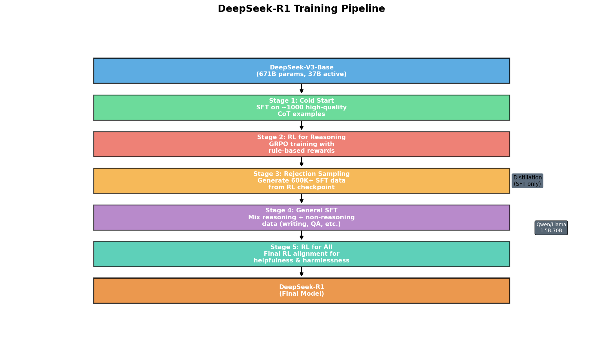
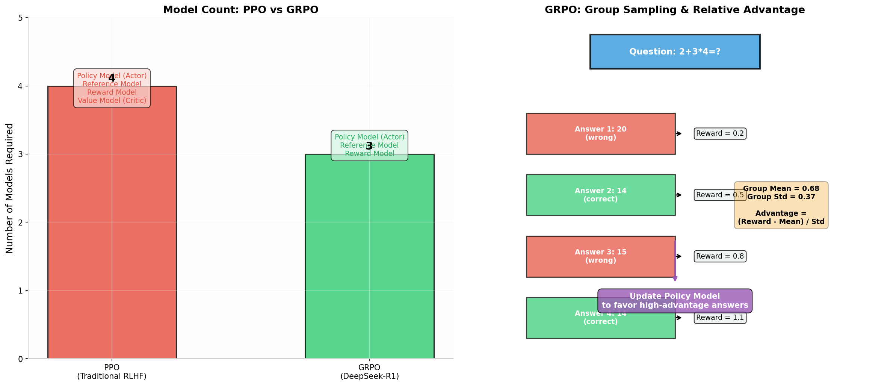

# DeepSeek-R1 面试资料大全

> 本文档整理了 DeepSeek-R1 的核心技术细节、模型架构、训练流程、算法原理及面试常见问题，帮助读者全面理解这一开源推理模型，应对算法工程师面试中的相关考察。

---

## 一、DeepSeek-R1 概述

### 1.1 什么是 DeepSeek-R1

DeepSeek-R1 是由深度求索（DeepSeek）于 **2025 年 1 月 20 日** 发布的开源推理大语言模型，在数学推理、代码生成和逻辑推理等任务上达到了与 OpenAI o1-1217 相当的表现。DeepSeek-R1 的核心突破在于**证明了仅通过大规模强化学习（RL）就能显著提升 LLM 的推理能力**，而不必依赖昂贵的监督微调（SFT）作为前置步骤。这一发现为开源社区带来了 ChatGPT 时刻级别的冲击，因为它表明高阶推理能力可以通过算法创新而非单纯堆砌算力来获得。

与 OpenAI o1 的闭源策略不同，DeepSeek-R1 采用了 **MIT 许可证** 完全开源，不仅开放了模型权重，还开源了训练方法和技术报告。基于 DeepSeek-R1，团队进一步通过**知识蒸馏**将推理能力迁移到更小规模的密集模型（1.5B 至 70B 参数），使得资源有限的研究者和开发者也能使用顶级推理能力。这种开放策略极大地推动了开源 AI 生态的发展，迫使 Meta、Google 等巨头加速开源进程，也让全球开发者首次有机会深入研究 o1 级别的推理模型内部机制。

### 1.2 DeepSeek-R1 系列模型概览

| 模型名称 | 发布时间 | 参数量 | 激活参数量 | 核心特点 |
|---|---|---|---|---|
| **DeepSeek-V3-Base** | 2024.12 | 671B | 37B | MoE 基座模型，R1 的起点 |
| **DeepSeek-R1-Zero** | 2025.01 | 671B | 37B | 纯 RL 训练，无 SFT，涌现推理能力 |
| **DeepSeek-R1** | 2025.01 | 671B | 37B | 冷启动 + 多阶段训练，最终版 |
| **R1-Distill-Qwen-1.5B** | 2025.01 | 1.5B | 1.5B | 蒸馏版，AIME 2024 达 28.9% |
| **R1-Distill-Qwen-7B** | 2025.01 | 7B | 7B | 蒸馏版，AIME 2024 达 55.5%，超越 GPT-4o |
| **R1-Distill-Qwen-14B** | 2025.01 | 14B | 14B | 蒸馏版，AIME 2024 达 69.7% |
| **R1-Distill-Qwen-32B** | 2025.01 | 32B | 32B | 蒸馏版，AIME 2024 达 72.6%，接近 o1-mini |
| **R1-Distill-Llama-8B** | 2025.01 | 8B | 8B | 基于 Llama3 架构蒸馏 |
| **R1-Distill-Llama-70B** | 2025.01 | 70B | 70B | 最大蒸馏版，综合性能最强 |

从上表可以看出，DeepSeek-R1 在**数学推理（AIME、MATH-500）和代码竞赛（Codeforces）**上已实现对 o1-1217 的超越，在通用知识（MMLU、GPQA）上略有差距。考虑到 R1 的训练成本仅为 o1 的极小一部分（估算 RL 阶段约 10 万美元），且完全开源，这一成果具有里程碑意义。

---

## 二、模型架构详解

### 2.1 Mixture of Experts (MoE) 架构

DeepSeek-R1 基于 DeepSeek-V3-Base，采用了 **Mixture of Experts（MoE，混合专家模型）** 架构。MoE 的核心思想是将一个巨大的神经网络拆分为多个"专家"子网络，每个输入 token 只需激活一小部分专家参与计算，从而在保持巨大参数量的同时控制计算成本。

**DeepSeek-V3/R1 的 MoE 配置参数：**

- **总参数量**：671B（6710 亿），是 Llama-3.1-405B 的 1.65 倍
- **激活参数量**：37B（370 亿），仅占总数量的 5.5%
- **Transformer 层数**：61 层
- **隐藏层维度**：7168
- **每层专家配置**：1 个共享专家 + 256 个路由专家
- **每 token 激活路由专家数**：8 个
- **单个专家中间维度**：2048

**为什么需要共享专家？** DeepSeek-V3 的 MoE 层包含 1 个始终激活的共享专家，这个设计源自 2022 年的 DeepSpeedMoE 研究。直觉上，共享专家负责学习通用、高频的语言模式（如语法结构、常见词组），让其他 256 个路由专家专注于更细分的领域知识。这种分工提高了专家专业化的程度，避免了所有专家都变成"通才"而导致的冗余。

**负载均衡策略**：DeepSeek-V3 采用了**无辅助损失的负载均衡（auxiliary-loss-free load balancing）**机制。传统 MoE 训练通常依赖辅助损失函数来确保各专家被均匀使用，但这会损害模型性能。DeepSeek 通过一种动态路由策略，在不引入辅助损失的情况下实现了专家间的负载均衡，这是其训练效率的关键创新之一。

### 2.2 Multi-head Latent Attention (MLA)

**MLA 是 DeepSeek-V3/R1 最具标志性的架构创新之一**，首次在 DeepSeek-V2 中提出并延续至 V3/R1。它的核心目标是解决 Transformer 推理阶段的 **KV Cache 内存瓶颈** 问题。

**KV Cache 内存问题背景**：在自回归生成中，为了避免重复计算，模型会缓存每一层的 Key（K）和 Value（V）矩阵。对于标准多头注意力（MHA），KV Cache 的内存占用为：

```
Memory = 2 × num_layers × num_heads × head_dim × sequence_length × batch_size × sizeof(dtype)
```

以 GPT-3 规模的模型（96 层、96 头、128 维 head、2048 序列长度）为例，KV Cache 可达 **3GB** 甚至更高，这严重限制了批处理大小和并发用户数。

**MLA 的解决方案**：MLA 采用了一种"压缩-解压"策略，灵感来自 LoRA（Low-Rank Adaptation）：

1. **KV 压缩**：不直接存储完整的 K 和 V，而是通过低秩投影将它们压缩到一个低维潜在空间：
   ```
   c_t = W_{DC} · h_t    (压缩到 d_c 维度，如 512)
   ```
   只缓存压缩后的向量 `c_t`，而非完整的 K/V。

2. **KV 解压**：计算注意力时，将压缩向量投影回原始维度：
   ```
   k_t = W_{UK} · c_t    (解压到 num_heads × head_dim)
   v_t = W_{UV} · c_t
   ```

3. **Query 压缩**：Query 也经过类似的压缩-解压流程，但压缩维度略高于 KV（如 1536 vs 512），因为 Query 不需要缓存，内存压力较小。

**内存节省效果**：以 DeepSeek-V3 的配置为例，缓存压缩向量（512 维）替代完整的 K/V（7168 维），内存占用降低为原来的 **1/14**，在实际部署中可实现 **4-16 倍** 的 KV Cache 压缩。

**解耦 RoPE**：MLA 的一个精妙设计是将位置编码（RoPE）与内容表示解耦。由于 RoPE 旋转矩阵是位置相关的，直接与低秩投影矩阵融合会导致位置信息丢失。因此 MLA 引入了额外的共享 Key 和 Query 向量专门承载 RoPE，主注意力计算不受影响。这种"内容-位置分离"设计确保了长序列建模能力的同时享受了低秩压缩的收益。

### 2.3 与 GQA/MQA 的对比

| 注意力机制 | 内存节省方式 | 缓存/Token (MHA=1x) | 建模质量 | 代表模型 |
|---|---|---|---|---|
| **MHA** | 无 | 1.0x | 基准 | GPT-3, LLaMA-1 |
| **MQA** | 所有头共享 1 组 KV | ~1/H (H=头数) | 明显下降 | PaLM, StarCoder |
| **GQA** | 头分组共享 KV | ~1/G (G=组数) | 轻微下降 | LLaMA-2/3, Mistral |
| **MLA** | 低秩压缩至潜空间 | ~d_c/(H×d_h) | **优于 MHA** | DeepSeek V2/V3/R1 |

DeepSeek 内部消融实验表明，**GQA 的建模质量实际上略低于 MHA**，而 MLA 在内存效率和质量上实现了双重突破。这是 DeepSeek 团队选择 MLA 而非更常见的 GQA 的关键原因。

### 2.4 Multi-Token Prediction (MTP)

除了 MLA 和 MoE，DeepSeek-V3 还引入了 **Multi-Token Prediction（多词元预测）** 训练目标。传统 LLM 训练只预测下一个 token，而 MTP 同时预测接下来的多个 token（V3 中设置预测深度 D=1，即额外预测 1 个 token）。

**MTP 的作用**：
1. **提高数据效率**：每个训练位置提供多个预测目标，相当于数据量翻倍
2. **增强表示学习**：迫使模型在隐藏层学习更具前瞻性的表示
3. **加速推理（推测解码）**：训练好的 MTP 头可用于投机解码（Speculative Decoding），在推理时预测多个 token 并并行验证，潜在加速 1.5-2 倍

**实现方式**：在模型的每一层（或顶层）添加额外的预测头，同时预测第 t+1、t+2... 个 token。损失函数是各位置预测损失的加权和。

### 2.5 无辅助损失的负载均衡

传统 MoE 训练通常使用辅助损失函数（auxiliary loss）来确保各专家被均匀使用，避免"专家坍塌"（所有 token 只路由到少数几个专家）。但辅助损失会干扰模型的主要训练目标，损害最终性能。

**DeepSeek 的解决方案**：采用**无辅助损失的负载均衡（auxiliary-loss-free load balancing）**机制。具体来说：
1. **动态偏置调整**：为每个专家引入一个可学习的偏置项（bias），在路由评分时加到对应专家的分数上
2. **负载感知的偏置更新**：根据每个专家的负载情况动态调整偏置——负载过高的专家偏置降低，负载过低的专家偏置提高
3. **无需辅助损失**：通过偏置机制天然实现负载均衡，不引入额外的损失项

消融实验表明，这种方法在保持完美负载均衡的同时，模型性能优于使用辅助损失的传统方法。这也是 DeepSeek-V3 训练效率的关键创新之一。

---

## 三、训练流程：五阶段流水线

DeepSeek-R1 的训练流程是其技术报告中最核心的部分，整个 pipeline 包含 **五个关键阶段**（2 次 SFT + 2 次 RL + 1 次数据生成），如下图所示：



### 3.1 Stage 0: 基座模型 DeepSeek-V3-Base

**DeepSeek-V3-Base 的预训练关键参数：**

| 参数 | 数值 |
|---|---|
| 训练数据量 | **14.8 万亿 tokens** |
| GPU 集群 | 2048 张 NVIDIA H800 |
| 训练时长 | 约 55 天 |
| 总 GPU 小时 | **278.8 万 H800 小时** |
| 精度格式 | FP8 混合精度 |
| 每万亿 token 耗时 | 18 万 GPU 小时 |
| 预估训练成本 | **557.6 万美元** |

V3-Base 在预训练中采用了 **FP8 混合精度**（约 80-85% 的计算使用 FP8，其余使用 BF16），这是降低训练成本的关键技术。H800 的 FP8 算力约为 4000 TFLOPS，是 BF16（~2000 TFLOPS）的两倍，充分利用 FP8 可实现接近 2 倍的训练加速。

### 3.2 Stage 1: 冷启动 SFT（Cold Start）

**核心问题**：直接从基座模型进行 RL 训练会经历一段不稳定的"冷启动"阶段，模型输出格式混乱、可读性差。

**解决方案**：收集约 **1000-2000 条高质量长 CoT（Chain-of-Thought）数据**，先对 V3-Base 进行小规模 SFT，为后续 RL 训练提供一个稳定的初始策略。

**冷启动数据的构建方式**：
- 使用 few-shot prompting + 长 CoT 示例引导模型生成详细推理过程
- 直接提示模型生成包含反思和验证的详细答案
- 收集 R1-Zero 的可读输出并进行人工后处理
- 设计统一的输出格式模板：`\|special_token\|<reasoning_process>\|special_token\|<summary>`

**冷启动的作用**：
1. **可读性**：解决 R1-Zero 的输出格式混乱、语言混合问题
2. **人类先验**：通过精心设计的 CoT 模式，将人类推理习惯注入模型
3. **收敛加速**：为 RL 提供一个高质量的初始策略，减少探索成本

### 3.3 Stage 2: 面向推理的强化学习（RL for Reasoning）

这是 DeepSeek-R1 训练流程中最核心的阶段，模型在此阶段涌现出强大的推理能力。

#### 3.3.1 GRPO 算法详解

**GRPO（Group Relative Policy Optimization，组相对策略优化）** 是 DeepSeek 在 DeepSeekMath 论文中首次提出的 RL 算法，是 PPO 的高效替代方案。

**GRPO 的核心思想**：对同一个问题采样多个回答，用**组内相对奖励**估计优势函数（Advantage），完全丢弃 PPO 中的 Value Model（Critic）。

**GRPO 的完整流程**：

```
对于每个问题 q：
  1. 从旧策略 π_θ_old 采样 G 个回答 {o_1, o_2, ..., o_G}
  2. 用奖励模型计算每个回答的奖励 {r_1, r_2, ..., r_G}
  3. 计算组内均值和标准差：
     μ = mean(r_1, ..., r_G)
     σ = std(r_1, ..., r_G)
  4. 计算每个回答的优势：
     A_i = (r_i - μ) / (σ + ε)     (ε 防止除零)
  5. 用 PPO-clip 目标更新策略模型
```

**GRPO 的目标函数**：

$$J_{GRPO}(\theta) = \mathbb{E}_{q \sim P(Q), \{o_i\} \sim \pi_{\theta_{old}}(\cdot|q)} \left[ \frac{1}{G} \sum_{i=1}^{G} \frac{1}{|o_i|} \sum_{t=1}^{|o_i|} \min\left( \frac{\pi_\theta(o_{i,t}|q,o_{i,<t})}{\pi_{\theta_{old}}(o_{i,t}|q,o_{i,<t})} A_i, \text{clip}(\cdot, 1-\epsilon, 1+\epsilon) A_i \right) - \beta \mathbb{D}_{KL}(\pi_\theta \| \pi_{ref}) \right]$$

其中：
- $A_i = \frac{r_i - \text{mean}(\{r_j\})}{\text{std}(\{r_j\})}$ 是组内标准化优势
- $\text{clip}(\cdot, 1-\epsilon, 1+\epsilon)$ 是 PPO 的裁剪机制，防止策略更新过大
- $\beta \mathbb{D}_{KL}(\pi_\theta \| \pi_{ref})$ 是 KL 散度正则项，防止策略偏离参考模型太远
- 通常取 $G=8$（每个问题采样 8 个回答）

**GRPO vs PPO 的核心区别**：

| 维度 | PPO | GRPO |
|---|---|---|
| **需要模型数** | 4 个 (Policy + Reference + Reward + Value) | 3 个 (Policy + Reference + Reward) |
| **优势估计** | 需要独立的 Value Model | 组内相对奖励标准化 |
| **显存占用** | 高（需同时加载 4 个模型） | 降低约 25% |
| **训练稳定性** | Value Model 训练困难，易崩溃 | 更稳定，无需训练 Critic |
| **推理成本** | 正常 | 每次更新需采样 G 个回答，推理成本高 |
| **适用场景** | 通用 RLHF | 数学、代码等可验证任务 |



#### 3.3.2 基于规则的奖励函数

DeepSeek-R1 不使用神经奖励模型（容易 reward hacking），而是采用**简单的规则奖励**：

| 奖励类型 | 取值 | 判断标准 |
|---|---|---|
| **Accuracy Reward** | 0 或 1 | 最终答案是否正确（数学问题用规则验证，代码问题用测试用例） |
| **Format Reward** | 0 或 0.5 | 推理过程是否放在 `<think>` 和 `</think>` 标签内 |

这种极简奖励设计的优势：
- **防 hacking**：规则奖励是确定性的，无法被模型"欺骗"
- **免维护**：无需像神经奖励模型那样持续重训练
- **可扩展**：易于扩展到新任务类型

#### 3.3.3 "Aha Moment"（顿悟时刻）

DeepSeek-R1-Zero 的训练过程中观察到了一个令人震惊的现象：在没有任何人类示范的情况下，模型自发地产生了**自我反思和自我纠正**行为。在训练的某个阶段，模型输出开始包含类似"Wait, let me reconsider"（等等，让我重新考虑）或"Actually, I made a mistake above"（实际上，我上面犯了一个错误）的自我修正语句。

这一"顿悟时刻"证明了**大规模 RL 能够让 LLM 自主发现元认知（metacognition）能力**——即思考自己的思考过程的能力。这是 R1 技术报告中最具学术价值的发现之一，因为它表明推理能力可以通过纯强化学习涌现，而不必依赖人类标注的 CoT 数据。

**Aha Moment 的典型表现**：
- 模型在得出错误中间结论后，主动回退并尝试其他路径
- 在推理过程中进行自我验证（如"Let me check if this is correct"）
- 对不同解题策略进行评估和比较

### 3.4 Stage 3: 拒绝采样与 SFT 数据生成

当 Stage 2 的 RL 训练接近收敛后，DeepSeek 使用该阶段的 checkpoint 进行**拒绝采样（Rejection Sampling）**来生成大规模 SFT 数据：

1. **推理数据（约 600K）**：对 RL checkpoint 采样大量回答，只保留正确答案对应的完整 CoT 轨迹
2. **非推理数据（约 200K）**：从 DeepSeek-V3 的写作、事实问答、自我认知等领域收集数据

这些数据共同构成下一阶段的 SFT 训练集。拒绝采样的核心思想是利用已经学会推理的模型作为"数据工厂"，自动生产高质量的 CoT 训练数据，从而避免昂贵的人工标注。

### 3.5 Stage 4: 通用 SFT（General Supervised Fine-Tuning）

使用 Stage 3 生成的约 **800K 混合数据**重新训练 DeepSeek-V3-Base：

- **推理数据（60 万条）**：包含数学、代码、逻辑推理等可验证问题的高质量 CoT
- **非推理数据（20 万条）**：涵盖写作、翻译、问答、角色扮演等通用任务

这一阶段的目的是让模型在保持强大推理能力的同时，不损失通用语言能力。如果不进行这步，模型可能会过度专注于推理任务而在日常对话中表现生硬。

### 3.6 Stage 5: 全场景 RL（RL for All Scenarios）

最后一轮 RL 训练同时考虑：
- **推理任务**：继续使用 GRPO + 规则奖励优化推理能力
- **通用任务**：使用传统的 RLHF 方法（基于人类偏好奖励模型）提升 helpfulness 和 harmlessness

这一阶段确保模型在各种场景下都能表现良好，而不仅仅是在数学和代码题上。

### 3.7 蒸馏（Distillation）：让小模型也拥有推理能力

DeepSeek-R1 的另一个重要贡献是**推理蒸馏**的实践。团队使用训练好的 R1 作为教师模型，生成了约 **80 万条 SFT 数据**（60K 推理 + 200K 非推理），用于微调小规模的密集模型（Qwen2.5 和 Llama3 系列）。

**蒸馏方式**：纯 SFT（监督微调），不需要任何 RL 训练。学生模型直接学习 R1 生成的 CoT 输出。

**蒸馏的关键发现**：
- **蒸馏效果惊人**：7B 蒸馏模型在 AIME 2024 上达到 55.5%，超越 GPT-4o（9.3%）和 Claude-3.5-Sonnet（16.0%）
- **蒸馏 > 小模型 RL**：直接在 7B 模型上做 RL 的效果远不如蒸馏 R1 的推理模式
- **大模型的推理模式是关键**：R1 发现的推理策略（如自我验证、分步分解）可以被小模型有效学习

---

## 五、训练基础设施与工程优化

### 5.1 硬件配置

| 参数 | DeepSeek-V3 (预训练) | DeepSeek-R1 (RL 阶段) |
|---|---|---|
| GPU 型号 | NVIDIA H800 (中国特供版) | NVIDIA H800 |
| GPU 数量 | 2048 张 | 2048 张 (共享集群) |
| 节点配置 | 256 节点 × 8 GPU | 动态调度 |
| 训练时长 | ~55 天 | ~22 天 (RL+SFT) |
| 总 GPU 小时 | 278.8 万 | ~90 万 |
| 显存带宽 | NVLink 400 GB/s (H100 的一半) | - |

**H800 的特殊性**：H800 是 NVIDIA 针对中国市场推出的 H100 "阉割版"，NVLink 互连带宽从 900 GB/s 降至 400 GB/s（约 44%）。DeepSeek 通过极致的算法优化和通信-计算重叠，在受限硬件上达到了与 H100 集群相当的训练效率。

### 5.2 FP8 混合精度训练

DeepSeek-V3 是**首个成功在大规模 MoE 模型上应用 FP8 训练**的工作。FP8（8 位浮点数）相比 BF16（16 位）可将矩阵乘法速度和显存占用减半，但面临精度不稳定的风险。

**DeepSeek 的 FP8 策略**：
- **分层混合精度**：Embedding 层和输出层保持 FP16/BF16，注意力计算使用 BF16，核心矩阵乘法（占 80-85%）使用 FP8
- **细粒度量化**：对激活值和权重采用不同的缩放策略，缓解 FP8 的动态范围不足问题
- **精度保持**：仅在模型的特定部分使用 FP8，关键路径保持更高精度

---

## 六、DeepSeek-R1 的局限性与挑战

### 6.1 已知局限

| 局限性 | 具体表现 | 根因 |
|---|---|---|
| **语言混合** | 非中英文查询时，模型可能用英语推理和回答 | 训练数据以中英文为主，RL 阶段多语言提示导致输出混杂 |
| **通用任务弱于 V3** | 函数调用、多轮对话、复杂角色扮演、JSON 输出等任务表现不如 DeepSeek-V3 | 多阶段训练过度优化推理能力，牺牲了部分通用能力 |
| **Prompt 敏感** | Few-shot prompting 会降低性能，需使用 Zero-shot | 长 CoT 训练使模型对示例过度拟合，干扰自主推理 |
| **软件工程任务未充分优化** | SWE-bench 上仅略优于 V3，未显著超越 | RL 评估耗时过长，未在代码生成任务上大规模应用 RL |
| **可读性与冗长** | 推理过程过于详细，输出冗长 | RL 训练未对回答长度施加足够约束 |
| **Reward Hacking 风险** | 规则奖励可能无法捕捉细微的有害内容 | 规则奖励的表达能力有限 |

### 6.2 失败尝试

技术报告中坦诚分享了以下未成功的方法：

1. **过程奖励模型（PRM）**：尝试为推理的每一步打分时，面临步骤定义困难和 reward hacking 问题
2. **蒙特卡洛树搜索（MCTS）**：搜索空间随序列长度指数增长，价值函数训练困难
3. **神经奖励模型**：在大规模 RL 中容易崩溃，需要持续重训练

---

## 七、面试常见问题与深度解析

### 7.1 基础概念题

**Q2: 为什么 DeepSeek-R1 选择 MoE 架构而不是 Dense 架构？**

> MoE 架构的核心优势是**用较少的激活参数获得较大的总参数量**。DeepSeek-V3 总参数 671B，但每次仅激活 37B（5.5%），这意味着：
> 1. **计算效率高**：推理时只计算 37B 参数，速度远快于 671B 的 dense 模型
> 2. **容量大**：总参数量大带来更强的知识存储能力
> 3. **专家专业化**：不同专家可以学习不同领域的知识，提高模型质量
> 4. **训练成本低**：MoE 的训练 FLOPs 与激活参数量成正比，而非总参数量

**Q3: MLA 相比 GQA 的优势是什么？**

> MLA（Multi-head Latent Attention）和 GQA（Grouped-Query Attention）都是降低 KV Cache 内存占用的技术，但原理不同：
> - **GQA**：减少 KV 头的数量，让多个 Query 头共享一组 KV。实现简单，但 DeepSeek 内部实验表明 GQA 的建模质量**低于标准 MHA**。
> - **MLA**：通过低秩压缩将 KV 投影到低维潜空间进行缓存，使用时再解压。实现更复杂，但 DeepSeek 实验表明 MLA 的建模质量**优于 MHA**，同时实现 4-16 倍的 KV Cache 压缩。
> 
> 本质上，GQA 是通过"减少量"来节省内存，MLA 是通过"压缩编码"来节省内存。MLA 在信息保留上更精细，因此质量损失更小甚至有所提升。

### 7.2 算法原理题

**Q4: GRPO 和 PPO 的核心区别是什么？为什么 R1 选择 GRPO？**

> **核心区别**：
> 1. **模型数量**：PPO 需要 4 个模型（Policy + Reference + Reward + Value），GRPO 只需要 3 个（去掉 Value Model）
> 2. **优势估计**：PPO 用独立的 Value Model 估计状态价值来计算 Advantage；GRPO 对同一个问题采样多个回答，用组内奖励的均值和标准差标准化来计算 Advantage
> 3. **显存占用**：GRPO 降低约 25% 的显存需求
> 4. **稳定性**：GRPO 无需训练 Value Model，避免了 Critic 训练不稳定的问题
>
> **R1 选择 GRPO 的原因**：
> - **训练成本**：对于 671B 参数的 MoE 模型，减少一个同等规模的 Value Model 意味着巨大的显存和计算节省
> - **任务特性**：数学/代码任务的奖励是确定性的（答案对或错），组内比较能有效区分回答质量
> - **可扩展性**：GRPO 天然适合可验证任务，规则奖励设计与组采样完美契合

**Q5: 解释 GRPO 中 Advantage 的计算方式和直观含义**

> GRPO 的 Advantage 计算公式为：$A_i = \frac{r_i - \text{mean}(\{r_j\})}{\text{std}(\{r_j\})}$
> 
> **直观含义**：
> - **分子** ($r_i - \text{mean}$)：当前回答的奖励相对于组内平均水平的偏差。正数表示优于平均，负数表示劣于平均。
> - **分母** ($\text{std}$)：组内奖励的离散程度。标准化后使得不同问题的 Advantage 具有可比性。
> - **最终结果**：表示当前回答在"同一问题的多个尝试"中的相对表现，是一种"内部排名"信号。
> 
> 例如，对问题"2+3×4="采样 4 个回答，奖励分别为 [0.2, 0.5, 0.8, 1.1]（0=错，1=对）：
> - mean = 0.65, std = 0.37
> - A_1 = (0.2-0.65)/0.37 = **-1.22** (远差于平均，应抑制)
> - A_4 = (1.1-0.65)/0.37 = **+1.22** (远好于平均，应鼓励)

**Q6: DeepSeek-R1 的奖励函数是如何设计的？为什么这么设计？**

> R1 使用**极简的规则奖励**，包含两部分：
> 1. **Accuracy Reward（0 或 1）**：答案正确得 1 分，错误得 0 分。数学问题通过规则验证最终答案，代码问题通过测试用例验证。
> 2. **Format Reward（0 或 0.5）**：推理过程放在 `<think>` 标签内得 0.5 分，否则 0 分。
> 
> **设计动机**：
> - **防 Reward Hacking**：神经奖励模型容易被模型"欺骗"（生成看似合理但实际错误的回答），规则奖励是确定性的，无法被 hack。
> - **免维护**：不需要像神经奖励模型那样持续收集人类偏好数据并重训练。
> - **简单可扩展**：易于扩展到新任务，只需定义新的 correctness 验证规则。

**Q7: 什么是 R1 训练中的"Aha Moment"？它有什么意义？**

> **"Aha Moment"** 指在 R1-Zero 的纯 RL 训练过程中，模型自发涌现出**自我反思和自我纠正**行为的现象。在训练的某个阶段，模型输出开始出现"Wait, let me reconsider""Actually, I made a mistake"等语句，主动回退并修正之前的错误推理。
> 
> **核心意义**：
> 1. **纯 RL 可以涌现元认知**：这是首次在大规模 LLM 中观察到，无需人类示范，模型通过试错学习就能掌握"思考自己的思考"的能力
> 2. **推理能力不是"教"出来的**：传统方法依赖人类标注的 CoT 数据教模型如何推理；R1 证明模型可以通过 RL 自主发现有效的推理策略
> 3. **对 AGI 的启示**：表明某些高阶认知能力可能是智能系统的"涌现属性"，而非必须显式编程

**Q9: MLA 在推理阶段如何实现 KV Cache 压缩？**

> MLA 的 KV Cache 压缩流程：
> 1. **压缩阶段**：对每个输入 token，计算其低维压缩表示 $c_t = W_{DC} \cdot h_t$，其中 $W_{DC}$ 是下投影矩阵，将 7168 维的隐藏状态压缩到 512 维
> 2. **缓存阶段**：只缓存压缩向量 $c_t$（512 维），而非完整的 K/V（7168 维），缓存体积减少为原来的 1/14
> 3. **解压阶段**：计算注意力时，将压缩向量投影回原始维度：$k_t = W_{UK} \cdot c_t$，$v_t = W_{UV} \cdot c_t$
> 4. **RoPE 处理**：位置编码通过额外的共享 Key 向量单独处理，与压缩内容解耦
> 
> **实际效果**：在 DeepSeek-V3 配置下，KV Cache 内存从约 14 GB 降至约 1 GB（per batch per layer），支持更长的上下文和更大的批处理。

**Q10: R1 的蒸馏为什么效果这么好？小模型直接做 RL 不行吗？**

> R1 蒸馏效果好的三个核心原因：
> 1. **数据质量压倒分布差异**：R1 生成的 80 万条数据包含极高质量的 CoT，涵盖自我验证、分步检查、错误修正等完整推理模式。即使只是模仿这些数据，小模型也能学到结构化的推理习惯。
> 2. **推理轨迹自带纠错能力**：R1 的长 CoT 不是线性推进的，而是包含"分支-验证-回溯"的完整思考过程。小模型学到的不仅是正确答案，更是"如何思考"的元策略。
> 3. **小模型的任务是学习结构而非探索**：数学推理的有效解题路径相对有限，R1 的蒸馏数据已覆盖主要路径。小模型的挑战是忠实复现这些结构化推理，而非从头发现新路径。
> 
> **小模型直接 RL 的效果差的原因**：
> - **探索空间太大**：小模型容量有限，在巨大的推理空间中难以有效探索
> - **奖励稀疏**：复杂问题的正确回答概率低，小模型很难获得足够的正反馈信号
> - **缺乏先验**：没有高质量冷启动数据，小模型在 RL 初期只能随机探索，收敛极慢

### 7.4 开放思考题

**Q11: 为什么 DeepSeek-R1 在 Few-shot 设置下表现反而下降？**

> 这与 R1 的训练方式密切相关：
> 1. **长 CoT 训练的副作用**：R1 经过大量长链思维训练，学会了自主分解问题、自我验证。提供 few-shot 示例会干扰这一自主流程，模型倾向于模仿示例的表面模式而非运用自身的推理能力。
> 2. **示例质量不匹配**：如果 few-shot 示例的推理质量低于 R1 自身水平，模型会被"拉低"到示例的水平。
> 3. **格式干扰**：示例可能使用不同的推理格式，导致模型输出混乱。
> 
> **最佳实践**：对 R1 使用 **Zero-shot** 设置，直接描述问题并指定输出格式（如"请把你的推理过程放在 `<think>` 标签内，最终答案放在 `<answer>` 标签内"）。

**Q14: 多阶段训练中为什么要在 RL 之后再次进行 SFT（Stage 4）？**

> 这是一个关键的设计决策。Stage 2 的 RL 训练专注于提升推理能力，但会导致模型在非推理任务上表现下降（如创意写作、开放域问答）。Stage 4 的通用 SFT 有两个核心作用：
> 1. **能力恢复**：通过混合非推理数据（写作、翻译、QA 等），恢复模型的通用语言能力
> 2. **质量提升**：Stage 3 通过拒绝采样生成了大量高质量的推理数据（600K），结合通用数据（200K）进行 SFT，可以进一步提升推理输出的质量和可读性
> 
> 这种"RL 专注优化 → SFT 恢复通用性"的交替策略，确保了最终模型既有强大的推理能力，又不失通用性。

**Q15: 拒绝采样（Rejection Sampling）在 R1 训练中扮演什么角色？**

> 拒绝采样是连接 Stage 2（推理 RL）和 Stage 4（通用 SFT）的关键桥梁：
> 1. **数据生成**：使用 Stage 2 训练好的 RL checkpoint 对大量推理问题进行采样，只保留奖励为 1（答案正确）的完整 CoT 轨迹
> 2. **质量筛选**：天然地过滤掉错误推理路径，只保留"成功路径"作为训练数据
> 3. **规模扩展**：通过自动化的方式生成约 60 万条高质量推理数据，避免了昂贵的人工标注
> 4. **推理模式固化**：将这些高质量的推理轨迹作为 SFT 数据，让模型学习并固化有效的推理模式
> 
> 拒绝采样的本质是"让已经学会推理的模型当老师，为自己生产训练数据"，这是一种自举（bootstrapping）策略。

**Q17: R1 的冷启动数据大约有多少条？为什么只需要这么少？**

> R1 的冷启动数据量约为 **1000-2000 条**高质量长 CoT 示例。这个数量看似很少，但足够有效的原因在于：
> 1. **质量极高**：每条数据都经过精心设计和人工审核，包含完整的推理结构（问题分析、分步推导、验证、总结）
> 2. **模式传递**：冷启动的目的不是"教会模型所有知识"，而是"展示理想的输出格式和推理模式"。模型通过少量示例学会"如何组织推理过程"，具体知识通过后续 RL 自行探索
> 3. **RL 的放大效应**：冷启动后，RL 训练会进行数百万次交互，将冷启动中学到的模式放大和泛化到各种问题
> 4. **避免过拟合**：少量数据 SFT 不会导致模型过度拟合到特定模式，保留了后续 RL 探索的空间
> 
> 这也印证了一个重要原则：在 RL 训练中，**数据质量远大于数据数量**。

---

> **免责声明**：本文档基于公开技术报告、论文和社区分析整理，部分内部细节（如确切的数据量、超参数）可能未完全公开，仅供参考学习之用。
