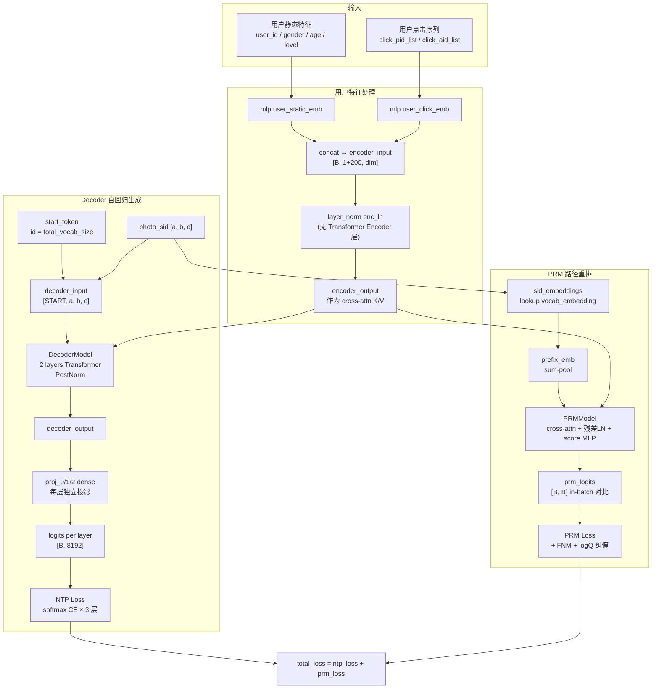

# Kaiworks Explore SID Transformer (Decoder-Only) + PRM

> 生成式召回模型：基于 **Decoder-Only Transformer + PRM（Path Rerank Model）** 的用户兴趣 → SID 生成框架。
> 用户侧输入用户静态特征 + 点击行为序列，模型自回归生成 3 层语义 ID（SID）作为召回目标。

---

## 一、框架概述

### 1.1 核心思想

本模型是一个**生成式召回模型**，将"给用户推荐内容"建模为"给定用户兴趣，生成对应内容的语义 ID 序列"：

- **输入**：用户静态特征（`user_id` / `gender` / `age_segment` / `level`）+ 用户行为序列（`click_pid_list` / `click_aid_list`）
- **输出**：3 层语义 ID（SID）序列 `[a, b, c]`，每层词表大小 8192，对应一个具体视频
- **召回**：用生成的 SID 序列去 ANN 索引中召回对应视频

与传统双塔召回相比：
- **双塔**：user 塔 ↔ item 塔，对每个候选 item 计算点积，**无法生成新内容**，召回空间受候选集限制
- **本模型**：直接**生成**用户可能感兴趣的 SID 序列，**可生成训练集中未出现过的组合**，召回空间为词表的笛卡尔积

### 1.2 架构特点

- **Decoder-Only**：去掉 Transformer Encoder 层，用户特征经 LayerNorm 后直接作为 cross-attention 的 K/V，仅用 Decoder 自回归生成 SID
- **PRM 路径重排**：在 NTP loss 之外，引入路径级对比学习 loss，用 in-batch 负采样训练路径评分器，推理时做 beam 剪枝
- **训练 / 推理一致**：dense 参数（PRM / proj）创建顺序在训练图和推理图中保持一致，避免线上 dense bin 加载错位

### 1.3 架构图



---

## 二、核心架构

### 2.1 模型结构（Decoder-Only）

模型主体在 `model.py` 的 `MultiInterestModel`，核心组件：

| 组件 | 实现 | 说明 |
|---|---|---|
| 用户特征处理 | `mlp('user_static_emb')` / `mlp('user_click_emb')` | 静态特征拼到 1 个 token；点击序列展开为 `max_len=200` 长度的序列 |
| "Encoder" | `layer_norm(encoder_input, scope="enc_ln")` | **仅 LayerNorm，无 Transformer Encoder 层**——这就是 "decoder-only" 的含义 |
| Decoder | `DecoderModel(num_layers=2, dim=self._dim, num_heads=8)` | 2 层 Transformer Decoder，PostNorm，每层含 self-attn + cross-attn + FFN |
| 输出投影 | `tf.layers.dense(last_h, V, name='pred')` 每层一个 | 将 decoder 输出映射到对应层词表大小（8192）的 logits |
| PRM | `PRMModel(dim=self._dim, num_heads=8)` | 路径级打分模型，详见 [2.3](#23-prmpath-rerank-model) |

关键超参（`MultiInterestModel.__init__`）：

- `dim=256`：模型隐藏维度
- `vocab_sizes=[8192, 8192, 8192]`：3 层 SID 词表大小
- `total_vocab_size = 24576`：统一词表大小（用于 SID embedding lookup）
- `num_heads=8`：多头注意力头数
- `max_len=200`：点击序列最大长度（`encoder_input` 总长 = `1 + 200 = 201`）

### 2.2 SID 表示

**3 层语义 ID**：每个视频对应一个 64 位整数 `photo_semantic_id_int`，按位拆分为 3 层（实现见 `util.py`）：

- `a`：右移 30 位 + `0x7FFF` 掩码 → `[0, 8192)`，对应第 0 层词表
- `b`：右移 15 位 + `0x7FFF` 掩码 → `[0, 8192)`，映射到 `[8192, 16384)`（加 `vocab_size[0]` offset）
- `c`：直接 + `0x7FFF` 掩码 → `[0, 8192)`，映射到 `[16384, 24576)`（加 `vocab_size[0] + vocab_size[1]` offset）

两个关键函数：
- `processInput(photo_semantic_id_int)`：拆分并映射到统一词表 ID，作为 decoder 输入
- `processLabel(photo_semantic_id_int)`：拆分但不映射偏移，作为每层预测的局部 label

**统一词表 embedding**（`MultiInterestModel.__init__`）：
- `self._vocab_embedding`：shape `[total_vocab_size + 1, dim] = [24577, 256]`
- 第 0 层用 `[0, 8192)`，第 1 层用 `[8192, 16384)`，第 2 层用 `[16384, 24576)`
- `<START>` token 用 ID = `total_vocab_size = 24576`

### 2.3 PRM（Path Rerank Model）

PRM 在路径级别对 `(用户, SID路径)` 进行打分，训练时与 NTP loss 联合优化，推理时做 beam 剪枝。

**路径表示（sum-pool）**：
```python
prefix_emb = sid_embeddings[:, :step+1, :]     # [B, step+1, dim]
target_embedding = tf.reduce_sum(prefix_emb, axis=1)  # [B, dim]
```
- 每层 SID 通过全局 offset 位于互不相交的区间，sum 天然保留位置信息、无合法路径碰撞
- 无参数投影层，梯度经 `reduce_sum` → `embedding_lookup` 回传至 `_vocab_embedding`

**PRM 结构**（`modulesV2.py` `PRMModel`）：
1. cross-attention：`target_embedding` 作 Q，`encoder_output` 作 K/V
2. 残差 + LayerNorm（PostNorm）：`target_attn = LayerNorm(target_emb + cross_attn(target_emb, encoder_output))`
3. score MLP：`mlp("target_score", target_attn, [dim, dim//2, dim//8], 1)` 输出标量分数

**训练 loss**（`model.py` `model()` step 循环）：
- in-batch 负采样：batch 内 B 个 target 两两配对，得到 `[B, B]` logits 矩阵，对角线为正样本
- **False Negative Mask (FNM)**：同路径 `(i, j)` 设为 `-1e9`，避免对比信号污染
- **logQ 纠偏**：减去 `log(freq_j / B)`，修正 in-batch 负采样的 popularity bias（WSDM 2019）
- loss = `sparse_softmax_cross_entropy_with_logits(labels=diag, logits=prm_logits / temperature)`

### 2.4 训练 / 推理图 dense 参数顺序

训练图中 PRM 参数先于 `proj_0` 创建。推理图也保持同样的 dense 参数创建顺序，避免线上 dense bin 按顺序加载时把投影层和 PRM 层权重错位。

通过 `test_model_flop.py` 的 `dump_prm_variable_order(graph, tag)` 打印图中所有 `prm_model/*` 变量的名字、shape 和顺序，用于训练/推理图对比验证。

---

## 三、训练流程

### 3.1 输入

| 字段 | 来源 | 用途 |
|---|---|---|
| `user_info__id` / `user_gender` / `user_age_segment` / `user_level` | dense | 用户静态特征 |
| `user_profile_v1_click_pid_list` / `user_profile_v1_click_aid_list` | sparse（序列） | 用户点击行为序列（`max_len=200`） |
| `photo_semantic_id` | dense int64 | 视频语义 ID，拆分为 3 层 SID 作为 decoder 输入和 label |
| `context_info__playing_time` | dense int64 | 播放时长，用于 loss 加权和正样本过滤 |
| `photo_info__duration_ms` | dense int64 | 视频时长，用于正样本过滤分档 |

### 3.2 正样本过滤（`filter_mask_wrapper`）

按视频时长分档设置播放时长阈值（全部绝对阈值）：

| Duration 分档 | 播放时长阈值 |
|---|---|
| `< 40s` | `≥ 27s` |
| `40s ~ 80s` | `≥ 50s` |
| `80s ~ 120s` | `≥ 60s` |
| `≥ 120s` | `≥ 70s` |

不满足阈值的样本被过滤掉（`mask = tf.less(action_cnt, 1)`），不参与训练。

### 3.3 Loss 组成

**总 loss = NTP loss + PRM loss**

1. **NTP Loss（每层 SID 预测）**：
   - decoder 输入：`[<START>, sid_a, sid_b, sid_c]`（teacher forcing）
   - 每层独立计算 `softmax_cross_entropy_with_logits`
   - 3 层 loss 求和后按 `loss_mask` 加权平均

2. **PRM Loss（路径级对比学习）**：
   - 每层独立计算（3 个 step）
   - in-batch 负采样 + FNM + logQ 纠偏
   - 3 个 step 的 loss 求和后按 `loss_mask` 加权平均

3. **Loss 加权**：
   - `weight = lg(2 + playing_time/1000)`，长播放样本权重更高
   - 仅对有效样本（`photo_semantic_id_int > 0`）计算 loss

### 3.4 优化器（Kai v2.0）

```python
sparse_optimizer = config.optimizer.Adam(0.0001)  # 稀疏参数（embedding）
dense_optimizer = config.optimizer.Adam(0.0001)   # 稠密参数（decoder / PRM / proj）
sparse_optimizer.minimize(loss, var_list=sparse_var_list)
dense_optimizer.minimize(loss, var_list=dense_var_list)
```

---

## 四、推理流程

### 4.1 Beam Search + PRM 剪枝（`beam_search_fast`）

**核心策略**：PRM 只决定去留，不决定先后。最终排序按 decoder 累积概率降序。

逐层解码（3 个 step，对应 3 层 SID）：

**Step 0（第 1 层 SID）**：
- decoder 从 `<START>` 出发，直接 top_k 选 `beam_size=512` 个候选
- **不做 PRM 打分**（无路径前缀，PRM 无意义）

**Step ≥ 1（第 2、3 层 SID）**：
1. decoder 每 beam 扩展 `beam_size` 条路径，全局选 top-`beam_size*2` 送 PRM
2. 候选 prefix 按 sum-pool 构造 PRM target embedding
3. PRM 打分 → top-`beam_size` 留下（`tf.sort` 保持原 decoder 概率序）
4. 留下的 beam 继承其原本的 decoder 累积 log 概率

**最终输出**：
- `gen_part_loc`：shape `[B, beam_size, 3]`，3 层局部 SID 序列
- `probs`：shape `[B, beam_size]`，每条路径的 decoder 累积概率（已排序）

### 4.2 KV Cache 优化

**self-attention KV cache**：
- 每层 decoder 维护 `k_self_{layer_id}` / `v_self_{layer_id}`
- 形状 `[B, beam, H, T, Dh]`，T 随解码步数增长
- 每步只算当前 token 的 q/k/v，与历史 cache concat

**cross-attention KV cache**：
- 第 1 步计算一次 `k_enc_{layer_id}` / `v_enc_{layer_id}`，shape `[B, 1, H, L_enc, Dh]`
- 后续每步用 `broadcast_to` 惰性扩展到 `cur_beam`，不物化大张量

**PRM K/V cache**：
- `build_encoder_cache(enc_out_base)` 一次，得到 `[B, 1, H, L_enc, Dh]` 缓存
- 每步 `forward_with_encoder_cache` 用 `broadcast_to` 惰性扩展
- PRM K/V 持久缓存从 ~420 MB 降到 ~206 KB

### 4.3 Beam Search 诊断指标

在 `beam_search_fast` 的 `step>=1` 分支通过 `tf.print` 输出：

| 指标 | 含义 | 健康范围 |
|---|---|---|
| `beam_diag/parent_entropy_step1/2` | 候选池中父 beam 分布信息熵 | 接近 `log(512)≈6.24` 为好；`<1` 说明退化 |
| `beam_diag/prm_entropy_step1/2` | PRM logits softmax 后信息熵 | 理想范围 `2~4` |
| `beam_diag/prm_top1_parent_ratio_step1/2` | PRM 保留 beam 中来自同一父 beam 的最大占比 | 越低越好；`>0.5` 说明严重退化 |

---

## 五、文件结构

```
.
├── kai_v2_model.py            # 框架入口：特征配置、训练/推理图构建、优化器
├── model.py                   # MultiInterestModel 核心模型（model / beam_search_fast / beam_search_fast_no_prm）
├── modulesV2.py               # DecoderLayer / DecoderModel / PRMModel + 多头注意力
├── modules_.py                # 工具函数：mlp / recall_at_k / print_tensor / sampled_softmax_loss
├── feature_attr_extract.py    # 特征配置：all_feats / Attr 类 / 共享 & 复制 embedding
├── feature_pool.json          # 特征池元信息（slot、dim 等）
├── util.py                    # processInput / processLabel（SID 拆分解码）
├── gen_infer.sh               # 推理配置生成脚本
├── test_model.py              # 模型基础测试
├── test_model_flop.py         # FLOPs / 参数量统计 + PRM 变量顺序对比
├── test_model_time.py         # 推理耗时测试
├── demo_logic.py              # 路径队列负采样逻辑验证（纯 TF）
├── demo_kai_v2.py             # 路径队列负采样 Kai v2 集成验证
├── readme.md                  # 本文件
└── uni_retr_server_local_ann/ # 推理服务部署
    ├── dsl.py / dsl_gpu*.py       # 推理 DSL（Dragonfly）
    └── predict/conf_gpu/          # GPU 推理配置（graph.pb / dnn_model.yaml / parameter_config.json）
```

---

## 六、运行方式

### 6.1 训练

```bash
# Kai v2.0 训练
python kai_v2_model.py --mode train --with_kai_v2 True

# Kai v2.0 dryrun（不执行实际训练）
python kai_v2_model.py --mode train --with_kai_v2 True --dryrun True

# MIO 框架训练
python kai_v2_model.py --mode train --with_kai_v2 False
```

### 6.2 推理

```bash
# Kai v2.0 推理
python kai_v2_model.py --mode predict --with_kai_v2 True

# 生成推理配置（通过 gen_infer.sh）
sh gen_infer.sh
```

### 6.3 测试 & Profiling

```bash
# 模型基础测试
python test_model.py

# FLOPs / 参数量统计 + PRM 变量顺序对比
python test_model_flop.py

# 推理耗时测试
python test_model_time.py
```

---

# 调优记录

> 以下为历次调优改动记录，按时间倒序排列。

## 正样本定义 & Loss 加权优化（2026-07-30）

### 1. 正样本过滤逻辑 (`filter_mask_wrapper`)

**旧逻辑**：基于「播放深度 + 显式互动」组合判断，短视频需完播+互动，长视频任一即可。

**新逻辑**：按视频时长(duration)分档设置播放时长阈值，全部使用绝对阈值：

| Duration 分档 | 播放时长阈值 | 设计意图 |
|---|---|---|
| `< 40s` | `≥ 27s` | 中短视频，需看27s以上 |
| `40s ~ 80s` | `≥ 50s` | 中等视频，需看50s以上 |
| `80s ~ 120s` | `≥ 60s` | 较长视频，需看60s以上 |
| `≥ 120s` | `≥ 70s` | 长视频绝对阈值，看70s已是强正向信号 |

**设计考量**：
- 全部使用绝对阈值，逻辑简洁且避免比例阈值在短视频上的"完播=正向"噪声（短视频完播可能只是放着自动放完）
- `<20s` 短视频需播放满20s才能进入训练，过滤掉"自动播放完但没真看"的噪声，同时保留真正观看短视频的用户兴趣信号
- 关于 per-user 个性化 p80：训练框架中序列特征只有 embedding 形式，无法反查每个历史视频的 playing_time；`photo_emp_watch_time` 是视频级全局均值非个性化值，因此当前使用分档固定阈值。若未来要实现 per-user p80，需在数据生产侧预计算并作为新 user-level dense 特征注入

### 2. Loss 加权逻辑 (`model.model()`)

**旧逻辑**：按 `duration_ms` 加权，`weight = lg(2 + duration_ms/1000)`，长视频权重更高。

**新逻辑**：按 `playing_time` 加权，`weight = lg(2 + playing_time/1000)`，长播放样本权重更高。

| playing_time | weight |
|---|---|
| 5s | lg(7) ≈ 0.85 |
| 20s | lg(22) ≈ 1.34 |
| 85s | lg(87) ≈ 1.94 |
| 300s | lg(302) ≈ 2.48 |

**关键区别**：旧方案下，120s 视频即使用户只看了 5s，权重也高达 2.09；新方案下同一样本权重仅 0.85，更准确反映"播放越久=越正向"。

监控统计（基于 `playing_time`，在 `model.model()` 内通过 `print_tensor` 输出）：

| 指标 | 含义 |
|---|---|
| `loss_mask_max` | 加权后 loss_mask 的最大值 |
| `loss_mask_valid_ratio` | 有效样本（`photo_semantic_id_int > 0`）占比 |
| `loss_mask_valid_mean` | 仅对有效样本求 loss_mask 均值（真正权重分布） |
| `play_short_ratio` / `play_long_ratio` | 有效样本中播放时长 ≤17s / >17s 的比例（两者之和≈1.0） |
| `play_ratio_sum` | 短/长播放比例之和，用于交叉验证 |
| `avg_playing_time` | 有效样本的平均播放时长（毫秒） |

### 3. 修改的文件

- **`kai_v2_model.py`**：`filter_mask_wrapper` 中的 `mask_fn`（正样本过滤）；训练模式下获取 `playing_time` 并传入 `model.model()`
- **`model.py`**：`model()` 函数签名新增 `playing_time` 参数（`duration_ms` 形参已移除）；loss 加权从 `duration_ms` 改为 `playing_time`；监控统计（短/长播放比例、平均播放时长等）全部基于 `playing_time`

---

## PRM 模块优化：残差+LN（先改回来了 否则无法训练） / False Negative Mask / K/V 投影优化 / 诊断指标（2026-07-30）

### 1. PRM 残差连接 + LayerNorm

**旧逻辑**：PRM 的 cross-attention 输出直接送入 score MLP，无残差连接、无归一化。

**新逻辑**：在 cross-attention 输出上加残差连接和 LayerNorm（PostNorm 形式）：

```
target_attn = cross_attn(target_emb, encoder_output)
target_attn = LayerNorm(target_emb + target_attn)   # 残差 + LN (PostNorm)
score = MLP(target_attn)
```

- **`modulesV2.py`**：`PRMModel.forward()` 和 `PRMModel.forward_with_kv()` 均加入残差连接 + LayerNorm（PostNorm）
- **`modulesV2.py`**：`PRMModel.build_variables()` 中 `ln_vars("cross_attn_ln", self.dim)` 已恢复

### 2. False Negative Mask（FNM）

**问题**：in-batch 负采样下，batch 内同路径的不同样本对 (i, j) 被当作负样本，但它们实际上是正样本（共享相同路径前缀），导致对比学习信号被污染。

**修复**：

1. 提前计算 `path_hash`（多项式哈希，与 logQ 复用同一份 hash，无额外开销）
2. 构造 `same_path` 矩阵 `[B, B]`，标记 batch 内同路径的所有 (i, j) 对
3. 去掉对角线（对角线是正样本，必须保留），得到 `false_neg_mask`
4. 将 false negative 位置的 logit 设为 `-1e9`，令其对 softmax 无贡献
5. logQ 纠偏在 mask 之后继续执行，已屏蔽位置（-1e9）减去 logQ 后仍极小，不影响 softmax

**新增监控指标**：

| 指标 | 含义 | 健康范围 |
|---|---|---|
| `prm/valid_neg_count_0/1/2` | 每行 mask 后剩余的真负样本数（均值） | 越接近 B-1=127 越好；若长期低于 50，需考虑调整数据采样策略 |

**改动位置**：`model.py` `model()` 方法的 PRM loss 循环内（`for step in range(len(self._vocab_sizes))` 循环）

### 3. K/V 投影优化：先投影再 tile

**旧逻辑**：先 tile `encoder_output` 到 `[B², L, dim]`（训练）或 `[B×cand, L, dim]`（推理），再对每个副本做 w_k/w_v 投影，同一份 encoder_output 的 K/V 投影被重复执行 B 次（训练）/ cand 次（推理），是 PRM FLOPs 的绝对大头。

**新逻辑**：
1. 对 `encoder_output [B, L, dim]` 做一次 w_k/w_v 投影，得到 `prm_K/prm_V [B, H, L, Dh]`
2. 再 tile 到 `[B², H, L, Dh]`（训练）或 `[B×cand, H, L, Dh]`（推理）

**关键点**：tile 和 src_mask 的构建都在循环外只做一次，避免 Python 静态展开后重复创建相同的 TF op。

**涉及新增函数**：

| 函数 | 文件 | 说明 |
|---|---|---|
| `multi_head_attention_with_kv` | `modulesV2.py` | 与 `multi_head_attention` 一致，但跳过 w_k/w_v 投影，直接用传入的 K_pre/V_pre（已 split_heads） |
| `PRMModel.project_kv` | `modulesV2.py` | 调用 `build_variables()` 固定 dense bin 顺序，再用 w_k/w_v（reuse）投影并 split_heads，返回 `[B, H, L, Dh]` |
| `PRMModel.forward_with_kv` | `modulesV2.py` | Q 在内部用 w_q 算，K/V 用传入值，其余与 forward 一致 |

**训练侧改动**（`model.py` `model()` 方法）：
- step 循环前调 `project_kv(encoder_output)` 一次，得到 `prm_K/prm_V`
- step 循环前统一 tile K/V 和 src_mask 到 `[B², H, L, Dh]`，循环内直接复用
- 循环内调 `forward_with_kv` 替代原 `forward`，删除原 `pair_encoder_output` 的 tile

**推理侧改动**（`model.py` `beam_search_fast()` 方法）：
- `step==0` 时调 `build_encoder_cache(enc_out_base)` 一次，得到 `[B, 1, H, L_enc, Dh]` 缓存
- `step>=1` 时调 `forward_with_encoder_cache`，内部用 `broadcast_to` 惰性扩展到 `cur_beam`，不物化大张量
- 与 `filter_infer_copy` 推理优化版对齐，PRM K/V 持久缓存从 ~420 MB 降到 ~206 KB

### 4. Beam Search 诊断指标

在 `beam_search_fast` 的 `step>=1` 分支（PRM 打分之后）通过 `tf.print` 输出以下指标，不影响推理逻辑：

| 指标 | 含义 | 计算方式 | 健康范围 |
|---|---|---|---|
| `beam_diag/parent_entropy_step1/2` | PRM 候选池中父 beam 分布的信息熵 | -sum(p_parent * log(p_parent)) | 接近 log(beam_size)=log(512)≈6.24 为好；<1 说明候选来自少数父 beam（退化） |
| `beam_diag/prm_entropy_step1/2` | PRM logits 经 softmax 后的信息熵 | -sum(prm_prob * log(prm_prob)) | 接近 log(cand_size) 说明 PRM 无法区分候选；理想范围 2~4 |
| `beam_diag/prm_top1_parent_ratio_step1/2` | PRM 保留的 beam_size 条路径中，来自同一父 beam 的最大占比 | max(parent_count) / beam_size | 越低越好；>0.5 说明超半数最终 beam 来自 1 个父 beam（严重退化） |

### 5. 训练/推理图 PRM 变量顺序对比

**新增函数**（`test_model_flop.py`）：`dump_prm_variable_order(graph, tag)` 打印图中所有 `prm_model/*` 变量的名字、shape 和顺序。

- 训练图 session 末尾调用 `dump_prm_variable_order(g_train, tag="train")`
- 推理图 session 末尾调用 `dump_prm_variable_order(g_infer, tag="infer")`
- 用于验证训练/推理两侧 PRM 变量创建顺序是否一致，避免线上 dense bin 加载时权重错位

### 6. 修改的文件

| 文件 | 改动位置 | 改动说明 |
|---|---|---|
| `modulesV2.py` | L73-118 新增函数 | `multi_head_attention_with_kv`：跳过 w_k/w_v 投影，直接用传入的 K_pre/V_pre |
| `modulesV2.py` | L421-443 `PRMModel.project_kv` | 内部先调 `build_variables()` 固定 dense bin 顺序，再用 w_k/w_v 投影并 split_heads |
| `modulesV2.py` | L445-469 `PRMModel.forward_with_kv` | Q 在内部用 w_q 算，K/V 用传入值，含残差 + LayerNorm（PostNorm） |
| `modulesV2.py` | L471-494 新增 `PRMModel.build_encoder_cache` | 推理专用：投影一次返回 `[B, 1, H, L_enc, Dh]` 缓存，后续 `broadcast_to` 惰性扩展 |
| `modulesV2.py` | L496-545 新增 `PRMModel.forward_with_encoder_cache` | 推理专用：K/V 从缓存 `broadcast_to` 获取，复用 `scaled_attention`，含残差 + LayerNorm（PostNorm） |
| `modulesV2.py` | L471-491 `PRMModel.forward` | 原函数也加入残差 + LayerNorm（PostNorm） |
| `modulesV2.py` | L392-419 `PRMModel.build_variables` | 新增 `ln_vars("cross_attn_ln", self.dim)`，已恢复 |
| `model.py` | `model()` L227-240 | step 循环前调 `project_kv` 一次；K/V 和 src_mask 统一在循环外 tile |
| `model.py` | `model()` L242-300 step 循环内 | 提前计算 path_hash → 构造 FNM → `forward_with_kv` → FNM 屏蔽 → logQ 纠偏 → 新增 `prm/valid_neg_count` 监控 |
| `model.py` | `beam_search_fast()` L495-499 | step==0 调 `build_encoder_cache` 一次，得到 `[B, 1, H, L, Dh]` 缓存（不物化大张量） |
| `model.py` | `beam_search_fast()` L534-584 step>=1 | 调 `forward_with_encoder_cache`，`broadcast_to` 惰性扩展 K/V 到 `cur_beam`；新增 beam 诊断指标（`tf.print`） |
| `test_model_flop.py` | L73-85 新增函数 | `dump_prm_variable_order` 打印 prm_model/* 变量顺序 |
| `test_model_flop.py` | L197 / L240 | 训练图/推理图 session 末尾各调用一次 |
