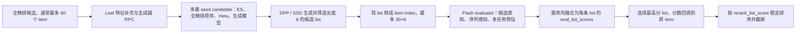

# 双列推荐重排技术介绍——以内流 Fountain 场景为例

> 文档范围：本文聚焦双列推荐内流的在线重排链路，按照“Leaf 编排 → 生成器产生候选序列 → Flash 评估器选择最优序列 → 分数回填并排序”的顺序展开。
>
> 代码快照：2026-08-16。本说明基于以下目录中的静态代码整理：
>
> - Leaf 链路：`/Users/jht/Downloads/explore-dragon/leaf/fountain/rerank/`
> - 生成器：`/Users/jht/Downloads/kuiba_to_kai/rerank/generator/`
> - Flash 评估器：`/Users/jht/Downloads/kuiba_to_kai/rerank/evaluator/fountain_rerank_flash_eval/`

## 0. 一页摘要

双列推荐重排不是对每个 item 再做一次独立打分，而是在全精排结果之上，以“一屏 6 个 item”为基本决策单元，先构造多条长度为 6 的候选序列，再比较整条序列的预期收益，最后把胜出序列的 list score 回填给原始 item，驱动最终排序。



链路中三个角色的边界如下：

| 角色 | 输入 | 核心职责 | 输出 |
|---|---|---|---|
| Leaf 编排 | 全精排 item、用户画像、AB 参数 | 调 RPC、构造多路候选、做 DPP/SSD、多列表管理、最终回填排序 | 最终 item 序列与 `virtual_rerank_score` |
| 生成器 | 用户、候选 item、精排/级联分 | 为 item 预测位置匹配分或直接给出序列偏好 | `rerank_gen_score`，Leaf 侧按通道重命名 |
| Flash 评估器 | 原始候选集、候选 list 的扁平 index、用户与 item 特征 | 一次请求批量计算所有候选 list 的序列收益并完成融分 | `eval_list_scores` |

一个关键点是：生成器负责提高候选空间质量，评估器负责在统一目标下比较候选序列。生成器不是最终裁判；ES、Hetu、原序和生成模型产出的序列都需要经过同一个评估阶段。

---

## 1. 整体重排 Leaf 链路

### 1.1 入口与总控

内流入口是 `rerank_fast_v1_flow.py` 中的 `RerankFastV1Flow`：

1. 进入 `rerank_fast_v1` namespace，读取 `get_rerank_v3_ab_params()` 中声明的 AB 参数。
2. 仅当 `enable_use_fountain_rerank == 1` 时进入重排主链路。
3. 调用 `rerank_v3()` 完成生成、评估和排序。
4. 将 `rerank_list_score` 复制成 `virtual_rerank_score`，供下游及 Kafka 采样使用。
5. 可选执行级联蒸馏样本与全链路蒸馏样本构造。
6. 按 `request_num` 截断，记录耗时、分布、来源等指标。

`rerank_v3()` 的固定执行顺序是：

```text
rerank_predict
  → rerank_get_embedding
  → rerank_gen_item_attr
  → rerank_gen_candidate_list
  → rerank_gen_list
  → rerank_list_predict
  → sort(score = rerank_list_score, stable_sort = true)
  → rerank_gen_reason_metrics
```

这里先调用生成器、后取 DPP 所需 embedding。二者互不依赖：生成器 RPC 使用用户/候选特征产生 item 分数，DPP/SSD 后续才使用 MMU、MC 或 Hetu embedding 计算序列多样性。

### 1.2 Step 1：生成器多路接入

`rerank_predict()` 提供五个独立 AB 开关，允许同时启用多种生成模型：

| Leaf 逻辑通道 | 开关 | RPC 输出在 Leaf 中的落地属性 |
|---|---|---|
| 通用生成器 | `fountain_rerank_enable_gen_model_beam` | `rerank_gen_score_list` |
| NAR 生成器 | `fountain_rerank_enable_gen_model_nar_beam` | `rerank_gen_nar_score_list` |
| AR 生成器 | `fountain_rerank_enable_gen_model_ar_beam` | `rerank_gen_ar_score_list` |
| RankMixer 生成器 | `fountain_rerank_enable_gen_model_rankmixer` | `rerank_gen_rankmixer_score_list` |
| AR PinRec 生成器 | `fountain_rerank_enable_gen_model_ar_pinrec` | `rerank_gen_ar_pinrec_score_list` |

五路 RPC 均通过 `delegate_enrich` 发起，超时为 50 ms，默认 `partition_size=60`、`request_type=kai_predict`。生成器收到的主要数据包括：

- 用户侧：活跃度、年龄/性别/城市、用户等级、实时 click/like/follow/forward、长短期用户行为序列等；
- item 侧：级联预估分、全精排各目标预估分、`fullrank_act_wtd`、相关性分及部分 LTR 分；
- 上下文侧：source pid/aid、source Hetu tag、source duration/tag 等。

Leaf 先通过 `explore_custom_trim_user_info` 从完整 `userInfo` 中裁剪模型真正需要的字段，保存为 `rerank_deep_ltr_trimmed_user_info`，再与 item/common attrs 一起发送。这一设计减少了 RPC 载荷，也让线上特征契约集中在 `rerank_base.py` 的三个列表中维护。

### 1.3 Step 2：补充 embedding 与 item 派生特征

`rerank_get_embedding()` 获取三类基础表示：

- `rerank_mc_emb`：128 维，来自 `grpc_hotMcEmbed`；
- `rerank_mmu_emb`：64 维，来自 `grpc_hotRerankMmuEmbServerV3`；
- `user_sid` / `photo_sid` / `author_sid`：来自 `explore_reco_user_pid_author_sid_v1`。

此外，可通过 AB 开启 128 维 `rerank_hetu_emb`，并在两个 Hetu embedding 服务间切换。后续 DPP 与 list 选择均可选择使用 Hetu embedding，否则使用 MMU embedding。

`rerank_gen_item_attr()` 主要生成三类派生特征：

1. 保存原始 `item_seq`，作为候选 item 与原列表之间的索引桥梁；
2. 从 Hetu 一级标签列表中抽取 `first_hetu_l1_tag`，用于同类内容约束；
3. 根据曝光、点击、互动、长短播及观看时长统计，计算经验 CTR/LTR/WTR/FTR/PTR/HTR/CMTR/watchtime；
4. 由 bad-item similarity 反推 `rerank_good_item_similary_score`。

### 1.4 Step 3：构造 seed candidates

`rerank_gen_candidate_list()` 先把不同来源统一成“候选序列种子”，再交给 DPP/SSD 扩展。来源包括：

| candidate source | 构造方式 | 主要价值 |
|---|---|---|
| `gen_model` / `gen_ar_model` / `gen_nar_model` / `gen_rankmixer_model` / `gen_ar_pinrec_model` | 从相应生成器输出分数中取指定 list size | 学习用户与位置的非线性匹配关系 |
| `fr_ensemble` | 按全精排融合分生成原序候选 | 提供稳定基线，避免候选空间完全偏离精排 |
| `hetu_fusion` | 对 Hetu 融合分做 top-k/shuffle 等处理 | 强化内容主题和业务队列控制 |
| `es_add` | 对多个精排目标随机扰动后加法融合 | 探索不同目标权重组合 |
| `es_mul` | 对多个精排目标随机扰动后乘法融合 | 捕获“多目标同时较好”的候选 |

生成 ES candidate 前，Leaf 还会按用户分群、时段偏好、近期/历史播放时长趋势、社交分享等因素调整各精排队列权重。它们影响候选生成阶段，而不是直接替代最终 evaluator。

### 1.5 Step 4：DPP / SSD 生成长度为 6 的候选序列

候选种子会进入两套可独立开关的 list generator：

#### DPP 路径

默认开启，核心参数包括：

- list size：6；
- 默认 beam size：1；
- 相关性/多样性平衡参数 `theta`：默认 0.7；
- 同一 Hetu 一级类目最多 2 个；
- 相似度由 MMU 64 维 embedding 计算，可切换至 Hetu 128 维 embedding；
- MC 128 维 embedding 作为补充表示。

DPP 的目标是在保留 seed relevance 的同时抑制相似 item 共现。`theta` 越偏相关性，序列越接近 seed 排序；越偏多样性，模型越愿意为内容差异牺牲一部分单点分数。代码还支持随 page 增加多样性，以及对“需要破茧”用户单独调整 `theta`。

#### SSD 路径

默认关闭。SSD 同样输入全部 seed candidates，以 rank score weight、MC embedding 和 Hetu 类目上限构造候选序列。它与 DPP 的结果分别保存在：

- `dpp_list_collection`
- `ssd_list_collection`

之后 `explore_rerank_select_list` 合并、可选集合去重，并限制最终候选 list 数量。默认 `fountain_ssd_filter_final_cnt=40`，而当前 Flash evaluator 的固定容量是 30 条 list，因此线上参数必须保证两端容量匹配；评估器服务会把实际 list padding 到 30 条。

### 1.6 Step 5：候选 list 索引化

`rerank_retrieve_list_index()` 将 DPP/SSD list collection 展开到独立的 `rerank_list` item table：

- `origin_result_list`：一条候选 list 对应的原始 item 序列；
- `origin_result_key_list`：候选 list 中的 item key；
- `list_source`：来自 DPP 还是 SSD；
- `candiate_list_source`：该 list 最初来自 ES、Hetu、全精排原序还是某个生成器；
- `rerank_list_item_idx_flat_list`：所有候选 list 对应的原始 item index 的扁平数组。

假设有 `L` 条候选 list、每条 6 个 item，则扁平 index 长度为 `6L`。Flash evaluator 固定接收最多 30 条，即最多 `30 × 6 = 180` 个 index。

### 1.7 Step 6：候选 list 评估

Leaf 支持两条互斥路径：

#### Flash evaluator（当前指定版本）

当 `enable_fountain_rerank_flash_eval_model_predict == 1` 时：

1. 再次裁剪 evaluator 所需的用户字段；
2. 通过 `delegate_enrich` 调 `grpc_fountain_rerank_model_flash_evaluator_server`；
3. 发送原始 item 特征与 `rerank_list_item_idx_flat_list`；
4. 服务直接返回 list 级 `eval_list_scores`；
5. Leaf 将分数 dispatch 到 `rerank_list` table 的 `es_score`。

这条路径把“模型多任务预测 + 预估值反解 + 多目标融分 + item-to-list 聚合”全部放进 evaluator infer 服务，Leaf 只负责传入候选集和 index。

#### 旧版 evaluator

关闭 Flash 时，Leaf 对每条 list 在线拼 6 个位置的特征，调用 `grpc_krpFountainRerankPredServerV2` 得到 `pos0..5`、`next0..5`、`play0..5`，再在 Leaf 内：

- 将 `play` 经时长分桶表转换为 WTD；
- 分别求和得到 `pos_score`、`next_score`、`wtd_score`；
- 按默认权重 `1.0 : 1.0 : 0.6` 融合成 `es_score`。

Flash 架构的主要变化不是简单换模型，而是将这段融分逻辑收拢到推理服务内，减少 Leaf 侧特征展开与二次计算。

### 1.8 Step 7：选出最佳 list，并回填 item 分数

`rerank_eval_sort()` 完成最后闭环：

1. 收集所有 list 的 `es_score` 到 `rerank_list_score_list`；
2. 在 `rerank_list` table 内按 `es_score` 降序排序；
3. 取最高分 list，通过 `explore_rerank_dispatch_list_score` 将 list 内位置对应的分数写回原始 item 的 `rerank_list_score`；
4. 保存胜出 list 的 `list_source` 和 `candiate_list_source`，并统计均值/最大值；
5. 回到主 item table，按 `rerank_list_score` 稳定排序。

稳定排序的含义是：若两个 item 的回填分数相同，尽量保持进入重排前的相对顺序，降低非预期抖动。

### 1.9 可观测性与样本闭环

Leaf 对重排结果做了三类观测：

- 来源指标：统计胜出 list 是 `dpp/ssd × es_add/es_mul/hetu/gen_*` 中的哪一种组合；
- 内容分布：统计 top-6 的视频时长段、图片/视频类型、Hetu 等分布；
- 分数与时延：`rerank_list_score_avg/max`、top-10 原始 rank index、各阶段 wall time/CPU time。

此外，`distill_sample()` 和 `full_link_distill_sample()` 能把候选 list index、list score 以及用户/item 特征写入训练样本，支持生成器和评估器迭代。

---

## 2. 生成器模型

### 2.1 线上通道与模型目录

Leaf 对 AR、NAR 分别预留独立开关、服务参数和结果属性：

| 类型 | 代表实现目录 | Leaf Kess 参数 | Leaf 结果属性 |
|---|---|---|---|
| AR | `splash_gen_model_ar/v1` | `fountain_rerank_gen_model_beam_ar_kess_service` | `rerank_gen_ar_score_list` |
| NAR | `splash_rerank_model_nar/end2end_v1` | `fountain_rerank_gen_model_beam_nar_kess_service` | `rerank_gen_nar_score_list` |

两项 Kess 参数在 `ab_params.py` 中的默认值都是空字符串，真实服务名由线上 AB/RECO_RPC 配置注入。因此，上表表示“Leaf 逻辑通道—目录内代表实现”的技术对应关系，不等价于静态确认某个实验桶当前部署的服务版本。

还有一个需要区分的口径：Leaf 内流默认按 60 个 item 分区、最终 list size 为 6；AR 代表实现快照使用 `CANDIDATES_SIZE=30`、`LIST_SIZE=4`，NAR 代表实现使用 `60×6`。前者说明 AR 的生成机制和接口实现，但若用于当前内流链路，需要部署图与 Leaf 侧容量协议保持一致。

### 2.2 AR 与 NAR 的共同输入输出

两类模型的输入特征大体一致：

- 用户画像及实时 click/like/follow/forward、长短期消费序列；
- item id、author、内容属性与经验统计特征；
- 级联和全精排的 pCTR、pLTR、pWTR、pVTR、pLVTR、pSVTR 等多目标分；
- source pid/aid、标签、时长和页面上下文。

模型把用户特征复制或广播到候选 item，与 item/context embedding 拼接，再编码候选集合。二者最终都把选中的序列转换成 item 级 rank signal，以 `rerank_gen_score_0...` 导出；推理 `backbone.py` 将这些 head 打包为 `rerank_gen_score`。Leaf 收到后，分别重命名为 AR 或 NAR 的 score list。

两者真正的区别在于序列概率如何分解：

```text
AR : P(y1...yL | X) = ∏ P(yt | y<t, X)
NAR: P(y1...yL | X) ≈ ∏ P(yt | X)
```

AR 的当前位置显式依赖已经生成的前序 item；NAR 则一次并行预测所有目标位置。

### 2.3 AR：自回归生成器

目录：`splash_gen_model_ar/v1`

#### 模型结构

AR 实现先将用户、候选 item 和上下文特征经 MLP 压缩，再用 Set Transformer 的 ISAB 编码无序候选集合。候选词表额外加入 `PAD`、`SOS`、`EOS` 三个特殊 token。Decoder 每一步接收“已经生成的 token embedding + 完整候选集合编码”，输出下一个 item 的概率。

这意味着第 2 个位置能够感知第 1 个位置选了什么，第 3 个位置又能感知前两个位置。序列的连贯性、多样性和前后依赖可以直接进入模型，而不是仅靠每个位置独立打分。

#### 训练方式

训练采用 teacher forcing：

```text
decoder input : [SOS, y1, y2, ...]
training target: [y1,  y2, y3, ..., EOS]
```

模型取真实曝光 item 在各解码步上的预测概率，以负对数似然训练；有效曝光位置由 `real_show` mask 控制，并使用全链路真实曝光权重对位置损失加权。当前 `kai_v2_model.py` 的主训练目标就是 `gen_loss`。

#### 推理解码

推理支持 greedy 和 beam search，当前代码默认走 beam search，代表实现中的 `beam_size=1`、最大生成长度为 4。每个解码步都会：

1. 根据已生成序列重新计算 Decoder 输出；
2. 预测下一个 token；
3. 屏蔽 `PAD/SOS/EOS` 和本路径已经选择过的 item，避免重复；
4. 累加路径 log probability，保留最高分路径。

选中的 item 序列再被转换为按位置递减的 item 分数，导出为 `rerank_gen_score_0`，服务层打包为 Leaf 可接收的 `rerank_gen_score`。

#### 特点

- 优点：显式建模位置间依赖，天然适合控制序列连贯性和重复 item；
- 代价：必须逐位置解码，时延随 list 长度增长，并可能发生前序错误向后传播；
- 适用：更重视上下文依赖、序列结构和精细控制的候选生成。

### 2.4 NAR：非自回归生成器

目录：`splash_rerank_model_nar/end2end_v1`

#### 模型结构

NAR 代表实现使用 `CANDIDATES_SIZE=60`、`LIST_SIZE=6`。共享特征经 MLP 和一层 4-head Transformer 后，同时得到候选 item hidden state 与 6 个 position embedding；二者矩阵相乘得到：

```text
[batch, 60 items, 6 positions]
```

模型沿 item 维使用温度 `tau=0.05` 的 hard Gumbel-Softmax，为 6 个位置同时产生近似离散选择，再转置为 `[batch, 6, 60]`。位置表示和候选表示都加入 contrastive loss，以降低表示塌缩并增强可分性。

#### 训练方式

训练信号包含三部分：

- `gen_loss`：真实曝光 item 在相应位置上的负对数似然；
- `cl_loss`：位置和候选表示的对比约束；
- `generator_loss`：内置 evaluator 对生成序列的反馈，推动生成序列获得更高评价。

当前代码把它们组合为：

```text
generator_loss + cl_loss + alpha × gen_loss
```

内置 evaluator 用真实曝光序列学习点击/播放时长相关目标，并对真实序列和生成序列都加入位置编码。不过它只是 NAR 训练中的反馈模块；Leaf 主链最终比较候选 list 时，仍以独立 Flash evaluator 返回的 `eval_list_scores` 为准。

#### 推理解码

NAR 网络一次前向即可得到所有位置的概率矩阵。后处理再用 beam search 在该矩阵上组合高分 item，主要作用是满足“同一条 list 不重复选择 item”等组合约束。也就是说，网络预测仍然是并行的，后处理搜索不会把它变成自回归模型。

当前推理快照会把若干候选序列编码为 `rerank_gen_score_0...`，再由服务层统一打包为 `rerank_gen_score`。该目录中 `LIST_SIZE=6`，但 predict 分支调用 beam search 时显式传入了 `list_size=4`；上线前应以最终导出的计算图为准，并核对这一参数是否已与 Leaf 的 6 位协议对齐。

#### 特点

- 优点：所有位置并行预测，推理吞吐和时延更友好，也便于一次形成多个候选方向；
- 代价：位置间没有 AR 那样的显式条件依赖，需要额外的去重、匹配或搜索约束；
- 适用：更重视在线效率、并行生成和候选覆盖面的场景。

### 2.5 AR 与 NAR 对比

| 维度 | AR | NAR |
|---|---|---|
| 概率建模 | 当前 item 依赖前序已选 item | 各位置基于同一候选集合并行预测 |
| 解码方式 | 逐步 greedy/beam search | 一次产生位置概率矩阵，再做组合约束 |
| 序列依赖 | 显式、较强 | 隐式、较弱 |
| 在线效率 | list 越长，串行成本越高 | 并行度高，时延更稳定 |
| 重复控制 | 解码过程中直接 mask 已选 item | 通常依赖后处理搜索/匹配约束 |
| 主要价值 | 序列质量与可控性 | 效率与候选覆盖 |

两者不是最终效果上的简单替代关系。在线应分别观察 AR/NAR 候选的进入率、经 DPP/SSD 后的保留率、被 Flash evaluator 选为 winner 的比例，以及最终业务指标。

### 2.6 生成器输出如何进入候选空间

```text
AR graph:  rerank_gen_score_0... → rerank_gen_score
NAR graph: rerank_gen_score_0... → rerank_gen_score
                              ↓ Leaf 按 RPC 通道重命名
             rerank_gen_ar_score_list / rerank_gen_nar_score_list
                              ↓ collect_single_score_candidate
                 gen_ar_model / gen_nar_model seed candidate
                              ↓ DPP / SSD
                       长度为 6 的候选 list
                              ↓ Flash evaluator
                     与其他来源候选统一竞争
```

生成器负责扩大高质量序列的搜索空间，不直接决定最终排序。仅看生成器自身 recall@k 不足以评价端到端价值，还应联看 `selected_candiate_list_source`、候选胜出率、最终 list score 和在线长期价值指标。

---

## 3. Flash 评估器

### 3.1 服务定位与接口

指定评估器目录 `fountain_rerank_flash_eval` 发布的服务名是：

```text
grpc_fountain_rerank_model_flash_evaluator_server
```

它与 Leaf `ab_params.py` 中的默认 `fountain_rerank_flash_eval_model_kess_service` 完全一致，因此这一映射可以由静态代码确定。

服务的输入不是 30 份重复 item 特征，而是：

- 一份最多 60 个 item 的候选特征；
- 一个最多 30×6 的 `rerank_list_item_idx_flat_list`；
- 一份用户及用户历史特征；
- 相关性、全精排预估分和页面上下文。

服务返回 common attr `eval_list_scores`。服务端按固定容量生成最多 30 个分数，只有前 `rerank_list_true_num` 个对应真实候选，padding list 的分数置为 0；Leaf 将有效部分 dispatch 给 `rerank_list` table。

### 3.2 固定形状与 padding 协议

模型常量为：

| 常量 | 值 | 含义 |
|---|---:|---|
| `CANDIDATES_SIZE` | 60 | 原始候选 item 上限 |
| `LIST_NUM` | 30 | 单请求评估的候选 list 上限 |
| `LIST_SIZE` | 6 | 每条候选 list 的 item 数 |

服务先校验扁平 index 长度能被 6 整除，计算 `rerank_list_true_num`，再将 index padding 到 180。padding 默认值经 `+1` 偏移后映射到前置的 zero embedding：

```text
原始 item index: 0..59
模型 gather index: 1..60
padding: -1 → +1 → 0 → zero embedding
```

这一约定避免 padding 误指向真实第 0 个 item，也让训练和推理共用相同 gather 逻辑。

### 3.3 特征表示：候选、用户历史与候选集上下文

评估器的 `_get_shared_features()` 主要包含四部分：

1. **Item 表示**：photo id/author/duration/upload type、经验统计、全精排多目标分等 embedding 拼接后映射到 64 维；
2. **用户静态表示**：用户 id、设备、年龄、性别、城市、活跃度等拼接并映射到 32 维；
3. **用户历史 cross-attention**：当前 item 分别查询用户 click 序列、long-view 序列；long-view 分支带 head gate；
4. **Candidates-aware Transformer**：让 60 个候选 item 先相互感知，编码“该 item 在当前候选集合中的相对位置和替代关系”。

最终将静态用户、历史兴趣和候选集上下文拼接，映射为每个候选 item 的 128 维共享表示。实现中特别避免把长历史序列复制 60 份，而是直接用 `query × keyᵀ` 做 cross-attention，以降低显存占用。

### 3.4 从 item 表示组装候选 list

模型按 `rerank_list_item_idx_flat_list` 从候选表示中 gather 出：

```text
[batch, 30, 6, dim]
```

每条 list 前拼一个可学习 CLS token，形成 `[batch, 30, 7, 64]`，再执行 list 内 self-attention。CLS 表示可用于 list-wise 建模；当前 list-wise task 已关闭，实际使用的是 6 个 item 的序列感知表示。

这一步让同一个 item 在不同 list、不同位置中产生不同表示，也是评估器区别于 point-wise 精排的核心。

### 3.5 多任务塔与顺序建模

当前 point-wise tasks 为：

| task | 语义 | 训练标签/损失 |
|---|---|---|
| `click` | 点击概率，线上输出名 `pctr` | click label，带播放收益 advantage 权重的 log loss |
| `ltr` | 互动/点击相关任务，线上输出名 `pltr` | 当前代码用 click label，并乘 evtr weight 的 log loss |
| `vtr` | 播放价值比例，线上反解为 `pvtr` 对应时长 | VTR 连续标签，Huber loss ×150 |
| `wtd` | 二维时长分桶 ratio，线上反解为 `pwtd` 时长 | WTD ratio，log loss |
| `continue` | 看完当前位置后是否继续下滑 | slide label，Focal loss，负样本权重 5 |

任务塔使用 PLE：每个任务一个 task expert，并共享一个 shared expert；各任务输出随后还做一次 task 间 output cross-attention，再经 MLP + sigmoid 输出概率。

`continue` 的输入不是单 item 表示，而是从 list 第 0 位到当前位置的 prefix mean embedding。因此位置 `i` 的继续概率显式依赖已经看过的前缀，适合表达“前面内容组合是否让用户愿意继续浏览”。

### 3.6 播放时长反解

模型并不直接回归任意实数时长，而采用两类归一化目标：

- `vtr`：按视频时长查最大可比时长表，模型输出比例，再乘回 bucket 值得到 `pvtr_wt`；
- `wtd`：先按 duration 分桶，再在对应的 play-time 分位点中预测 ratio，推理时线性插值反解为 `pwtd_wt`。

这样可以减弱长短视频时长分布差异，使模型学习“相对该时长视频是否看得足够久”，再在融分时恢复为可解释的秒数收益。

### 3.7 expected list reward

代码计算了 list 级统计：

```text
expected_vtr_wt = Σ position_vtr_wt
expected_ltr    = Σ position_pltr
expected_pctr   = Σ position_pctr
expected_like   = Σ context_pltr
expected_comment= Σ context_pcmtr
expected_follow = Σ context_pwtr
```

训练阶段还实现了基于 `continue` 的到达概率：

```text
p_reach(0) = 1
p_reach(i) = ∏ continue(0..i-1)
expected_vtr_wt = Σ p_reach(i) × vtr_wt(i)
```

但当前 predict 分支把带 `p_reach` 的实现注释掉，实际线上导出的 `expected_vtr_wt` 是 6 个位置时长的直接求和。也就是说，`continue` 任务在训练图中有效，但这份推理快照尚未用它折损深位置收益。上线评审时应特别核对部署图是否与源码一致。

### 3.8 服务内 list 融分

模型输出后，`backbone.py` 在服务内用 Lua 将 item 级分数聚合成 list 级 `eval_list_scores`。支持三种模式。

#### 默认加法模式

每个位置先计算多目标加权和，再沿 6 个位置累加。默认开启位置衰减：

```text
decay(j) = 1 / (0.3 + j^0.6), j 从 1 开始
list_score = Σ decay(j) × element_score(j) + list_level_expected_reward
```

默认 AB 权重中，模型输出的 `pctr/pwtd/pvtr/pltr` 各为 1.0；context 侧默认 `pctr=4.5`、`pltr=0.7`、`pwtr=1.0`、`pcmtr=0.7`，其余多为 0。不同目标还带固定尺度变换，例如 pctr ×10、pltr/pwtr/pcmtr ×100，以对齐数值量级。

#### 乘法模式

当 `use_multiply == 1` 时，仅让权重大于 0 的目标参与：

```text
element_score = ∏ (1 + scaled_reward_t) ^ weight_t
```

底数加 1 保证正值和单调性，适合强调多目标同时较好的 item。

#### Order ES 模式

当 `use_order_es == 1` 时：

1. 每个目标先从 6 个 item 聚合成 30 个 list 级分数；
2. 每个目标内对 30 条 list 排名；
3. 按 `(1/(rank+10))^weight` 累乘各目标排名贡献；
4. 得到最终 list score。

该模式降低不同目标绝对标度不一致的影响，融合的是相对顺序而非原始数值。

### 3.9 为什么称为 Flash evaluator

与旧版 Leaf 侧逐 list 展特征、模型返回 position/next/play、Leaf 再查表融分相比，Flash 版本有四个工程优势：

1. **共享候选编码**：60 个 item 只编码一次，不为每条 list 重复发送/计算；
2. **索引组装 list**：通过 30×6 index 在服务内 gather，天然支持批量比较；
3. **模型与融分同服务**：AB 权重、时长反解、位置衰减、加乘/序融合集中管理；
4. **接口更简单**：Leaf 只接收最终 `eval_list_scores`，减少跨组件中间属性。

其复杂度可以粗略理解为“一次候选集编码 + 30 条短序列建模”，而不是“30 次完整 evaluator RPC”。

### 3.10 训练与线上一致性检查清单

这套链路迭代时最容易出问题的是协议和源码/部署产物不一致，建议每次上线至少核对：

- Leaf 发送的 item/common/user attrs 是否与 evaluator `feature_pool.json`、`feature_attr_extract.py` 一致；
- `LIST_NUM=30`、`LIST_SIZE=6` 与 Leaf 最终候选 list 数是否一致；
- index 是 0-based，服务端是否仍按 `+1 + zero padding` 处理；
- `continue` 是否真正进入线上 `expected_vtr_wt`；
- `wtd_encode` 与 `wtd_decode` 是否使用同一套 duration/play-time buckets；
- AB 中加法、乘法、Order ES 是否互斥且权重尺度经过校准；
- 实际部署的 `graph.pb` / `dnn_model.yaml` 输出 tensor 是否与源码 predict 分支一致；
- Flash 开关关闭时，旧 evaluator 路径是否仍可作为降级方案。

---

## 4. 端到端数据契约速查

| 阶段 | 关键属性 | 形态/含义 |
|---|---|---|
| 全精排输入 | `fullrank_detail_*`, `cascade_*` | item 级多目标预估分 |
| 生成器输出 | `rerank_gen_*_score_list` | 每个 item 的生成位置/偏好分 |
| seed candidate | `rerank_*_candidate` | 各来源的候选种子 |
| DPP/SSD 输出 | `dpp_list_collection`, `ssd_list_collection` | 多条长度 6 的候选序列 |
| list 展开 | `origin_result_list` | `rerank_list` table 中的一条序列 |
| evaluator 索引 | `rerank_list_item_idx_flat_list` | `list_num × 6` 的扁平原始 item index |
| evaluator 输出 | `eval_list_scores` | 每条候选 list 一个分数 |
| list table 分数 | `es_score` | `eval_list_scores` dispatch 后的 list 分数 |
| item 回填分数 | `rerank_list_score` | 胜出 list 映射回原始 item 的排序分 |
| 下游导出 | `virtual_rerank_score` | 最终对外重排分数 |

## 5. 核心代码索引

| 内容 | 文件 |
|---|---|
| 内流 Leaf 入口、截断、采样与指标 | `/Users/jht/Downloads/explore-dragon/leaf/fountain/rerank/rerank_fast_v1_flow.py` |
| V3 主链、生成器 RPC、DPP/SSD、评估与回填 | `/Users/jht/Downloads/explore-dragon/leaf/fountain/rerank/rerank_v3_mixin.py` |
| AB 参数默认值 | `/Users/jht/Downloads/explore-dragon/leaf/fountain/rerank/ab_params.py` |
| 生成器/评估器 Leaf 特征契约 | `/Users/jht/Downloads/explore-dragon/leaf/fountain/rerank/rerank_base.py` |
| ES queue 定义 | `/Users/jht/Downloads/explore-dragon/leaf/fountain/rerank/rerank_es_queue.py` |
| DAT / weighted graph 生成器 | `/Users/jht/Downloads/kuiba_to_kai/rerank/generator/rerank_gen_model_weighted_graph/` |
| Gumbel E2E 生成器 | `/Users/jht/Downloads/kuiba_to_kai/rerank/generator/rerank_model_e2e/` |
| Multiple / DPO 生成器 | `/Users/jht/Downloads/kuiba_to_kai/rerank/generator/rerank_gen_model_dpo/` |
| Flash evaluator 模型结构 | `/Users/jht/Downloads/kuiba_to_kai/rerank/evaluator/fountain_rerank_flash_eval/model.py` |
| Flash evaluator 训练/导出图 | `/Users/jht/Downloads/kuiba_to_kai/rerank/evaluator/fountain_rerank_flash_eval/kai_v2_model.py` |
| Flash evaluator 在线服务与融分 | `/Users/jht/Downloads/kuiba_to_kai/rerank/evaluator/fountain_rerank_flash_eval/backbone.py` |
| Flash evaluator 特征与 WTD 配置 | `/Users/jht/Downloads/kuiba_to_kai/rerank/evaluator/fountain_rerank_flash_eval/feature_attr_extract.py` |

## 6. 总结

双列内流重排的核心不是某一个模型，而是一套分层搜索系统：

```text
多目标精排分与生成模型
        ↓ 扩大候选序列空间
DPP / SSD
        ↓ 加入多样性与业务约束
Flash evaluator
        ↓ 在统一长期价值目标下比较整条序列
胜出 list 回填
        ↓ 转换为线上最终 item 排序
```

生成器决定“有哪些值得比较的序列”，DPP/SSD 决定“序列是否足够多样且满足约束”，评估器决定“哪条序列的整体用户价值最高”，Leaf 则保证这些组件在可实验、可降级、可观测的线上链路中闭环运行。
