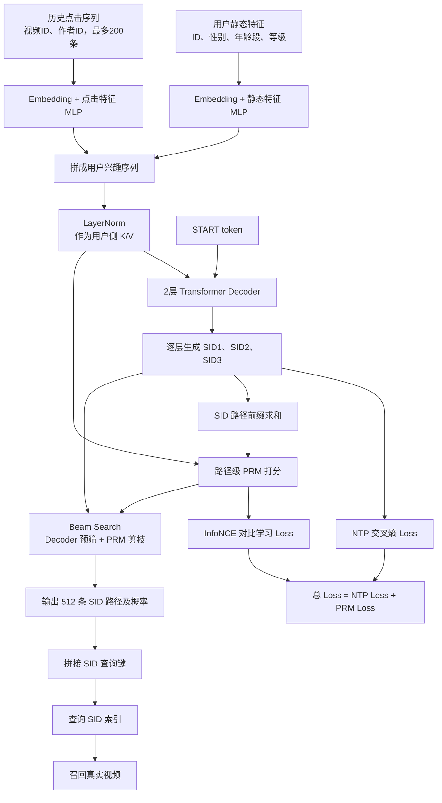

# 双列外流新增生成式召回：原始方案、个人优化与代码详解

> LR 主题：**主站_双列外流_召回_新增生成式召回**
>
> 重点分析对象：`models/explore_transformer_retr_model/kaiworks_explore_sid_tran_decoder_only_PRMv2_t1/kai_v2_model.py`
>
> 本文目的不只是解释当前代码，还要明确区分：
>
> 1. **原始版本已有的生成式召回能力**；
> 2. **本次 LR 中由作者完成的优化工作**；
> 3. **优化后代码的具体实现方式**；
> 4. **LR 实验结果、收益和后续计划**。
>
> 分析范围：目标入口文件，以及同目录的 `model.py`、`modulesV2.py`、`util.py`、`feature_attr_extract.py`、线上检索 DSL；另外参考同仓库原始 Encoder-Decoder/NTP 版本和同系列推理优化版本做差异核对。

## 阅读口径与证据标记

为避免把“原始能力”误写成“个人优化”，本文使用以下标记：

| 标记 | 含义 |
|---|---|
| **[原始版本]** | 在本次 LR 优化前已经存在的标准生成式召回能力 |
| **[本次优化]** | LR 中明确描述、并能在当前或同系列代码中找到实现依据的工作 |
| **[目标代码]** | 当前指定的 `PRMv2_t1` 代码快照可直接验证 |
| **[同系列部署]** | 在相邻的推理优化版本中可验证，但目标代码快照未完整保留 |
| **[LR 结果]** | 来源于用户提供的 LR 截图，不是仅靠源码推导出的数字 |

> 说明：当前 `/Users/jht/Downloads` 不是 Git 仓库根目录，无法通过提交作者记录做逐 commit 归因。因此本文的“原始/优化”边界，以 LR 的方案描述、同仓库版本族对比和当前实现三者交叉确认；不会把无法确认作者归属的通用能力强行算作个人贡献。

---

## 0. 先说结论

**是的，这是一套生成式召回模型代码。**

更准确地说，它是一套：

> **根据用户画像和历史点击序列，用 Decoder-Only 风格的 Transformer 自回归生成三层语义 ID（SID），再使用生成的 SID 查询线上索引以召回视频的模型。**

模型不是直接输出最终的 `photo_id` 列表，而是先生成最多 512 条三层 SID 路径：

```text
用户信息 + 历史点击
        ↓
Transformer Decoder 自回归生成
        ↓
SID 路径 (sid1, sid2, sid3) × 512
        ↓
把三段 SID 拼成索引查询键
        ↓
查询 explore_sid_index_client
        ↓
召回真实视频
```

判断它属于生成式召回，主要有四条硬证据：

1. 训练目标是预测视频的三层语义 ID，而不是普通点击率分数；
2. 三层 SID 按 `sid1 → sid2 → sid3` 自回归生成；
3. 推理使用 Beam Search，一次保留 512 条生成路径；
4. 线上服务把生成 SID 拼成整数后查询 `explore_sid_index_client`，得到真实视频。

所以，它不是“生成式精排”，也不是传统双塔召回；**生成动作本身就在构造召回查询**。

---

## 1. 先补齐几个基础概念

### 1.1 推荐系统里的“召回”是什么？

推荐系统通常不会直接从几亿个视频里做精细排序，而是分阶段缩小范围：

```text
海量视频库
  ↓ 召回：快速找出几百/几千个可能感兴趣的视频
候选集
  ↓ 粗排
较小候选集
  ↓ 精排、重排
最终展示列表
```

本模型负责的是最前面的**召回阶段**。

### 1.2 什么是 SID？

SID 是 Semantic ID，即“语义 ID”。可以把一个视频对应的三层 SID 想象成地址：

```text
一级区域 / 二级区域 / 具体门牌
 sid1      sid2      sid3
```

例如：

```text
[12, 608, 4317]
```

越靠前的层通常越粗，越靠后的层越细。模型不直接在海量 `photo_id` 上分类，而是分三次预测：

```text
P(sid1 | user)
P(sid2 | user, sid1)
P(sid3 | user, sid1, sid2)
```

完整路径概率可以理解为：

```text
P(sid1, sid2, sid3 | user)
= P(sid1 | user)
× P(sid2 | user, sid1)
× P(sid3 | user, sid1, sid2)
```

### 1.3 什么叫“生成式召回”？

传统双塔常见做法是：

```text
用户塔 → user embedding
视频塔 → item embedding
两者点积 → 近邻搜索
```

而本模型把召回改写成了类似语言模型的“下一个 token 预测”：

```text
<START> → 生成 sid1 → 生成 sid2 → 生成 sid3
```

语言模型生成的是词；这里生成的是内容的语义 ID。因此叫“生成式召回”。

### 1.4 PRM 是什么？

你的 LR 将 PRM 称为 **Process Reward Model**，强调它像过程奖励模型一样，对生成中的 SID 路径前缀逐步给分；当前代码目录 README 又将其解释为 **Path Rerank Model**，强调它用于路径级重排/剪枝。

两种命名在本项目中指向同一个功能模块：

> **对 `(user, Semantic ID path/prefix)` 做路径级匹配打分，辅助 Decoder 筛掉质量不好的生成路径。**

为避免术语争议，本文后续统一称为“**路径级 PRM**”或“**PRM 路径判别模型**”。它可以理解为路径质量检查员：

- Decoder 负责说：“这些 SID 路径从概率上看不错”；
- PRM 负责说：“这些路径和当前用户兴趣是否真的匹配”；
- 推理中 PRM 只负责候选路径的去留，不直接改变最终的 Decoder 概率排序。

---

## 2. 原始版本：已经具备什么？

这一节只讲**优化前已有能力**，不计入本次 LR 的个人优化产出。

### 2.1 原始版本已经是生成式召回

**[原始版本]** 已经完成了从传统“编码—匹配”召回向“编码—生成”召回的范式转换：

```text
用户静态特征 + 用户点击序列
            ↓
Transformer Encoder 编码用户上下文
            ↓
Transformer Decoder 自回归生成
            ↓
SID1 → SID2 → SID3
            ↓
SID 索引查询真实视频
```

也就是说，以下能力不是本次 LR 才首次出现：

- 使用三层 Semantic ID 表示视频；
- 每层 8192 个码字，逐层预测 SID；
- 使用 Teacher Forcing 和 NTP 交叉熵训练；
- 使用 Beam Search 同时保留多条候选路径；
- 将生成 SID 交给索引查询真实视频。

### 2.2 原始模型架构

仓库中的标准基线实现使用：

```text
4 层 Transformer Encoder
          +
4 层 Transformer Decoder
          +
三层 SID Projection Head
```

其中：

1. 用户静态特征与点击序列先组成用户上下文；
2. 独立 Encoder 对整段用户序列做多层 self-attention 编码；
3. Decoder 通过 cross-attention 读取 Encoder 输出；
4. 三步分别预测 SID0、SID1、SID2；
5. 三层 NTP loss 相加训练。

### 2.3 原始训练目标的局限

原始版本主要优化：

```text
下一个正确 SID token 的生成概率
```

即：

```text
L_NTP = CE(sid1) + CE(sid2) + CE(sid3)
```

它能学会“哪条路径生成概率高”，但不一定等价于：

```text
哪条完整路径最符合当前用户真实兴趣
```

原因是 NTP 更关注局部 token 预测，而线上召回最终使用的是完整 SID 路径。

### 2.4 原始推理的局限

普通 Beam Search 每一步都按 Decoder 累积概率保留 Top-K：

```text
Decoder 概率高 → 路径留下
Decoder 概率低 → 路径淘汰
```

主要问题有两个：

1. **效率问题**：独立 Encoder 需要额外计算，Beam Search 又会重复进行注意力计算；
2. **质量问题**：生成概率高的路径，不一定是对当前用户判别力最强、最匹配的路径。

---

## 3. 本次 LR 的个人优化：做了什么？

本次工作的核心不是“从零发明生成式召回”，而是在已有生成式召回基线上，围绕**线上效率、路径质量、样本质量和部署成本**做系统优化。

一句话概括：

> **把原始的 Encoder-Decoder + NTP + 普通 Beam Search，升级为 Decoder 主体 + NTP/PRM 联合训练 + PRM 路径剪枝，并补充样本优化和推理工程优化。**

### 3.1 优化一：移除独立 Transformer Encoder

**问题**：标准 Encoder-Decoder 架构需要先对用户序列跑多层 Encoder，再让 Decoder cross-attention 读取结果，用户侧编码增加线上时延。

**本次优化**：

```text
原始版本：
用户特征 → 4 层 Encoder → Decoder Cross-Attention

优化版本：
用户特征 → MLP → LayerNorm → Decoder Cross-Attention
```

用户静态特征和点击行为序列经 MLP 对齐维度、拼接并 LayerNorm 后，直接作为 Decoder cross-attention 的 K/V。

收益：

- 省去独立 Encoder 的多层 Transformer 计算；
- 保留 Decoder 与用户历史的逐步交互；
- 为线上生成式召回降低延迟和资源成本。

> 严格来说，这不是 GPT 式“完全没有 cross-attention”的纯 Decoder-Only，而是“无独立 Transformer Encoder 堆栈、带用户条件 cross-attention 的自回归 Decoder”。

### 3.2 优化二：新增 PRM 路径判别模型

**问题**：NTP 只优化下一个 token 的概率，完整路径概率高不代表用户—路径匹配一定最好。

**本次优化**：新增 PRM，对 `(user, Semantic ID path)` 打分。

```text
Decoder：负责生成候选路径
PRM：负责判断路径是否匹配用户
```

PRM 的输入：

- Query：当前 SID 路径前缀的 embedding；
- Key/Value：用户静态特征和点击序列构成的用户上下文；
- 输出：一个用户—路径匹配分数。

形成“**生成 + 判别**”互补：

```text
NTP：这条路径是否容易被生成？
PRM：这条路径是否真的适合这个用户？
```

### 3.3 优化三：NTP 与 PRM 联合训练

训练目标由原来的单一 NTP 升级为：

```text
total_loss = ntp_loss + prm_loss
```

- NTP loss 保持生成能力；
- PRM 使用 in-batch 负采样和 InfoNCE，对用户与目标路径做对比学习；
- 正样本是当前用户的真实 SID 路径；
- batch 中其他路径作为负样本。

这使模型不仅会“生成”，还会“区分”。

### 3.4 优化四：False Negative Mask

**问题**：in-batch 负采样可能把相同路径误当作负样本。

例如用户 A 和用户 B 的目标 SID 前缀相同：

```text
A 的真实路径：[12, 608]
B 的真实路径：[12, 608]
```

如果直接把 B 的路径当成 A 的负样本，会制造错误监督。

**本次优化**：对路径做哈希，识别 batch 内相同路径；除对角线正样本外，将这些 false negative 的 logit 设为极小值，使其不参与 softmax 竞争。

### 3.5 优化五：logQ 纠偏

**问题**：热门路径在 batch 中出现频率更高，也更容易被采成负样本，产生 popularity bias。

**本次优化**：按照路径在 batch 内频率估计采样概率 `Q(j)`，对 logit 做：

```text
corrected_logit(i,j) = logit(i,j) - log Q(j)
```

避免热门路径仅因“出现得多”而被过度惩罚。

### 3.6 优化六：PRM 介入 Beam Search 剪枝

原始普通 Beam Search 只看 Decoder 概率。优化后：

```text
第一层：Decoder 直接取 Top-512
第二、三层：
  每条 Beam 扩展候选
  → 按 Decoder 累积概率预筛 Top-1024
  → PRM 根据用户—路径匹配打分
  → 剪枝保留 Top-512
```

PRM 从第二层开始介入，以降低计算量。

当前策略中：

- Decoder 决定候选池和最终概率顺序；
- PRM 决定 1024 条候选中哪些 512 条有资格留下；
- PRM 分数不直接混入最终 Decoder path score。

### 3.7 优化七：样本质量优化

点击行为中存在大量浅层消费噪声。此次优化从两个方向处理：

#### 按实际播放时长加权

```text
weight = log10(2 + playing_time / 1000)
```

播放越久，训练权重越大，让高质量消费行为贡献更多梯度。

#### 按视频时长分档过滤

| 视频时长 | 最低播放阈值 |
|---|---:|
| `< 40 秒` | 27 秒 |
| `40～80 秒` | 50 秒 |
| `80～120 秒` | 60 秒 |
| `≥ 120 秒` | 70 秒 |

不满足阈值的浅层消费样本被过滤，只保留更有真实兴趣含义的内容。

### 3.8 优化八：推理 KV Cache

**Decoder Self-Attention Cache**：缓存每层历史 token 的 K/V，每步只计算新增 token。

**Decoder Cross-Attention Cache**：用户上下文的 K/V 只在首步投影一次，后续复用。

**PRM K/V Cache**：用户上下文在 PRM 中也只投影一次，后续候选通过 `broadcast_to` 扩展，避免反复物化大张量。

这些优化降低 Beam Search 与 PRM 引入的额外计算和显存成本。

### 3.9 优化九：混合精度部署

**[LR 方案 / 同系列部署可验证]**：

- 注意力关键计算使用 FP32，保证数值稳定；
- 其余适合的计算使用 FP16，降低延迟和显存占用。

需要特别区分：目标 `PRMv2_t1` 快照完整体现了 KV Cache 等逻辑，但混合精度代码在同系列 `filter_infer` 部署版本中更明确。因此本文将其归为 LR 的部署优化，不声称目标文件单独完整承载了全部混合精度实现。

### 3.10 本次优化归属总表

| 能力 | 原始版本已有 | 本次 LR 优化 |
|---|:---:|:---:|
| 三层 SID 表示 | ✓ | 复用 |
| 自回归生成 SID | ✓ | 复用 |
| Teacher Forcing / NTP | ✓ | 复用并联合训练 |
| 普通 Beam Search | ✓ | 改造成 PRM 剪枝 Beam Search |
| 独立 Transformer Encoder | ✓ | **移除** |
| Decoder 直接读取用户上下文 |  | **新增/改造** |
| PRM 路径打分 |  | **新增** |
| InfoNCE in-batch 对比学习 |  | **新增** |
| False Negative Mask |  | **新增** |
| logQ 采样纠偏 |  | **新增** |
| 播放时长 loss 加权 |  | **新增** |
| 分档正样本过滤 |  | **新增** |
| Decoder / PRM KV Cache | 基础 Beam 可有局部缓存 | **系统增强** |
| 混合精度部署 |  | **新增部署优化** |

---

## 4. 优化前后对照

| 维度 | 原始版本 | 本次优化版本 |
|---|---|---|
| 用户侧网络 | 4 层 Transformer Encoder | MLP + LayerNorm，无独立 Encoder 堆栈 |
| 生成器 | 4 层 Decoder | 2 层 Decoder 主体 |
| 训练目标 | NTP | NTP + PRM InfoNCE |
| 路径质量 | 由 token 概率间接决定 | PRM 显式学习用户—路径匹配 |
| 负样本 | 无路径级对比学习 | In-batch negatives |
| 假负样本 | 不涉及 | False Negative Mask |
| 采样偏差 | 不涉及 | logQ correction |
| Beam 筛选 | 只看 Decoder 概率 | Decoder 预筛 + PRM 剪枝 |
| 样本权重 | 有效 SID 二值 mask | 按实际播放时长加权 |
| 样本过滤 | 相对宽松 | 按视频时长分档过滤 |
| 推理优化 | 基础 Beam/KV 逻辑 | Decoder + Cross-Attn + PRM 多级 Cache |
| 精度策略 | 常规精度 | 关键 Attention FP32，其余 FP16 |
| 最终召回 | SID → 索引 → 视频 | 不变，保证可接入原召回链路 |

---

## 5. LR 实验结果

> 本节数字全部标记为 **[LR 结果]**，来源于用户提供的 LR 截图，不是源码静态分析推导值。

### 5.1 大盘与发现页整体指标

| 指标组 | 指标 | 变化 |
|---|---|---:|
| 大盘 | 活跃用户数 | -0.014% |
| 大盘 | App 使用时长 | -0.001% |
| 大盘 | 用户均 App 使用时长 | +0.015% |
| 发现页整体 | 视频播放时长 | **+0.099%** |
| 发现页整体 | 视频播放次数 | +0.037% |
| 发现页整体 | 视频关注率 | +0.322% |
| 发现页整体 | 外流播放时长 ≥2min 用户数 | **+0.238%** |
| 发现页整体 | 外流播放时长 ≥5min 用户数 | **+0.293%** |

解读：大盘整体基本中性，收益主要集中在发现页和双列外流场景，符合“新增一条外流召回通道”的预期。

### 5.2 发现页外流指标

| 方向 | 指标 | 变化 | 解读 |
|---|---|---:|---|
| 外流消费 | 视频播放时长 | **+0.358%** | 核心正向收益 |
| 外流消费 | 视频播放次数 | -0.044% | 次数略降但时长提升，单次消费可能更深 |
| 外流互动 | 次均播放时长 | **+0.409%** | 用户对召回内容消费更深 |
| 外流互动 | 视频短播率 | -0.044% | 小幅改善 |
| 外流互动 | 视频点赞率 | -0.028% | 轻微负向 |
| 外流互动 | 视频评论率 | -0.400% | 需要关注 |
| 外流互动 | 视频关注率 | **+0.892%** | 明显正向 |
| 外流互动 | 视频收藏率 | **+0.794%** | 明显正向 |
| 负反馈 | 视频减少此类作品次数 | **-1.415%** | 负反馈下降，方向正向 |
| 图文及垂类 | 单图曝光占比 | -0.322% | 内容结构变化 |
| 图文及垂类 | 双列外流图集曝光占比 | +0.172% | 图集有所增加 |
| 图文及垂类 | 双列外流长图曝光占比 | -0.125% | 长图略降 |
| 日龄 | 当天上传视频曝光占比 | **+1.710%** | 新内容曝光明显增加 |

综合看，生成式召回带来的主要价值不是“让用户点更多次”，而是：

- 单次消费更深；
- 关注、收藏更高；
- 负反馈下降；
- 当天新视频曝光增加；
- 对原向量召回形成增量候选补充。

### 5.3 发现页内流指标

| 指标 | 变化 |
|---|---:|
| 内流视频播放时长 | +0.031% |
| 内流视频播放次数 | +0.053% |
| 内流视频点赞率 | -0.014% |
| 内流视频评论率 | +0.265% |
| 内流视频关注率 | +0.093% |
| 内流视频收藏率 | +0.053% |
| 内流视频减少此类作品次数 | +0.688% |

内流不是本实验主要作用区域，指标总体波动较小，但“减少此类作品”有所上升，后续需要观察是否存在流量结构迁移或间接影响。

### 5.4 资源消耗

| 指标 | 变化 |
|---|---:|
| Leaf 平均耗时 | +1.411% |
| Leaf 平均 CPU 耗时 | +1.540% |

这是明确的资源成本，而不是收益。说明 Decoder-Only、KV Cache、PRM 延迟介入和混合精度等优化是必要的：它们的目标不是让计算完全免费，而是把新增生成式召回和 PRM 的成本控制在可上线范围。

### 5.5 中间指标：3452 外流召回

LR 中 `h3452` 通道的关键表现：

- 回透出占比约 **9.914%**；
- 在展示表中，后验平均播放时长约 **42.2408**，高于其他主要通道；
- 在透出率大于 1% 的召回中，独占率最高；
- `pid_cnt = 351,562`；
- `exclusive_pid_cnt = 110,513`；
- 独占率约 **31.4349%**。

这组数据支持两个判断：

1. 该通道不是简单复刻已有召回，能提供较高比例独占候选；
2. 独占内容的后验消费质量较好，说明生成式 SID 路径为向量召回提供了互补候选。

### 5.6 离线 SID Recall

| SID 层级 | Recall@1 | Recall@16 | Recall@128 |
|---|---:|---:|---:|
| sid0 | 0.140 | 0.500 | 0.805 |
| sid1 | 0.360 | 0.720 | 0.900 |
| sid2 | 0.685 | 0.850 | 0.915 |

解读：

- Top-K 增大后，各层真实 token 覆盖率明显提升，说明 Beam Search 保留多路径是必要的；
- sid0 的 Recall@1 最低，第一层是最难、也最影响后续路径空间的一层；
- 后两层 Recall 更高，说明在已有前缀和用户上下文条件下，细粒度路径更容易判断；
- PRM 从第二层介入，与“第一层先保证候选广度，后两层增强路径判别”的设计相匹配。

### 5.7 实验结论

本次 LR 可以概括为：

> 在大盘基本中性的情况下，生成式召回对双列外流消费深度、关注收藏、负反馈、新内容曝光和候选独占性带来正向收益；代价是 Leaf 耗时和 CPU 小幅增加。

这说明方案的业务价值主要来自两点：

1. **增量性**：生成式 SID 路径提供了传统向量召回不容易覆盖的独占候选；
2. **质量性**：整体方案通过路径级 PRM 和高质量样本训练强化了候选质量；但当前 LR 是组合实验，不能仅凭总体指标严格拆分 PRM、样本优化等单项模块各自贡献了多少收益。

### 5.8 下一步计划

LR 给出的下一步方向是用户侧上下文压缩：

```text
长用户行为序列
      ↓
Q-Former 提取少量用户兴趣 Query
      ↓
Decoder / PRM 读取压缩后的兴趣表示
```

目标是在尽量保持召回效果的前提下：

- 降低序列侧 attention 计算量；
- 降低 KV Cache 体积；
- 降低线上时延和资源消耗；
- 缓解当前 Leaf 耗时和 CPU 的增量成本。

---

## 6. 优化方案在代码中如何落地

前面已经讲清楚原始方案和本次优化，这里不再逐模块重复解释，只沿着一次训练和一次推理说明代码链路。

### 6.1 整体流程图



这张图同时覆盖了训练和推理：上半部分是用户上下文构建，中间左侧是 Decoder 生成和 NTP，右侧是 PRM 路径判别，底部是 Beam Search 到真实视频召回的线上闭环。

### 6.2 文件分工

| 文件 | 核心职责 |
|---|---|
| `kai_v2_model.py` | 入口：读取特征、过滤样本、区分训练/推理、配置优化器和导出模型 |
| `model.py` | 主体：用户上下文、NTP/PRM loss、PRM Beam Search |
| `modulesV2.py` | Decoder、Attention、PRM、KV Cache |
| `util.py` | 将整数语义 ID 拆成三层 SID，并处理层级 offset |
| `feature_attr_extract.py` | 用户静态特征和 200 长度点击序列的配置 |
| `dsl_gpu_v3_model.py` | 将模型生成的 SID 查询线上索引，得到真实视频 |

阅读顺序建议：

```text
kai_v2_model.py 训练/推理分支
→ model.py 的 model() 与 beam_search_fast()
→ modulesV2.py 的 DecoderLayer 与 PRMModel
→ util.py 的 SID 拆分
→ dsl_gpu_v3_model.py 的 retrieve()
```

### 6.3 训练链路

```text
用户静态特征（ID、性别、年龄段、等级）
        +
点击视频/作者序列（最多 200 条）
        ↓
Embedding + 两路 MLP
        ↓
拼成 [B, 201, 256] 用户上下文
        ↓
LayerNorm（不再经过独立 Transformer Encoder）
        ↓
2 层 Decoder，Teacher Forcing 预测 3 层 SID
        ├── NTP：三层 8192 分类交叉熵
        └── PRM：用户—路径 InfoNCE 对比学习
        ↓
total_loss = ntp_loss + prm_loss
```

SID 的统一 token 空间为：

```text
第 1 层：[0, 8192)
第 2 层：[8192, 16384)
第 3 层：[16384, 24576)
START：24576
```

真实 SID 通过 `processInput()` 加入层级 offset 后查统一 embedding；通过 `processLabel()` 保留每层局部 ID，用于对应的 8192 分类。

训练中还会：

- 按视频时长分档过滤浅层播放样本；
- 使用 `log10(2 + playing_time / 1000)` 提高长播放样本权重；
- 对三个 SID 前缀分别计算 PRM loss；
- 使用 False Negative Mask 排除同路径假负样本；
- 使用 logQ 修正热门路径的 in-batch 采样偏差。

### 6.4 推理与真实召回链路

推理从 `START` 开始生成三层 SID：

```text
第 1 层：Decoder 从 8192 个 token 中选 Top-512
第 2 层：Decoder 预筛 Top-1024 → PRM 剪到 Top-512
第 3 层：Decoder 预筛 Top-1024 → PRM 剪到 Top-512
```

PRM 在当前实现中只决定路径去留，不把分数加到最终排序分数里；保留路径仍按 Decoder 累积概率排序。

最终模型输出：

| 输出 | 形状 | 含义 |
|---|---|---|
| `user_sid_origin` | `[B, 512×3]` | 512 条三层 SID 路径拉平后的结果 |
| `user_sid_prob` | `[B, 512]` | 每条路径的 Decoder 联合概率 |

线上 DSL 再将三层 SID 合并：

```text
sid_int = sid1 × 8192 × 8192 + sid2 × 8192 + sid3
```

随后以 `ia_sid:{{user_sid_int}}` 查询 `explore_sid_index_client`，得到真实视频，再进行视频和作者去重。因此模型生成的是**召回查询键**，而不是最终 `photo_id` 列表。

推理成本主要通过三类缓存控制：

- Decoder self-attention 缓存历史 token K/V；
- Decoder cross-attention 缓存用户上下文 K/V；
- PRM 缓存用户上下文 K/V，并通过 `broadcast_to` 扩展到候选路径。

同系列部署版本还使用关键 Attention FP32、其余适合部分 FP16 的混合精度方案。

---

## 7. 阅读和使用代码时需要注意

以下问题不影响“它是生成式召回模型”的结论，但后续修改或上线排查时值得重点确认：

1. **布尔参数解析**：`--with_kai_v2 False` 可能被解析成非空字符串，条件判断仍为真。
2. **推理特征跳过逻辑**：`get_param_dict()` 遇到 ignore 特征时使用 `return`，可能本意是 `continue`。
3. **Click AUC 不是模型效果**：入口中的 click 预测是随机值，更像框架占位指标；生成式效果应看 SID Recall、路径召回和线上业务指标。
4. **SID 编码口径需统一**：拆分使用 15 bit 掩码，但词表为 8192；`processOutputV2()`、训练拆分和线上 8192 进制合并也存在版本口径差异。
5. **历史序列顺序需核实**：代码只通过 `used_len` 构造 mask，没有显式截取“最后 200 条”，实际顺序依赖上游特征。
6. **概率输出语义需核实**：模型导出 `[B,512]` 路径联合概率，但部分 DSL 代码像是在按每条路径 3 个分层概率读取。
7. **训练/推理 PRM 不完全对称**：训练对三层都计算 PRM loss，推理从第二层才用 PRM 剪枝。
8. **参数创建顺序有部署约束**：训练图和推理图需要保持 PRM、Projection 参数创建顺序一致，避免 dense bin 权重错位。
9. **组合实验不能拆单项收益**：LR 证明了整套方案有效，但不能仅凭总体实验严格判断 PRM、样本过滤或缓存各自贡献了多少业务收益。

评估时建议分四层看：

- **Token 层**：SID0/1/2 的 Recall@1、Recall@16、Recall@128；
- **路径层**：完整 SID Path Recall、PRM 剪枝前后真实路径保留率；
- **召回层**：透出率、独占率、去重后数量、与传统召回重合率；
- **业务与成本层**：播放时长、关注收藏、负反馈、Leaf 延迟、CPU 和显存。

---

## 8. 最终总结

### 原始版本已有能力

原始版本已经是生成式召回：它使用 Encoder-Decoder，根据用户上下文自回归生成三层 SID，通过 NTP 训练和普通 Beam Search 产生候选路径，最后查询 SID 索引召回视频。

### 本次 LR 的个人工作

本次工作不是从零发明生成式召回，而是完成了系统升级：

- 移除独立 Transformer Encoder，改为 MLP + LayerNorm 用户上下文和 2 层 Decoder；
- 新增路径级 PRM，使用 InfoNCE 与 NTP 联合训练；
- 加入 False Negative Mask 和 logQ correction；
- 将普通 Beam Search 改为 Decoder 预筛 + PRM 剪枝；
- 通过播放时长加权和分档过滤提升训练样本质量；
- 完善 Decoder、Cross-Attention、PRM KV Cache 及混合精度部署；
- 完成离线 Recall、线上收益、独占性和资源成本评估。

### 业务结果

整套方案在大盘基本中性的情况下取得了明确的双列外流收益：

- 外流视频播放时长 **+0.358%**；
- 次均播放时长 **+0.409%**；
- 关注率 **+0.892%**、收藏率 **+0.794%**；
- “减少此类作品”负反馈 **-1.415%**；
- 当天上传视频曝光占比 **+1.710%**；
- `h3452` 通道独占率约 **31.4349%**。

代价是 Leaf 平均耗时 **+1.411%**、CPU 耗时 **+1.540%**。下一步通过 Q-Former 压缩用户行为序列，是沿着当前瓶颈继续优化的合理方向。

一句话概括：

> **原始版本解决“如何生成 SID”，本次 LR 重点解决“如何更快地生成、如何判断路径质量、如何用更干净的样本训练，以及如何验证生成式召回的增量业务价值”。**

---

## 9. 实习经历表达口径

这一节用于将前面的技术细节组织为简历或面试中的完整叙事，不改变“原始能力/个人优化”的归属边界。推荐围绕以下主线展开：

> **针对三层 SID 自回归召回中的路径语义漂移与线上时延问题，对生成器、路径级 PRM、搜索策略和部署链路进行联合优化，提升候选质量、增量性与线上消费表现。**

### 9.1 为什么需要路径级 PRM


生成式召回训练通常采用 Teacher Forcing：每一步都在真实 SID 前缀下预测下一个 token；推理时则依赖模型自己已经生成的前缀。一旦前层 SID 产生偏差，错误会沿层级路径继续累积，使候选逐渐偏离用户真实兴趣，可将这一现象概括为**路径语义漂移**。

同时，NTP 主要回答“下一个 SID token 是否容易被生成”，局部 token 概率并不完全等价于“当前完整路径是否匹配用户”。因此，本方案增加路径级 PRM，为每层 SID Prefix 提供显式的用户—路径匹配监督，并在推理时及时剪除低质量分支。这里应使用“缓解语义漂移”，不宜表述为彻底消除 Teacher Forcing 的 Exposure Bias。

### 9.2 PRM 具体如何工作

PRM 的建模、训练和推理链路可以概括为：

```text
SID Prefix Token Embedding 累加
              ↓
         路径 Query
              ↓
Cross-Attention 读取用户画像与历史点击序列 K/V
              ↓
       MLP 输出用户—路径匹配分数
              ↓
训练：InfoNCE 路径对比学习
推理：PRM-guided Beam Search 剪枝
```

具体而言：

1. **路径表示**：对 `sid1`、`sid1→sid2`、`sid1→sid2→sid3` 三个 Prefix 分别累加 token embedding，形成当前层路径 Query。
2. **用户条件打分**：将用户画像和最长 200 条点击序列构成的上下文作为 Key/Value，通过 Cross-Attention 聚合与当前路径相关的兴趣信息，再由 MLP 输出匹配分数。
3. **正负样本**：真实目标的同层 SID Prefix 为正样本，Batch 内其他用户的同层路径为负样本，对三层 Prefix 分别计算 InfoNCE。
4. **联合目标**：使用 `total_loss = ntp_loss + prm_loss`，在保持 SID 生成能力的同时学习用户—路径判别能力。
5. **负采样修正**：使用路径哈希和 False Negative Mask 排除重复 Prefix 造成的假负样本；通过 logQ correction 缓解热门路径因采样频率过高而受到的过度惩罚。
6. **推理使用**：第一层由 Decoder 直接保留 Top-512；第二、三层由 Decoder 按累积概率预筛 Top-1024，再由 PRM 剪枝至 Top-512。PRM 只决定路径去留，最终结果仍按 Decoder 累积概率排序。

### 9.3 推荐拆分为四个部分

在简历中建议保留四个部分，每一部分只回答一个核心问题：

#### 1. 轻量生成式召回架构

- 基于用户画像和最长 200 条点击序列，自回归生成三层 Semantic ID，并通过 SID 索引召回真实视频；
- 移除独立 4 层 Transformer Encoder，以 MLP + LayerNorm 编码用户上下文，并直接作为轻量 Decoder Cross-Attention 的 K/V；
- 强调这是对已有生成式召回基线的架构优化，而不是从零提出 SID 或生成式召回范式。

#### 2. 路径级 PRM 建模与训练

- 从 NTP 局部 token 目标与完整路径匹配度不一致的问题切入；
- 说明路径 Query、用户上下文 K/V、Cross-Attention 和 MLP 打分的模型结构；
- 说明三层 Prefix 正样本、In-batch Negatives、NTP + InfoNCE 联合训练，以及 False Negative Mask、logQ correction。

#### 3. PRM 引导搜索与部署优化

- 说明 `Decoder Top-1024 预筛 → PRM Top-512 剪枝`，以及 PRM 负责候选去留、Decoder 概率负责最终排序；
- 补充消费样本分档过滤、播放时长 loss 加权；
- 补充 Decoder Self/Cross-Attention、PRM KV Cache 和混合精度部署，体现效果与成本的共同约束。

#### 4. 线上实验收益

- 候选独占率约 **31.43%**，体现相对传统向量召回的增量价值；
- 外流播放时长 **+0.358%**，次均播放时长 **+0.409%**；
- 关注率/收藏率 **+0.892%/+0.794%**，负反馈 **-1.415%**；
- 当天上传视频曝光占比 **+1.710%**；
- Leaf 平均耗时 **+1.411%**、CPU 耗时 **+1.540%**，用于说明新增生成能力的资源代价处于可上线范围。

### 9.4 表达时的归因边界

可以借鉴相关 LR 对“语义漂移、路径级过程监督、PRM-guided Beam Search”的问题定义和叙事方式，但下列能力若未在本方案中落地，不应写成个人贡献：

- Engram/前缀词表扩展；
- Short-term Encoder 与 ACT Encoder 双路长短期兴趣建模；
- 基于用户历史 p80/p75 的个性化正样本阈值；
- 没有对应 Beam 宽度消融实验支撑的 test-time scaling law；
- 其他方案的离线 Recall 增幅或主站收益数字。

对当前线上实验也应保持组合实验口径：可以表述为“整套生成式召回优化方案取得上述收益”，但不能仅凭总体实验把全部收益单独归因给 PRM、样本过滤或任一缓存模块。
