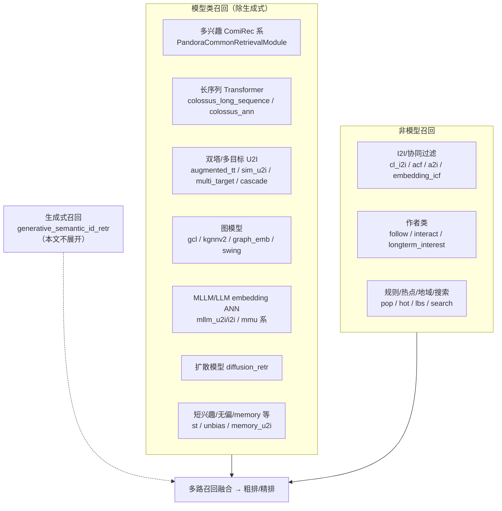

# 召回链路典型召回源梳理

> 代码路径：`Rec/explore-dragon/leaf/explore/retrieval`
> 说明：本文梳理探索（explore）场景召回链路中注册的典型召回源，重点是**模型类召回方法**（生成式召回 `generative_semantic_id_retr` 除外，单独说明）。`config/retrieval_default.json` 中共注册了 200+ 个召回模块实例，几乎全部受独立 AB 开关（`enable_xxx`）控制，线上实际生效集合由实验配置决定。

## 一、模型类召回源（重点）

### 1. 多兴趣向量召回（ComiRec 系，走 Pandora 统一召回服务）

统一走 `grpc_exploreMultiInterestCommonRetrServer`，是主力个性化模型召回。

| 召回源 | 特点 |
|---|---|
| `comirec_retr` / `comirec_fill_actionlist_retr` | 基础多兴趣 U2I |
| `enhance_comi_retr` / `comirec_elegant_retr` / `comirec_mixed_sample_retr` | ComiRec 增强 / 采样变体 |
| `comirec_interact_retr` / `comirec_hot_list_retr` | 互动行为 / 热榜多兴趣 |
| `cold_comirec_retr` | 冷启动 ComiRec-DPO（`grpc_exploreColdComiDpoRetr`） |
| `comirec_u2i_lau_retr` | 低活用户变体 |
| `pic_comirec_retr` / `life_comirec_retr` / `hot_content_comirec_retr` | 图片 / 生活内容 / 热点内容变体 |
| `sine_retr` / `sine_similar_user_fill_interest_retr` | SINE 稀疏兴趣网络 |

### 2. 长序列模型召回

- `colossus_long_sequence_retr`：长序列 Transformer 直接出召回结果（`grpc_KaiWorksExploreLongSequenceTransformerRetrInfer`）
- `colossus_ann` / `colossus_ann_v2_retr`：基于长序列画像 embedding（`grpc_hotMcEmbed`）做 I2I ANN（`grpc_exploreColossusMcI2i`），trigger 来自 colossus 画像、知识 / 兴趣探索 trigger、全局 trigger
- `explore_sim_long_sequence_retr`：长序列相似召回

### 3. 双塔 / 多目标 U2I 向量召回

- `augmented_tt_u2i_ann` / `augmented_tt_i2i_ann`：增强双塔（DSSM，`explore-la-dssm-v2-emb`）
- `explore_sim_u2i_retr`（及 `life_content`、`high_xtr`、`pic` 变体）：U2I 相似模型（`grpc_exploreSimRetrAsync`），带 hetu 类目探索 / 利用控制
- `explore_multi_target_u2i/u2u_retr`：多目标召回模型（`grpc_ExploreMultiTargetRetr`），slide 场景另有 `original_author` / `prior_author` / `quality_life` 三个多目标变体
- `cascade_u2i_retr`：级联召回模型（`com-retr-cascade-retr-v1`）
- `mc_u2i_ann` / `mc_u2i_level3/4/5` / `mc_u2u_retr` / `mc_bucket_u2i_retr`：多通道 / 分层类目 embedding 召回
- `gcl_model_retr` / `gcl_u2u_retr`：图对比学习召回
- `mind_retr` / `supervised_multi_interset_retr` / `supervised_hetu_interest_retr`：MIND / 监督多兴趣
- `nn_retr` / `graph_emb_retr` / `lr_retr` / `sim_lr_retr` / `long_view_sim_lr_retr`：NN / 图 embedding / LR 类浅模型
- `pic_fm_u2i_retr`：FM；`pic_ssm_u2i_retr`（v1/v2）：SSM 序列模型（图片场景）
- `explore_st_retr` / `explore_pic_st_retr(_v2)` / `explore_pic_mix_st_retr` / `explore_pic_unbiased_retr`：短期兴趣模型（图片场景多路变体）
- `unbias_interest_u2i_retr` / `unbias_interest_top_photo_retr`（含 inactive 人群版）：无偏兴趣建模
- `memory_u2i_retr` / `hetu_memory_rank_retr`：记忆网络类
- `trinity_retr` / `ua_model_retr` / `rerank_sample_u2i_retr` / `cold_u2i_retr` / `cold_hetuv3_u2i_retr`：其他模型化召回

### 4. 扩散模型召回

- `diffusion_retr`：扩散模型生成候选（`grpc_MvkeServerVDMV5`）。注意这是 diffusion 建模路线的召回，与语义 ID 生成式召回是两条技术路线。

### 5. MLLM / LLM embedding 召回（非生成式，用 LLM / 多模态 embedding 做 ANN）

- `explore_mllm_u2i_retr`：MLLM embedding U2I ANN（`hot-llm-emb-ann-u2i`）
- `explore_mllm_i2i_retr`：MLLM embedding I2I ANN（`llm-emb-ann-v2`），带全局 trigger
- `pic_mmu_i2i_retr` / `life_mmu_i2i_retr` / `mmu_u2u_retr` / `mmu_sim_emb_dup_i2i_retr` / `mmu_sim_emb_neg_i2i_retr`：多模态理解（MMU）embedding 系列
- `pic_colossus_mc_i2i_retr` / `pic_long_caption_i2i_retr` / `pic_gnn_retr` / `pic_high_value_i2i_retr`：colossus 内容理解 embedding 的 I2I（长 caption、GNN、高价值内容）
- `embedding_v2_u2u_multishard_retr`：U2U embedding 多分片

### 6. 模型化 I2I / 图协同

- `cl_i2i_retr`：聚类 / 协同学习 I2I（`grpc_exploreClrecI2i`），支持 cluster trigger、知识 trigger、兴趣探索 trigger
- `kgnnv2`（`cold_p2u_retr`）：知识图谱 GNN，冷启动物品 → 用户
- `embedding_icf_retr`：embedding 版 ItemCF；`swing_sim_neg_i2i/u2u_retr`：swing 图算法

## 二、非模型 / 弱模型召回源（对照）

- **作者类**：`follow_author_retr`、`interact_author_retr`、`longterm_interest_author_retr`、`longterm_retarget_author_retr`、`diverse_loyal_author_retr`、`a2i_retr`（author2item）、`acf_retr`（author CF）
- **行为倒排 / Redis 类**：collect / comment swing、jingxuan ICF、memory_rank 等 `RedisPhotoRetrievalModule` 系列
- **搜索意图**：`search_retr`、`pic_search_i2i/q2i_retr`、`long_term_search_retr`、`short_term_search_retr`、`pic_llm_q2i_retr`（LLM query 改写）
- **热点 / 兜底**：`pop_retr`、`pic_hot_content_retr`、`recent_top_photo_retr`、`pic_region_hotfire_retr`
- **地域 / 人群包**：`lbs_retr`、`pic_location_retr`、TGI 人群包（`user_group_tgi_retr` 等）
- **负反馈 / 过滤**：`hate_photo_i2i_retr`、audit 类（`audit_bad_i2i_retr`、`audit_topk_pass_retr`）

## 三、整体结构

## 四、补充说明

1. **开关控制**：几乎所有召回源由独立 AB 开关控制（`enable_xxx` 默认多为 `false`），`retrieval_default.json` 是全集注册，线上生效集合由实验决定。
2. **归因**：每个召回源有独立的 `reason` 码（如 comirec=3099、colossus_ann=3061、mllm_u2i=4016、mllm_i2i=4015、a2i=4030、acf=4010、cl_i2i=3096、cascade_u2i=10040、diffusion=508、multi_target_u2i=3130、explore_sim_u2i=13020、long_sequence=3453、cold_comirec=2075），方便统计各路贡献。
3. **趋势**：模型类召回占绝对大头，**ComiRec 多兴趣系、长序列 Transformer（colossus）、MLLM embedding** 三族迭代最频繁；非模型路主要承担冷启动、探索、负反馈和兜底职责。

## 附：关键文件索引

| 文件 | 说明 |
|---|---|
| `retrieval_flow.py` | 召回主流程（`RetrievalFlow`） |
| `retrieval_module.py` / `common_module.py` | 召回模块基类 |
| `config/retrieval_default.json` | 默认注册的全部召回模块（全集） |
| `config/module/*.json` | 每路召回的独立配置（开关、服务名、召回数、reason 码等） |
| `module/*.py` | 各召回模块的 Python 实现 |
