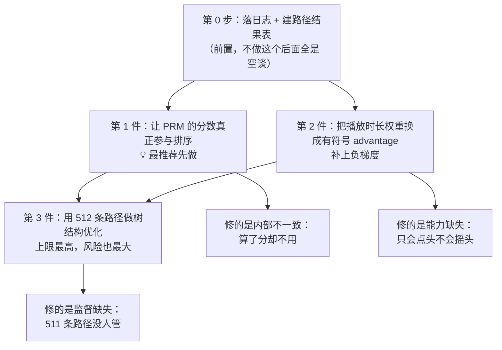

# 生成式召回能不能用 RL 优化？——从零讲起

> 讨论对象：`kai_v2_model.py`（双列外流新增生成式召回，三层 SID + PRM 剪枝 Beam Search）
>
> 配套阅读：`Rec/生成式召回模型_kai_v2_model_详细梳理.md`
>
> 这份文档的目标：**让没接触过 RL 的人也能看懂"为什么要用 RL、用在哪、怎么落地、有什么坑"**。
> 所以前三节几乎没有公式，全部用类比和现状对照；公式集中在第 7 节，想跳过可以直接跳过。

---

## 目录

- [第 1 节：先用一个类比讲清楚"现在的模型缺什么"](#1)
- [第 2 节：RL 在这里到底指什么（不是你以为的那个 RL）](#2)
- [第 3 节：你的代码里其实已经有 RL 的三个零件了](#3)
- [第 4 节：三件该做的事（按推荐顺序）](#4)
- [第 5 节：最大的坑——"变准了，但变窄了"](#5)
- [第 6 节：不该做的事](#6)
- [第 7 节：技术细节与公式](#7)
- [第 8 节：怎么验证 + 上线顺序](#8)
- [第 9 节：收益预期（不吹）](#9)
- [第 10 节：一句话总结](#10)
- [附录：参考文献 + 名词表](#appendix)

---

<a id="1"></a>
## 第 1 节：先用一个类比讲清楚"现在的模型缺什么"

### 1.1 把模型想象成一个实习生

假设你带一个实习生，工作是**给用户挑视频**。你的培养方式是这样的：

> 每天给他看一条记录："用户 A 昨天看了视频 X"，然后让他猜"用户 A 会看什么"。
> 他猜错了，你就纠正他："应该是 X"。他猜对了，你就说"对"。

这就是现在的训练方式（Teacher Forcing + 交叉熵，也叫 NTP）。

这样带出来的实习生，有三个很具体的毛病：

---

**毛病一：他只知道什么是对的，不知道什么是错的**

因为你从来只告诉他"正确答案是 X"，从来没有说过"Y 是个烂选择，别推"。

对应到代码里：

```python
weight = log10(2 + playing_time / 1000)   # 永远 > 0
```

这个权重永远是正数。意思是：**播放时长长的样本，你多学一点；播放时长短的样本，你少学一点。但没有任何样本是"要往反方向学"的。**

于是就出现一个很奇怪的情况：

> 用户明确点了「减少此类作品」——这是用户能给出的最强负面信号了。
> 但在训练里，这条样本最多是"权重小一点"或者"被过滤掉"，
> **模型不会因此把这类内容的生成概率压下去。**

LR 里负反馈 -1.415% 是怎么来的？是靠"把脏样本过滤掉"间接拿到的，**不是直接优化出来的**。这里明显有一块没吃到的收益。

---

**毛病二：他只被考过 1 道题，但实际要答 512 道**

训练时：给他看 1 个真实点击的视频，让他猜这 1 个的 SID。

上线时：他要一口气吐出 **512 条 SID 路径**。

那剩下 511 条的质量谁来管？**没人管。** 从来没有任何训练信号告诉他"你输出的第 300 条是垃圾"。

```text
训练：  1 条真实路径 ────────► 有监督
上线：  512 条路径
        └─ 第 1 条    ──► 恰好是真实的，有监督
        └─ 第 2~512 条 ──► 完全没有监督 ❌
```

---

**毛病三：他心里有判断，但汇报时不说**

这个最有意思。看你现在的推理流程：

```text
第 1 层：Decoder 按概率取 Top-512
第 2 层：Decoder 预筛 Top-1024 → PRM 打分 → 剪到 Top-512
第 3 层：Decoder 预筛 Top-1024 → PRM 打分 → 剪到 Top-512
                                    ↓
                最终 512 条按什么排序？→ **Decoder 概率**
```

也就是说：**PRM 辛辛苦苦算出了"这条路径和用户有多匹配"，但只用来决定"谁被淘汰"，最终的排序名次跟它一点关系都没有。**

用类比说就是：实习生心里给每个候选打了分，但交上来的报告是按另一套标准排的。

再看你自己测出来的这组数：

| SID 层级 | Recall@1 |
|---|---|
| **sid0** | **0.140** |
| sid1 | 0.360 |
| sid2 | 0.685 |

**第 1 层只有 14% 的概率把真实答案排在第一名**——这一层的概率排序几乎没有判别力。

而恰好，**第 1 层是 PRM 完全不介入的那一层**。

> 第 1 层是最不确定的一层，也是最需要帮助的一层，
> 却是唯一一层完全靠 Decoder 概率单打独斗。
>
> 而且第 1 层剪错的代价最大——**剪掉一个 sid1，它下面整棵子树（8192 × 8192 种可能）全没了。**

### 1.2 三个毛病汇总

| 毛病 | 本质 | 现在有处理吗 |
|---|---|---|
| 只知对不知错 | 没有负梯度 | ❌ 只有过滤 |
| 只考 1 题却要答 512 题 | 511 条路径无监督 | ❌ 完全没有 |
| 心里有分但不说 | PRM 不进排序 | ❌ 只用于剪枝 |

**这三件事，恰好就是 RL 擅长解决的三件事。**

---

<a id="2"></a>
## 第 2 节：RL 在这里到底指什么（不是你以为的那个 RL）

听到"RL"，很多人第一反应是：

> ❌ 要搭一个环境，让模型在线上跟真实用户交互，试错、探索、拿奖励……

**这条路在你这个场景是走不通的，我一开始就排除了。** 原因很硬：

- 你的 Leaf 耗时已经 **+1.411%**、CPU **+1.540%**，预算基本用完了，没有余量做在线 rollout。
- OneRec-V1（快手自己的论文）明确说过：他们做 RM-based RL 时，**在线 rollout 只能覆盖 1% 的用户**，这是他们最主要的瓶颈。

**所以本文说的 RL，指的是另一件事，也温和得多：**

> ### 换掉损失函数里那个"权重"的含义。
>
> 从「**这条样本你要多学一点**」（只能是正数）
>
> 换成「**这条样本比平均水平好还是差**」（可以是负数）

就这么一句话。这个"好还是差"的量，RL 里叫 **advantage（优势）**。

### 2.1 对比一下就很清楚

| | 现在（行为克隆） | 改成（优势加权） |
|---|---|---|
| 权重取值 | $w \ge 0$，只能正 | $A \in [-1, +1]$，**可以负** |
| 含义 | 这条样本学多少 | 这条样本比平均**好还是差** |
| 播放很久的视频 | 权重大 → 多学 | $A = +1$ → 概率**推高** |
| 用户点了「减少此类」 | 权重小 / 被过滤 | $A = -1$ → 概率**压低** ⭐ |
| 表达"A 比 B 好" | ❌ 做不到 | ✅ 做得到 |

**改动范围有多大？** 只改 loss 里系数的算法。不动模型结构、不动推理图、不加在线算力。

> 💡 **这就是核心心态**：
> 我们不是"引入一套新的 RL 系统"，
> 而是"把一个只会点头的老师，换成一个会摇头的老师"。

---

<a id="3"></a>
## 第 3 节：你的代码里其实已经有 RL 的三个零件了

这一节想说明：**这不是从零搭一套东西，你已经有 80% 的零件了。**

RL 里做策略优化需要三样东西：

```text
① policy（策略）    —— 谁在做决策？
② value（价值函数）  —— 怎么判断"当前局面好不好"？
③ group（采样组）    —— 拿什么互相比较，才知道谁好谁差？
```

对照你的代码：

| RL 零件 | 你的代码里对应什么 | 状态 |
|---|---|---|
| ① policy | **Decoder**（自回归生成 SID） | ✅ 完整具备 |
| ② value | **PRM**（对 `(user, SID prefix)` 打分） | 🟡 **形状对了，但训练目标和用法不对** |
| ③ group | **Beam Search 的 512 条路径** | ✅ **免费具备，但没落日志** |

### 3.1 关于 ② ——PRM 其实已经是价值函数了

这是我整个调研里最重要的一个发现。

RL 里的**价值函数** $V(s)$ 的定义是：

> 在当前局面 $s$ 下，**预期未来能拿到多少回报**。

而你的 PRM 在做什么？

> 输入 `(用户, SID 前缀)`，输出一个匹配分数。

再看一下它的输入形式（引自你的文档）：

```text
SID Prefix Token Embedding 累加
        ↓
    路径 Query
        ↓
Cross-Attention 读取用户画像与历史点击序列 K/V
        ↓
  MLP 输出用户—路径匹配分数
```

**"给定用户 + 一个走了一半的路径前缀，判断这条路走下去好不好"——这在定义上就是一个 prefix value function $V(s_\ell)$。**

它跟真正的价值函数只差两点：

| | 现在的 PRM | 价值函数需要 |
|---|---|---|
| **训练目标** | InfoNCE（对比学习）——学"排得开" | 回归 return——学"分数值多少" |
| **推理用法** | 只剪枝，不进排序 | 应该参与最终打分 |

**打个比方**：InfoNCE 训出来的分数，像是"名次"——它知道 A 比 B 好，但不知道 A 好多少。而要把 PRM 的分数加到 Decoder 的 $\log P$ 上，你需要的是"分数"，不是"名次"，因为**只有可比、同量纲的数才能相加**。

所以第 4 节的第一件事就是：**给 PRM 补一个回归头，让它的分数变成可比的绝对值，然后让它进排序。**

### 3.2 关于 ③ ——你的 512 条 beam 是免费的 RL group

RL 要判断"哪条路好、哪条路差"，必须**在同一个输入下采样出多条结果互相比较**。这个采样在大模型 RL 里是最贵的一步（要跑很多次生成）。

而你这边：

> **一次请求就吐出 512 条路径。这本身就是一个 $G=512$ 的采样组。**
> **而且这个成本你已经付掉了。**

对比一下：

| | OneRec-V1 | 你的方案 |
|---|---|---|
| 采样怎么来 | 需要额外在线 rollout | **Beam Search 顺带产出** |
| 覆盖率 | 只能覆盖 1% 用户 | **100% 请求** |
| 额外算力 | 需要 | **零** |

> ✅ **所以你只需要做一件事：把这 512 条路径连同它们的 logprob 落到日志里。**
> 之后所有的离线优化都能在这份日志上做，**不需要新增任何在线算力。**

这是你相对 OneRec 的**结构性便利**，我认为是这个方案最值得利用的一点。

### 3.3 小结

```text
policy  ✅ 有（Decoder）
value   🟡 有形状，差训练目标和用法（PRM）
group   ✅ 有，但没落日志（512 条 beam）
reward  🟡 有来源，但没聚合成表（见 4.1）
────────────────────────────────
缺的不是模型，是"把它们接成闭环的日志 + 目标函数"。
```

---

<a id="4"></a>
## 第 4 节：三件该做的事（按推荐顺序）

### 4.0 总览



---

### 4.1 第 0 步：落日志 + 建路径结果表（前置，没有捷径）

这一步不做，后面全是空谈。需要两张表。

#### 表一：生成侧日志（每次请求记一条）

| 字段 | 干什么用 |
|---|---|
| `path[512]` = (sid1, sid2, sid3) | 模型做了什么"动作" |
| `logp_layer[512][3]` | 每层的对数概率，后面算 ratio 要用 |
| `prm_score[512]` | PRM 当时打了多少分（用来做校准分析） |
| `beam_rank`、是否被 PRM 剪掉 | 分析剪枝对不对 |
| `retrieved_pid_cnt`、去重后数量 | **免费的稠密信号**（见下） |

#### 表二：路径—结果表（离线 join，天级）

对每条路径 $p$，统计"它召回的那些视频，后来怎么样了"。**按可得性分层是关键**：

| 层级 | 信号 | 覆盖率 |
|---|---|---|
| **索引层** | 这个 SID 簇有多少存货、失效率、当天新内容占比 | 🟢 **100%，不需要曝光** |
| **粗排层** | 簇内视频的粗排分分布（均值 / top-k） | 🟢 **100%，不需要曝光** |
| 曝光层 | 是否曝光、曝光了几个 | 🟡 部分 |
| 消费层 | 播放时长分位、关注/收藏、负反馈 | 🔴 稀疏 |

#### ⭐ 为什么"粗排分"这一层特别重要

RL 用在推荐上最大的现实困难是 **reward 太稀疏**：512 条路径里，最后真正被用户消费的可能只有几条，其余全是"不知道好不好"。

但你的链路里有一段**免费信息**：

> 一条路径召回的视频，即使**最终没被曝光**，
> 它也大概率**进过粗排、拿到过粗排分**。
>
> 粗排分虽然不是真实用户反馈，但它是"下游认不认这批候选"的直接证据。

这就把 reward 覆盖率从"只有被消费的少数几条"扩展到了"绝大多数路径"。

#### ⭐ 还有一个你独有的便利：SID 是"簇"不是"单个视频"

你的 SID 是**簇地址**（一个 SID 对应多个 photo），不是唯一 item id。这意味着：

> "一条路径的 reward"天然是**簇内聚合量**——
> 不需要等某个具体视频被曝光，只要这个簇里有内容被消费过，就能算出信号。

对比 OneRec 那种"生成具体 item，再等它被曝光"，你这边的 reward **本来就稠密得多**。V-STAR 论文的稠密 reward 也正是靠"前缀下所有候选 item 聚合"构造的，而你这边**簇是真实存在的索引单元，能做得比论文更实**。

---

### 4.2 第 1 件事：让 PRM 的分数真正参与排序 💡 最推荐先做

#### 为什么这件事排第一

因为它**不是引入新能力，而是修一个明显的内部不一致**：

> 模型已经花算力算出了路径质量分，却在最终排序时把它丢掉了。

所以它的特点是：

- ✅ **收益确定性最高**（修 bug 型改动，不是赌新方法）
- ✅ **线上风险最低**（PRM 前向已经在算了，不增加多少延迟）
- ✅ **天然可回滚**（见下面的 $\alpha$）
- ✅ **是第 3 件事的前提**（算 advantage 需要一个 baseline，就是它）

#### 具体做三步

**Step 1：给 PRM 加一个"打分头"**

保留现有的 InfoNCE 分支（它负责"把好路径和坏路径排得开"，这是它的强项），**再加一个回归头**，让它去预测"这条路径实际能拿到多少回报"。

```text
              ┌── InfoNCE 头 ──► 负责"排得开"（判别力）
PRM 主干 ─────┤
              └── value 头   ──► 负责"分数可比"（新增）⭐
```

> **为什么两个都要留？**
> InfoNCE 给的是"名次"，value 头给的是"分数"。
> 你要把 PRM 分数**加到** Decoder 的 $\log P$ 上，必须是可比的分数。
> 只有名次没法相加——这是必须新增 value 头的根本原因。

回归的目标（"实际拿到多少回报"）就从 4.1 的路径—结果表里来：

```text
r = 簇内消费分位 + 粗排分 + 是否有货 − 负反馈率
```

**Step 2：让 V 进入最终排序**

```text
现在：  score(路径) = Σ logP                    ← PRM 完全不参与
改成：  score(路径) = Σ logP + α · V(路径)       ← PRM 进来了
```

**$\alpha$ 从 0 开始灰度放量。$\alpha = 0$ 时严格等于现在的行为，所以天然可回滚——这是我特别喜欢这一步的原因。**

> ⚠️ **上线门槛**：先画一条**校准曲线**——把 $V$ 分成若干桶，看每桶的实际后验播放时长是不是单调递增。
> **校准不过关就不要加**。因为 $V$ 如果不准，加到 $\log P$ 上只会破坏原本的排序。

**Step 3：让 V 也管第 1 层（可能收益最大的一处）**

回到 1.1 那个 `sid0 Recall@1 = 0.140`。第 1 层的概率排序基本没判别力，改成：

```text
现在：  第 1 层：Decoder 直接取 Top-512
改成：  第 1 层：Decoder 取 Top-M（M = 1024~2048）
                → V 重排
                → 保留 512
```

**成本为什么可控？**

第 1 层是整棵搜索树里**最便宜的一层**：

- PRM 的用户上下文 K/V 已经缓存了（你现有的 `broadcast_to` 逻辑）
- 第 1 层的前缀长度只有 1（最短）
- 候选数量最少

> ⚠️ 但这一步**必须实测能不能吃进 Leaf 预算**。你现在已经 +1.411% 了。
> 如果吃不进，退化方案就是只做 Step 2（Step 2 几乎不增加延迟）。

**Step 4（可选，后面再说）**：借 V-STAR 的思路，只对"关键分叉点"做深度扩展，把固定的 512 预算从"均匀铺开"改成"花在真正需要判断的地方"。这属于纯推理侧优化，**不用重训模型**。

---

### 4.3 第 2 件事：把播放时长权重换成有符号 advantage

这件事修的是 1.1 的**毛病一**（只会点头不会摇头）。

**改动范围：只改训练 loss。不动模型结构，不动推理图。**

#### Step 1：先把"播放时长"换成"播放分位"

现在的做法有两个问题：

```python
weight = log10(2 + playing_time / 1000)      # 问题①：绝对时长有偏
# 加上硬阈值分档：<40s 要播 27s，40~80s 要播 50s ...   # 问题②：一刀切扔样本
```

**问题①**：一个 3 分钟视频播 60 秒 vs 一个 15 秒视频播 14 秒，谁更能说明用户喜欢？显然是后者（看完了！），但绝对时长是前者高。

**问题②**：一个 40 秒的视频播了 26 秒，差 1 秒不达标就整条扔掉。但它的信息量不是零——它是个"中等偏弱"的信号，现在被当成不存在。

**改成 OneRec-V2 的做法**（他们线上验证过）：

```text
1. 把视频按时长做「对数分桶」（因为时长是长尾分布，等宽分桶不合理）
2. 对目标视频，看它的播放时长在【这个用户自己、同一时长桶的历史视频】里排第几
3. 用这个「分位数 q」代替绝对时长
```

> 这一步同时治好了两个问题：
> - 分位数天然消除了时长偏置（跟同类视频比，而不是跟所有视频比）
> - 不用硬阈值扔样本了，26 秒就是一个"中等分位"，信息保留下来

#### Step 2：变成有符号的 advantage

```text
A = +1    如果 播放分位 q 很高（比如 batch 内前 25%）且没有负反馈
A = -1    如果 用户点了「减少此类作品」等明确负反馈        ⭐ 这是新增能力
A =  0    其他（不参与训练，等于过滤）
```

**注意这里第一次出现了 $A = -1$。这就是"会摇头的老师"。**

> OneRec-V2 特别强调：**不要再对这个 advantage 做归一化**。
> 因为正负样本的定义已经足够严格了，再做归一化反而引入优化不一致。
> （省掉一个容易调坏的环节，挺好。）

#### Step 3 ⚠️：必须加"梯度上界"，否则很可能训崩

**这一步不能省，我要重点强调。**

原因用大白话说：

> 引入负梯度后，损失函数的梯度大小大致正比于 **$1 / \pi_\theta$**（当前概率的倒数）。
>
> 也就是说：**这个 token 的概率越小，压制它的梯度就越大。**
>
> 但这个逻辑对负样本是反的！一个概率本来就已经很小的 token，
> **它已经没有多少可压的空间了，却会收到一个巨大的梯度。**

而你的场景**恰好是最危险的情况**：

- SID 空间是 8192³，长尾 token 的概率**极低**
- 这是模型**第一次**引入负梯度，之前从来没有过

> 📌 所以必须用 OneRec-V2 的 **GBPO** 做法：给梯度加一个动态上界，
> 把 RL 的梯度**约束到 BCE loss 那种稳定的量级**上
> （BCE 的负样本梯度正比于 $1/(1-p)$，概率越小梯度越小 —— 这才是对的方向）。
>
> 具体公式见 [第 7.3 节](#73)。

还有一个坑要提醒：

> 你的训练样本来自传统链路（不是这个模型自己生成的），所以拿不到"生成时的概率 $\pi_{old}$"。
> 按 OneRec-V2 的处理，令 $\pi_{old} = \mathrm{sg}(\pi_\theta)$，此时 ratio 恒等于 1。
>
> ⚠️ **而这恰好是最容易梯度爆炸的情形**——V2 论文 Figure 8 专门讨论了这一点：
> 传统 RL 认为 ratio=1 的样本是"安全的、不需要裁剪的"，**但实际上它照样会爆炸**。

#### Step 4：NTP 必须留着

```text
总 loss = NTP loss（权重不要降！）+ PRM loss + advantage 项
```

> 📌 PSG 论文的消融实验里，**去掉 NTP 是所有改动中退化最大的一项**。
> NTP 是稳定的"模仿学习锚点"，RL 只能在它之上做微调，不能替代它。
> 这是硬约束，不是建议。

---

### 4.4 第 3 件事：用 512 条路径做树结构优化（上限最高，风险最大）

这件事修的是 1.1 的**毛病二**（511 条路径没人管）。

#### Step 1：group 是免费的

见 3.2。一次请求的 512 条 beam 就是采样组，成本已付。

#### Step 2：reward 分层（让信号变稠密）

把"这条路径好不好"分成几档，**关键是最底下两档不需要曝光就能算**：

| reward | 条件 | 覆盖率 |
|---:|---|---|
| **+1.0** | 簇内有视频被消费，且播放分位高 | 🔴 稀疏 |
| **+0.5** | 有曝光但消费一般 | 🟡 部分 |
| **+0.2** | 进入了粗排且粗排分较高（**不需要曝光**） | 🟢 大部分 |
| **+0.05** | 索引里有货、内容有效（**纯离线可算**） | 🟢 100% |
| **0.0** | **索引空簇 / 全是失效内容** | 🟢 100% |
| **−1.0** | 产生了明确负反馈 | 🔴 稀疏 |

> 底部两档（`+0.05` / `0.0`）是**纯离线、100% 覆盖、无法被 hack** 的信号。
> 它直接治一个很实在的问题：**模型生成了一条 SID，但查索引啥也查不到。**
> 这种路径白占了 512 个名额里的一个。
>
> `+0.2` 那一档用粗排分覆盖了大量未曝光路径，是缓解 reward 稀疏**最实用**的一招。

#### Step 3 ⚠️：必须在"兄弟节点"内比较，不能在全组 512 条里比

这是个容易踩的坑，我详细说一下。

标准 GRPO 的做法是：在整组（512 条）里算平均，然后看每条比平均高多少。

**但这在你的场景会失效。** 因为 512 条路径**共享前缀的情况极其严重**：

```text
第 1 层其实只有几百个不同的 sid1
    └─ sid1 = 12
         ├─ sid2 = 608 ─┬─ sid3 = 4317   ┐
         │              ├─ sid3 = 4318   │ 这些路径几乎一样，
         │              └─ sid3 = 4319   │ reward 也几乎一样
         └─ sid2 = 609 ─┬─ ...           ┘
```

同前缀的路径召回的内容高度相似，**reward 也高度相关**。结果是：

> 组内 reward 方差趋近于 0 → 每条路径的 advantage 都接近 0 → **梯度信号被完全稀释**

V-STAR 论文管这叫 **advantage compression**，是他们专门要解决的问题之一。

**正确做法：只在"同一个父节点下的兄弟"之间比较。**

```text
❌ 全组归一化：拿 sid1=12 下的路径 去和 sid1=999 下的路径比
              （它们根本不是一个语义大区的，比了没意义）

✅ 兄弟内归一化：在 sid1=12、sid2=608 这个前缀下，
              比较 sid3 = 4317 / 4318 / 4319 谁更好
```

> 💡 **这样做语义也更对**：你真正想让模型学的，就是
> **"在这个前缀下，下一步该往哪个子簇走"**——这本来就是个局部决策。

#### Step 4：三重防塌缩（这是本步骤的重点，不是附注）

| 措施 | 做什么 | 为什么 |
|---|---|---|
| **① 注入真实路径** | 往每个 group 里塞 2~4 条真实点击的 SID 路径，参与 advantage 计算 | 保证每次更新都有正例，压住稀疏 reward 的方差（淘天 EG-GRPO 的做法，$K=2\sim4$ 有效，再大收益饱和） |
| **② NTP 锚 + KL 约束** | NTP 权重不降，另加一个 KL 项拉住原模型 | 别跑太远 |
| **③ 第 1 层熵下界** | 给第 1 层单独加熵正则，或直接给 distinct-sid1 数量设下界 | 第 1 层是广度的源头，守住它 |

#### Step 5：reward 的口径——不要用大盘指标

> ❌ **不要用** App 使用时长、大盘活跃这类指标做 reward。

原因很直接：**你这个通道只占 9.914% 透出**。大盘信号里，它的贡献被稀释到噪声水平（LR 里大盘活跃本来就是 -0.014%，基本是中性）。**归因根本不成立。**

✅ reward 必须停在**这个通道自己的责任边界**上：

> "我给出的这批候选，进入下游链路之后表现如何。"

---

<a id="5"></a>
## 第 5 节：最大的坑——"变准了，但变窄了"

**这一节我认为是整份文档最重要的部分。** 如果你只记住一件事，请记这个。

### 5.1 你这个通道的价值到底是什么

回看你的 LR 数据：

| 指标 | 数值 | 说明 |
|---|---|---|
| **独占率** | **31.4349%** | 三分之一的候选是别的召回给不了的 |
| **当天上传视频曝光占比** | **+1.710%** | 明显推动新内容分发 |
| 后验平均播放时长 | 42.2408 | 高于其他主要通道 |
| 透出占比 | 9.914% | |

**结论很清楚：这个通道的核心价值是「增量性和广度」，不是「排得最准」。**

排得准是精排的活。召回的活是**"把别人找不到的好东西捞出来"**。

### 5.2 而 RL 最典型的失败，恰好就是把广度换成准确率

这不是我的猜测，是两篇论文的实测结果：

**证据一：淘天 CQ-SID + EG-GRPO（和你定位几乎一样，也是"召回补充通道"）**

他们用原始 GRPO（不加专家样本注入）的结果：

```text
clk@1   ↑ 略微上升      ← 看起来"变准了"
clk@10  ↓ 下降          ← 但深层候选变差了
pvr     ↓ 下降          ← 曝光覆盖率也降了
```

论文的归因：稀疏 reward 下的高方差，把概率质量**集中到少数几个 SID** 上，模型反复生成相似候选，**牺牲了深 beam 位置的多样性**。他们管这叫 **mode concentration**（模式坍缩）。

**证据二：V-STAR（腾讯视频号）**

指出似然驱动的解码 + RL 会导致 **exploration 不足**：高 reward 但低概率的分支被提前剪掉，**尤其是长尾内容**。

### 5.3 所以最危险的结果长什么样

```text
📊 离线报告：SID Recall@1 从 0.140 → 0.180  🎉 看起来很棒！

📉 线上实际：
    独占率           31.43% → 22%     ❌ 通道价值腰斩
    当天新内容曝光    +1.71% → -0.5%   ❌ 只推熟悉的老内容
    外流播放时长      基本不动          ❌ 白折腾
```

**模型学会了"稳妥地推那些明显会被点的东西"——而那些东西，别的召回通道本来就能给你。**

**你付出了算力，换来一个和其他通道高度重合的召回。这就是最坏的结果。**

### 5.4 因此必须有专门抓这个的指标

普通的 Recall 指标**看不出这个问题**。必须单独盯：

| 指标 | 作用 |
|---|---|
| **独占率** | 🚨 **首要护栏**，跌破阈值直接回滚 |
| **当天上传视频曝光占比** | 🚨 **探索性 canary**——塌缩会先表现为"只推老内容"，这个指标会**最先掉** |
| distinct sid1 / sid2 数量 | 离线就能看，塌缩的第一现场 |
| 512 条路径的 token 熵 | 同上 |
| 覆盖的索引簇数、簇存货总量 | 同上 |

> 💡 **提前定好红线**：在开始做之前就写下"独占率跌破 X% 就回滚"，
> 不要等到实验做完了再来讨论"这个 trade-off 能不能接受"。

---

<a id="6"></a>
## 第 6 节：不该做的事

这一节和第 4 节同样重要——**知道什么不做，能省掉大量白工。**

| ❌ 不做 | 理由 |
|---|---|
| **在线 on-policy rollout / MCTS** | Leaf 已 +1.411%、CPU +1.540%，预算基本用完。OneRec-V1 自己就是被 rollout 覆盖率（1% 用户）卡住的 |
| **用 App 使用时长 / 大盘活跃做 reward** | 9.9% 透出通道无法归因；LR 里大盘本来就中性（活跃 -0.014%），信噪比不支持 |
| **标准 GRPO + 全组归一化** | 双重问题：advantage compression（V-STAR）+ mode concentration（淘天实测 clk@10/pvr 双降）。这条路会**用独占率换 Recall@1** |
| **裸 DPO / S-DPO 做路径偏好** | DPO 的隐式 reward 会**锐化分布**，对"要广度"的召回是逆向优化。且需要成对偏好，pair 只能靠启发式构造（GReF 的 winner/loser 就继承了伪标签偏差）。可作为 logprob 日志拿不到时的降级方案，不是首选 |
| **让 PRM 同时当 reward 和在线打分器** | 自我奖励闭环 ⇒ reward hacking。若后期上 RM，**必须与在线打分用的 $V$ 参数解耦**（哪怕结构相同） |
| **对 SID tokenizer / codebook 做 RL** | 会让线上索引 key 漂移，`ia_sid:{{user_sid_int}}` 整条检索链路和所有已建索引全部失效。**SID 空间必须冻结** |
| **和 Q-Former 上下文压缩同时上** | 两个都改分布，出问题无法归因。建议**先做压缩**（纯效率优化，还能腾出 Leaf 预算），稳定后再做 RL |

---

<a id="7"></a>
## 第 7 节：技术细节与公式

前面为了好读省略了公式，这里补齐。**不看这节也能理解整个方案。**

### 7.1 现状：weighted behavior cloning

$$\mathcal{L}_{\text{now}} = -\sum_i w_i \log \pi_\theta(y_i \mid x_i), \qquad w_i = \log_{10}\!\left(2 + \frac{pt_i}{1000}\right) \ge 0$$

$w_i \ge 0$ 是关键限制：梯度方向恒为"提升 $\pi_\theta(y_i|x_i)$"，无法表达抑制。

### 7.2 时长感知 reward shaping（OneRec-V2）

对时长做对数分桶：

$$\mathcal{F}(d) = \lfloor \log_\beta(d + \epsilon) \rfloor$$

$\beta$ 控制桶粒度，$\epsilon \approx 10^{-6}$ 保证数值稳定。

用户 $u$ 的历史 $H_u = \{(d_k, p_k)\}_{k=1}^N$，桶 $b$ 内的播放时长经验分布：

$$P_{u,b} = \{\, p_j \mid (d_j,p_j) \in H_u,\ \mathcal{F}(d_j) = b \,\}$$

目标视频 $i$（时长 $d_i$、播放 $p_i$，桶 $b = \mathcal{F}(d_i)$）的归一化消费分位：

$$q_i = \frac{\big|\{\, p_j \in P_{u,b} \mid p_j \le p_i \,\}\big|}{\big|P_{u,b}\big|}$$

有符号 advantage：

$$A_i = \begin{cases}
+1, & q_i > \tau_b \ \text{且}\ neg_i = 0 \\
-1, & neg_i = 1 \\
\ \ 0, & \text{otherwise}
\end{cases}$$

$\tau_b$ 取 batch 内 $q$ 降序的 25% 分位。**不做归一化**（V2 明确建议）。

<a id="73"></a>
### 7.3 GBPO：梯度上界（必须）

先看为什么需要它。当 $\pi_{old} = \mathrm{sg}(\pi_\theta)$（ratio 恒为 1）时：

$$\mathcal{J}^i = -A_i \cdot \frac{\pi_\theta}{\mathrm{sg}(\pi_\theta)}
\quad\Longrightarrow\quad
\frac{\partial \mathcal{J}^i}{\partial \theta} = -A_i \cdot \frac{1}{\pi_\theta}\frac{\partial \pi_\theta}{\partial \theta}$$

**$\pi_\theta$ 越小，梯度越大。**

- 对正样本：概率小 ⇒ 提升空间大 ⇒ 大梯度合理 ✅
- 对负样本：概率小 ⇒ 压制空间小 ⇒ **大梯度会导致过拟合甚至塌缩** ❌

而 BCE 的梯度是：

$$\frac{\partial \mathcal{L}_{BCE}}{\partial \theta} = \begin{cases}
-\dfrac{1}{p_\theta}\dfrac{\partial p_\theta}{\partial \theta}, & y = 1 \\[8pt]
+\dfrac{1}{1 - p_\theta}\dfrac{\partial p_\theta}{\partial \theta}, & y = 0
\end{cases}$$

负样本的 $1/(1-p)$：概率越小，梯度越小 ✅ **这才是稳定的形状。**

GBPO 就是用 BCE 的梯度形状给 RL 梯度加界：

$$\mathcal{J}_{GBPO}(\theta) = -\mathbb{E}\left[\frac{1}{G}\sum_{i=1}^{G} \frac{\pi_\theta(o_i \mid u)}{\pi'_{old}(o_i \mid u)} \cdot A_i \right]$$

$$\pi'_{old}(o_i \mid u) = \begin{cases}
\max\big(\pi_{old},\ \mathrm{sg}(\pi_\theta)\big), & A_i \ge 0 \\[4pt]
\max\big(\pi_{old},\ 1 - \mathrm{sg}(\pi_\theta)\big), & A_i < 0
\end{cases}$$

两个好处：**① 不丢弃任何样本的梯度**（保留探索多样性）；**② 负样本梯度被 BCE 形状约束住**（稳定）。

> 对比：GRPO/PPO 靠 clip 丢样本；DAPO 放松 clip 换多样性但没解决稳定性；ECPO（OneRec-V1）截断负样本梯度上界；GBPO 进一步用动态 bound。

### 7.4 prefix value model（TD 学习）

$$\mathcal{L}_{value} = \mathbb{E}_{(x,y)\sim\mathcal{D}}\left[\sum_{\ell=1}^{L}\Big(V_\phi(s_\ell) - \big(r_\ell + \gamma V_\phi(s_{\ell+1})\big)\Big)^2\right]$$

其中 $s_\ell = (x, y_{\le \ell})$ 是前缀状态，$L = 3$。

稠密 reward（越靠后的层权重越大，与 V-STAR 一致）：

$$r_\ell = w_\ell \cdot \Big(\alpha_1 \underbrace{\bar{q}_{\text{cluster}}}_{\text{簇内消费分位}} + \alpha_2 \underbrace{\overline{s_{\text{coarse}}}}_{\text{粗排分}} + \alpha_3 \underbrace{\mathbb{1}[\text{有货}]}_{\text{索引存货}} - \alpha_4 \underbrace{\text{negRate}}_{\text{负反馈}}\Big)$$

PRM 总损失（两个头都保留）：

$$\mathcal{L}_{PRM} = \mathcal{L}_{InfoNCE} + \lambda_v \mathcal{L}_{value}$$

### 7.5 打分与解码

最终排序分数：

$$\text{score}(p) = \sum_{\ell=1}^{3} \log P_\theta(\text{sid}_\ell \mid x, \text{sid}_{<\ell}) + \alpha \cdot V_\phi(p)$$

V-STAR 的解码优先级（价值 + 策略熵，用于 Step 4 的 gated expansion）：

$$G(s) = V_\phi(s) + \lambda H_\theta(s)$$

只扩展 $G(s)$ 超过该层均值的 **decisive node**，避开完整 MCTS 的开销。

### 7.6 Sibling 归一化的策略梯度

对父前缀 $h$ 和子 token $v$，$\bar R(x;h,v)$ 是经过该子节点的候选的平均 reward：

$$A_{node}(x; h, v) = \frac{\bar R(x;h,v) - \mu_{S(h)}}{\sigma_{S(h)} + \epsilon}$$

$\mu_{S(h)}, \sigma_{S(h)}$ 是**兄弟集合内**的均值和标准差（不是全组 512 条）。

$$\mathcal{J}_{sib}(\theta) = \mathbb{E}_{x\sim\mathcal{D}}\left[\sum_{h,v} A_{node}(x;h,v)\cdot \log \pi_\theta(v \mid x, h)\cdot \rho(v \mid x,h)\right]$$

### 7.7 完整目标函数

$$\mathcal{L}_{total} = \underbrace{\mathcal{L}_{NTP}}_{\text{锚点，权重不降}} + \lambda_1 \underbrace{\mathcal{L}_{PRM}}_{\text{InfoNCE} + \text{value}} + \lambda_2 \underbrace{\mathcal{J}_{GBPO/sib}}_{\text{策略优化}} + \beta \underbrace{\mathrm{KL}(\pi_\theta \| \pi_{SFT})}_{\text{防漂移}} - \eta \underbrace{H(\pi_\theta^{(1)})}_{\text{第 1 层熵，保广度}}$$

---

<a id="8"></a>
## 第 8 节：怎么验证 + 上线顺序

### 8.1 离线指标（四层）

| 层 | 指标 | 现有基线 |
|---|---|---|
| Token | sid0/1/2 的 Recall@1/16/128 | 0.140 / 0.360 / 0.685（@1） |
| 路径 | 完整 SID Path Recall；PRM/V 剪枝前后真实路径保留率 | 待补 |
| **广度 ⭐新增** | **distinct sid1/sid2、512 条路径 token 熵、覆盖索引簇数、簇存货总量** | 待补 |
| **校准 ⭐新增** | **$V$ 分桶 vs 实际后验播放时长的校准曲线** | 待补 |
| 成本 | Leaf 耗时、CPU、显存、**beam 宽度—质量曲线** | +1.411% / +1.540% |

> 顺手把 **beam 宽度消融**补上——你自己的文档里也提到"没有消融实验支撑就不该声称 test-time scaling law"。这次正好一并做掉。

### 8.2 在线护栏（带回滚阈值）

| 指标 | 当前值 | 作用 |
|---|---|---|
| **独占率** | 31.4349% | 🚨 首要护栏，跌破直接回滚 |
| **当天上传视频曝光占比** | +1.710% | 🚨 探索性 canary，塌缩最先掉这个 |
| 透出占比 | 9.914% | 通道存在感 |
| 后验平均播放时长 | 42.2408 | 通道质量 |
| 负反馈（减少此类作品） | -1.415% | 第 2 件事的直接目标 |
| 视频评论率 | -0.400% | 目前唯一明显负向，观察能否顺手修掉；也是跷跷板观察点 |
| Leaf 耗时 / CPU | +1.411% / +1.540% | 4.2 Step 3 的硬约束 |

### 8.3 上线顺序（按"改动面 × 风险"排）

| 顺序 | 内容 | 改动面 | 线上风险 | 依赖 |
|---|---|---|---|---|
| **0** | 落日志 + 路径结果表 | 纯离线 | 无 | — |
| **1** | V 进排序（$\alpha$ 灰度） | 训练 + 打分 | 🟢 低（$\alpha{=}0$ 等价现状） | 0 |
| **2** | 有符号 advantage + GBPO | 仅训练 | 🟡 中（首次负梯度） | 0 |
| **3** | 第 1 层 V 重排 | 推理 | 🟡 中（延迟） | 1 |
| **4** | Sibling 树结构优化 | 仅训练 | 🟠 中高（塌缩） | 0,1,2 |
| **5** | gated expansion / RM Hybrid | 推理 / 训练 | 🔴 高 | 全部 |

> ⚠️ **1 和 2 可以并行开发**（一个改打分、一个改训练 loss），**但上线必须拆开**。
> 否则收益无法归因——这正是你当前 LR 已经踩到的问题（文档里也承认了"组合实验不能拆单项收益"）。

---

<a id="9"></a>
## 第 9 节：收益预期（不吹）

我不想给一个夸张的数字，所以把三个外部参照摆出来：

| 工作 | 结果 |
|---|---|
| **EG-GRPO**（淘天，定位最接近） | 作者**自己说** RL 的绝对增益 modest。原因：三阶段 SFT 已接近强局部最优；hitrate 是二值指标；EG-GRPO 做的是 click/exposure 之间的 **Pareto 改进**而不是单目标最大化 |
| **V-STAR**（腾讯） | HR@3 +4.0%（vs 最强 RL baseline）；线上 GMV **+1.23%**（vs BeamSearch+GRPO） |
| **OneRec-V2**（快手） | RL 部分 App Stay Time +0.299%（真实反馈）/ +0.269%（RM）；但**互动指标幅度大得多**（Like +2.4%~6.6%） |

映射到你这边，我的合理预期：

**1. 第 1 件事（V 进排序）——收益确定性最高**

因为它修的是一个明显的内部不一致。量级上对应"路径级排序质量"改善，预期**和本次 LR 同一量级**（外流播放时长零点几个百分点），**不是数量级跃升**。

**2. 第 2 件事（有符号 advantage）——收益集中在特定方向**

主要在**负反馈和短播**方向（目前完全空白，一点负梯度都没有），以及评论率这类当前负向指标。时长类指标可能只是小幅正向。

**3. 第 3 件事（树结构 RL）——上限最高，方差最大**

它是唯一能优化"512 条路径作为一个集合"的手段，也是唯一可能把独占率**进一步做高**的手段；同时也是唯一可能把独占率**做崩**的手段。

**4. 互动类指标的弹性明显大于时长类**

这是 OneRec 两代都反复观测到的规律（Like/Follow 动辄 +2%~7%，而 App Stay Time 是 +0.3% 量级）。所以 **reward 里给互动信号留权重，可能比死磕播放时长更容易看到显著变化**。

---

### ⚠️ 最后一条，我觉得比上面所有 RL 都重要

第 0 步的路径—结果表**本身就有独立价值**，跟 RL 无关。

它能回答你现在答不上来的一个问题：

> **512 条路径里，到底有多少落到了空簇 / 低存货簇 / 全是失效内容的簇？**

我怀疑这个比例不低。如果确实不低，那么：

> 🎯 **「过滤掉无效路径，把名额让给有效路径」**
> 这一条**纯工程优化**的收益，可能比任何 RL 算法都立竿见影，
> **而且零风险、零算力增加、不用改模型。**

**所以我的建议是：第 0 步做完以后，先看这个数字，再决定 RL 要投多少力气。**

别一上来就冲算法。

---

<a id="10"></a>
## 第 10 节：一句话总结

> 这套方案已经有了 **policy**（Decoder）、有了近似的 **value**（PRM）、有了免费的 **group**（512 条 beam）、有了稠密可得的 **reward 源**（簇存货 + 粗排分 + 时长分位）。
>
> **缺的不是模型，是把它们接成闭环的日志和目标函数。**
>
> 所以合适的做法不是"外挂一个 GRPO"，而是三步走：
>
> 1. **先把 PRM 补成校准的价值函数，并让它真正参与排序** —— 修内部不一致
> 2. **再把播放时长权重换成有符号 advantage，并加 GBPO 梯度上界** —— 补上负梯度
> 3. **最后在兄弟节点粒度做 off-policy 树结构优化** —— 优化"路径集合"
>
> 全程以**独占率**和**当天新内容曝光占比**作为首要护栏。
>
> 因为这个通道的价值是"**增量与广度**"，而 RL 在生成式召回上最典型的失败，恰恰是**把广度换成了准确率**。

---

<a id="appendix"></a>
## 附录

### A. 参考文献

| 文献 | 出处 | 本文用到的点 |
|---|---|---|
| OneRec: Unifying Retrieve and Rank with Generative Recommender and Iterative Preference Alignment | arXiv 2502.18965（快手） | RM-based RL、ECPO、rollout 只覆盖 1% 用户的瓶颈、reward hacking |
| OneRec-V2 Technical Report | arXiv 2508.20900（快手） | Lazy Decoder-Only、**Duration-Aware Reward Shaping**、**GBPO 与负样本梯度分析**、RM vs 真实反馈 vs Hybrid 对比、自生成样本效应 |
| Spend Search Where It Pays: Value-Guided Structured Sampling and Optimization for Generative Recommendation（V-STAR） | arXiv 2602.10699（腾讯 / 视频号） | **probability-reward misalignment**、**advantage compression**、prefix value + TD 学习、VED gated expansion、**Sibling-GRPO** |
| Efficient Generative Retrieval for E-commerce Search with Semantic Cluster IDs and Expert-Guided RL（CQ-SID + EG-GRPO） | arXiv 2605.14434（淘天） | **召回补充通道的定位**、**reward 分层**、**原始 GRPO 的 mode concentration 实测**、专家样本注入、收益幅度的诚实讨论 |
| DeGRe / GoalRank / PSG 等 | 见 `Rec/2025-2026生成评估重排论文调研.md` | 路径级 + 步级稠密监督、组内标准化与 group size、**NTP anchor 不可去** |

### B. 名词表

| 名词 | 一句话解释 |
|---|---|
| **NTP** | Next Token Prediction，就是现在的交叉熵训练：给前缀，猜下一个 token |
| **Teacher Forcing** | 训练时喂真实前缀而不是模型自己生成的前缀 |
| **policy（策略）** | 做决策的模型。这里就是 Decoder |
| **value（价值函数）** | 判断"当前局面预期能拿多少回报"的模型。这里应该是升级后的 PRM |
| **advantage（优势）** | 这个动作比平均水平好多少。**可以为负** |
| **return（回报）** | 从当前状态往后累计拿到的 reward |
| **group（采样组）** | 同一输入下采样出的多条结果，用来互相比较。这里就是 512 条 beam |
| **rollout** | 让模型实际跑一遍生成，拿到结果。在线 rollout 很贵 |
| **on-policy / off-policy** | 用当前模型自己生成的数据训练 / 用别的来源的数据训练 |
| **GRPO** | Group Relative Policy Optimization。在一组采样里算相对优势，不需要单独的 value 网络 |
| **GBPO** | OneRec-V2 提的方法。不裁剪 ratio，改用动态梯度上界，防止负样本梯度爆炸 |
| **ECPO** | OneRec-V1 的 Early Clipped GRPO，截断负样本梯度上界 |
| **DPO** | Direct Preference Optimization。用成对偏好数据直接优化，会锐化分布 |
| **KL 约束** | 惩罚新模型偏离原模型太远的项，防止训飞 |
| **reward hacking** | 模型学会钻 reward 模型的漏洞拿高分，但实际效果没变好 |
| **mode concentration（模式坍缩）** | 概率质量集中到少数几个输出上，多样性丧失 |
| **advantage compression** | 组内样本 reward 太相似，导致 advantage 都接近 0，梯度信号被稀释 |
| **TD 学习** | Temporal Difference。用 $V(s_\ell) \approx r_\ell + \gamma V(s_{\ell+1})$ 这个递推关系训练价值函数 |
| **InfoNCE** | 对比学习损失，让正样本和负样本"排得开" |
| **prefix（前缀）** | 已经生成的部分路径，比如 `sid1→sid2` |
| **sibling（兄弟节点）** | 同一个父前缀下的不同分支 |
| **gated expansion** | 只对"关键分叉点"做深度扩展，省算力 |
| **canary 指标** | 用来最早发现问题的预警指标 |
